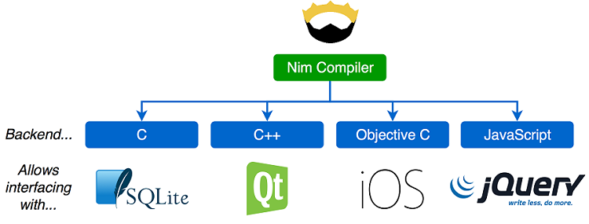
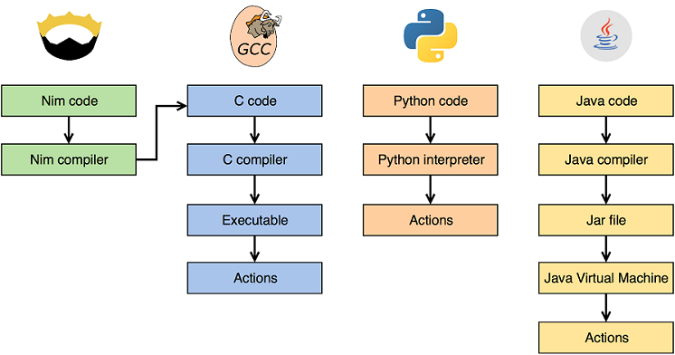

# 第一章 初识 Nim


本章涵盖：

* 为什么要学习Nim？
* 与其他编程语言的比较
* 使用场景
* 优势和劣势

Nim是一种较新的编程语言。您将通过这本书来认识 Nim。该语言目前已经完整了，马上将推出[2.0版本](.nim2.0.html)，核心方面，如语法、过程语义、方法、迭代器、泛型、模板基本上是固定不变了。多年来，编程社区对Nim还是很感兴趣，因为它实现并向用户提供了一组独特的特性。


本章包括您在学习 Nim 之前可能会问的问题的答案，例如您可能想要使用它的原因。除其他事项外，我将概述Nim的一些常见实际用途，将其与其他编程语言进行比较，并讨论其一些优点和缺点。最后，我还将简要讨论本书所针对的读者类型。

## 1.1 什么是Nim？


Nim 是一种通用编程语言，旨在高效、富有表现力和优雅。这三个目标很难同时实现，因此Nim的设计者给每个目标都赋予了不同的优先级。效率是最重要的，优雅排在最后。

尽管优雅对Nim的设计相对不重要，但在设计过程中仍然会考虑它。正因为如此，语言本身仍然保持优雅。只有当需要在效率和优雅之间进行权衡时，效率才会获胜。

从表面上看，Nim具有Python的许多特征。特别是其语法的许多方面，包括使用缩进来界定范围，以及某些运算符使用单词而不是符号的趋势。还有其他方面与语法无关，例如高度用户友好的异常追溯（Traceback），如下所示。

```bash
Traceback (most recent call last)
request.nim(74)          request
request.nim(25)          getUsers
json.nim(837)            []
tables.nim(147)          []
Error: unhandled exception: key not found: totalsForAllResults [KeyError]
```

但也有很多不同之处。特别是在语言的语义方面。主要区别在于类型系统和执行模型，您将在下一节中了解。

**Nim的历史**

Nim的开发始于2005年，由Andreas Rumpf开始。不久之后，该项目获得了开源社区的支持和贡献，世界各地的许多志愿者通过 GitHub 上的拉取请求贡献代码。[1]

>提示 给Nim贡献代码：编译器、标准库和相关工具都是开源的，用 Nim 编写。该项目可在 GitHub 上找到，鼓励每个人做出贡献。为Nim做出贡献是了解其工作原理并为其发展做出贡献的好方法。

### 1.1.1 使用场景

Nim 从一开始就被设计为一种通用编程语言。因此，它包含广泛的功能，使其几乎可用于任何软件项目。这种设计使其成为在从 Web 应用程序到内核的各种应用领域中编写软件的良好候选者。

虽然它几乎可以支持任何应用程序域，但这并不能使其成为所有应用程序的正确选择。该语言的某些方面使其比其他方面更适合某些类别的应用程序。这并不意味着这些应用程序不能使用 Nim 编写;这只是意味着 Nim 可能不支持非常适合编写这些类型的应用程序的代码样式。

该语言的一个特点使其特别适合系统编程。你会发现 Nim 是一种编译语言，但它的编译方式很特殊。当源代码由 Nim 编译器编译时，它首先被转换为 C 代码。C 是一种相当古老但支持良好的系统编程语言，因此，允许更直接、更轻松地访问机器的物理硬件。因此，Nim 非常适合编写操作系统、编译器、设备驱动程序、嵌入式系统软件等。尽管它仍然是一种新的编程语言，但已经有很多此类项目的例子。例如，GitHub上有一个名为NimKernel的非常简单的操作系统：https://github.com/dom96/nimkernel。

>注意 Nim 如何编译源代码？ 
Nim特殊的编译模型及其优点的完整细节在后面的部分，“1.1.3它是如何工作的？”中描述的。

用 Nim 编写的应用程序非常快，在许多情况下与用 C 编写的应用程序一样快，比用 Python 编写的应用程序快 13 倍以上。效率是最重要的，并且提供了一些功能，使优化代码变得容易。这与软件的实时垃圾收集器紧密相连，后者允许您指定收集内存所花费的时间量。这在游戏开发过程中变得很重要，如果普通垃圾回收器占用太多时间收集内存，则可能会减慢屏幕上帧的渲染速度。它在需要在非常严格的时间范围内运行的实时系统中也很有用。

Nim也很好地支持执行输入/输出操作的应用程序，例如读取文件或通过网络发送数据。例如，Web应用程序可以使用许多Web框架（如Jester）轻松编写。[2] Nim 的类似脚本的语法以及强大的异步输入/输出支持使这些应用程序的快速开发变得容易。

命令行应用程序可以从 Nim 的效率中受益匪浅。除此之外，Nim 应用程序被编译的事实意味着它们是独立的，因此不需要任何庞大的运行时依赖项。这使得它们的分发非常容易。用 Nim 编写的此类应用程序的一个例子是 Nimble，它是 Nim 的包管理器，允许用户安装包含 Nim 库和应用程序的包。

这些只是 Nim 可用于的场景的一些示例，当然不是详尽的列表。要记住的另一件事是，在撰写本文时，Nim 仍在开发中，尚未达到1.0版本。有些功能尚未实现，这可能会使 Nim 不太适合某些应用程序。例如，Nim 包含一个 JavaScript 后端，允许您在 Nim 中为您的网页编写 JavaScript 应用程序。这个后端可以工作，但尚不支持编写良好的客户端 Web 应用程序所需的所有 JavaScript 功能。这将随着时间的推移而改善。

您现在应该对 Nim 是什么、它的历史以及它特别适合的一些应用程序有所了解。接下来的小节将演示 Nim 的一些功能，并讨论 Nim 的工作原理。

### 1.1.2 核心功能

在许多方面，Nim 非常具有创新性。Nim 的许多功能在任何其他编程语言中都找不到。如果您喜欢学习新的编程语言，尤其是那些具有有趣和独特功能的语言，那么这绝对是适合您的语言。

在本节中，我们将介绍 Nim 的一些核心功能。特别是使Nim从其他编程语言中脱颖而出的功能。总之，核心功能包括：

* 一种称为元编程的工具，用于根据您的需求塑造语言。
* 样式不敏感的变量、函数和类型名称。此功能略有争议，它允许您以您希望的任何样式处理标识符，无论它是 `camelCase` 还是  `snake_case` 。
* 具有丰富功能（如泛型）的类型系统，这些功能使代码更易于编写和维护。
* 编译为 `C`，允许 Nim 程序高效且可移植。编译本身也非常快。
* 可**互换**的**可选**垃圾回收器。
  
**元编程**

Nim 最实用，在某种意义上也是最独特的功能是其广泛的元编程支持。元编程允许您读取、生成、分析和转换源代码。它绝不是 Nim 的发明，但是没有其他编程语言具有元编程功能，它像 Nim 一样广泛且同时易于上手。如果你熟悉 Lisp，那么你可能已经有一些元编程的经验了。

元编程允许您以 **抽象语法树(AST)** 的形式将代码视为数据。这允许您操作现有代码，并在编译应用程序时生成全新的代码。

Nim 中的元编程很特别，因为具有良好元编程功能的语言通常属于Lisp 语言家族。如果你已经熟悉 Java 或P ython 之类的东西，那么你会发现开始使用 Nim 比 Lisp 更容易。你还会发现学习使用 Nim 的元编程功能比 Lisp 的更自然。

虽然元编程通常是一个高级主题，但是一个非常强大的功能，您将在本书的[第9章](m09.md)中更详细地了解它。元编程提供的主要好处之一是能够去除重复代码。元编程还允许创建特定于领域的语言，例如：

```nim
html:
  body:
    p: "Hello World"
```
上面的 DSL 指定了一些 HTML 代码。根据它的实现方式，DSL 可能会被转换为类似于以下内容的 Nim 代码：

```nim
echo("<html>")
echo("  <body>")
echo("    <p>Hello World</p>")
echo("  </body>")
echo("</html>")
```

这本身将导致以下输出：

```html
<html>
  <body>
    <p>Hello World</p>
  </body>
</html>
```
Nim 中的元编程允许您定义特定于领域的语言，并将它们与普通的Nim 代码自由混合在一起。像上面这样的语言有许多用例，例如上面的语言可用于为您的 Web 应用程序创建 HTML 模板。

这个功能是 Nim 设计的核心，Nim 的设计者非常希望鼓励用户使用元编程以适应他们的编程风格。这方面的一个例子是，虽然 Nim 确实提供了一些面向对象编程功能，但在 Nim 中没有类定义结构。相反，任何希望在 Nim 中以与其他语言类似的风格使用 OOP 的人,都应该使用元编程,来做这样的事。

**风格不敏感**

Nim 的另一个有趣且可能的独特特征是风格不敏感。程序员必须做的最困难的事情之一就是为各种标识符（如变量、函数和模块）提供名称。在许多编程语言中，这些名称不能包含空格，因此程序员被迫采用另一种方式在单个名称中分隔多个单词。通常情况下，设计了多种不同的方法。最受欢迎的存在，是蛇形 `snake_case` ,还是驼峰 `camelCase` 至今仍在争论。Nim 允许您使用 `snake_case` ，即使标识符已使用 `camelCase` 定义，反之亦然。这允许您以首选样式编写代码，即使您使用的库对其标识符使用不同的样式也是如此。  

清单 1.1.风格不敏感

```nim
import strutils     # <1>
echo("hello".to_upper())     # <2>
echo("world".toUpper())      # <3>
```

><1>	该strutils模块定义了一个名为toUpper的函数。
<2>	我们可以使用 `snake_case` 来调用它。
<3> 或者 `camelCase` ，正如最初定义的那样。

这是有效的，因为 Nim 认为 `to_upper` 和 `toUpper` 标识符是相等的。在比较标识符时，Nim 会考虑第一个字符的大小写，但它不会打扰标识符的其余字符也忽略下划线的情况。这意味着标识符 `toUpper` 和 `ToUpper` 不相等，因为第一个字符的大小写不同。

按约定类型名称以大写字母开头，变量名称以小写字母开头， 这将允类型和变量区分开来。下面的清单 1.2 显示了此约定非常有用的一个场景。

清单 1.2.不区分样式和类型标识符

```nim
type
  Dog = object     # <1>
    age: int     # <2>

let dog = Dog(age: 3)     # <3>
```

><1>	类型 `Dog` 由大写首字母定义。
<2>	只有基元类型（如 `int` 以小写字母开头）。
<3>	可以安全地定义变量 `dog` ，因为它不会与 `Dog` 类型冲突。

**强大的类型系统**

区分编程语言的众多特征之一是它们的类型系统。类型系统的主要目的是减少程序中出现错误的机会。一个好的类型系统提供的其他好处是某些编译器优化的可能性，更好的代码文档等等。

有许多不同的类别，用于对编程语言的类型系统进行分类。主要类别是静态和动态类型系统。在大多数情况下，编程语言并不是这些类型系统中的极端，它结合了这两种类型的思想。这样做是因为两者都需要一定的权衡。虽然静态类型在编译时发现更多错误，但它也会降低编写程序的速度。动态类型恰恰相反。

Nim 是静态类型的。但与一些静态类型编程语言不同，它还包含许多使开发快速的功能。类型推断就是一个很好的例子，类型可以由编译器解析，而无需您自己指定类型，除非您当然选择指定它们。因此，您的程序仍然没有错误，并且您的开发速度不会受到阻碍。Nim 还包含一些动态类型检查功能，例如允许动态调用函数的运行时类型信息。

类型系统确保程序没有错误的一种方法是验证内存安全性。一些编程语言（如 C ）不是内存安全的，因为它们允许程序访问尚未分配供其使用的内存。其他内存安全的编程语言，不允许程序访问内存的低级细节，这在某些情况下是必要的。Nim 结合了两者，只要您不使用任何不安全的类型指针 `ptr` （例如在您的程序中），它就是内存安全的；同时该类型 `ptr` 在与 C 库接口时是必需的，并且支持这些不安全的功能使 Nim 成为一种强大的系统编程语言。

默认情况下，Nim 会保护您不受每种类型的内存错误的影响。数组在编译时或在运行时进行边界检查，当无法进行编译时检查时，可防止缓冲区溢出和缓冲区过度读取。指针运算对于引用类型是不可能的，因为它们完全由 Nim 的垃圾收集器管理，这可以防止诸如**悬空指针**和与手动管理内存相关的其他内存问题等问题。最后，Nim始终将变量初始化为其默认值，这可以防止变量包含意外和损坏的值。

最后，Nim类型系统最重要的功能之一是使用泛型编程。Nim 中的泛型允许在不牺牲类型安全性的情况下重用大量代码。它允许的一件事是单个函数过程可以接受多种不同的类型。例如，您可能有一个在屏幕上同时显示整数和浮点数的 `showNumber` 过程。

```nim
proc showNumber(num: int | float) =
  echo(num)

showNumber(3.14)
showNumber(42)
```

在上面的列表中，该 `showNumber` 过程接受类型 `int` 或  `float` 类型。`|` 运算符用于指定 `int` 或  `float` 两者，并且可以传递给过程。这个列表是对 Nim 泛型的一个非常简单的演示，您将在后面的章节中了解有关 Nim 类型系统以及泛型的更多信息。

**编译**

我在上一节中提到过，Nim 编译器首先将源代码编译为 C，然后将该源代码发送到 C 编译器中。您将在 *1.1.3它是如何工作的？* 部分中详细了解它是如何工作的，但现在让我谈谈这个编译模型所具有的许多实际优势中的一些。C 编程语言作为一种系统编程语言已经非常成熟，并且已经使用了 40 多年。C 是最便携的编程语言之一，具有 Windows，Linux，Mac OS X，x86，amd64，arm 和许多其他更晦涩的操作系统和平台的多种实现。C 编译器支持从超级计算机到微控制器的所有内容，它们也非常成熟，并实现了许多强大的优化，这使得 C 非常高效。

Nim 利用了 C 语言的这些方面，包括它的可移植性、广泛使用和效率。

编译为 C 也使得使用现有的 C 和 C++ 库变得非常简单。为此，您只需要编写一些简单的包装器代码。编写此代码的过程可以通过使用名为 `c2nim` 的工具更快地完成，此工具将 C 和 C++ 头文件转换为包装这些文件的 Nim 代码。

>注意 c2nim 
该工具无法翻译每一段 C/C++ 代码，在某些情况下，您可能需要手动编辑部分代码。在 *第 8 章* 中查找更多 `c2nim` 信息。

有很多用 C 和 C++ 编写的库，其中许多非常流行。您可以从 Nim 非常轻松地使用所有这些库。这是双向的，因此您还可以编写库，然后可以从 C 和其他编程语言使用。

图 1.1.编译后端




Nim 编译器还可以将 Nim 源代码编译为 Objective C 和 JavaScript。Objective C 是主要用于iOS软件开发的语言。通过编译到 Objective C，您可以在 Nim 中编写 iOS 应用程序。这还包括可以使用 Java 或 C 编写的 Android 应用程序. Nim目前没有编译为 Java ，但它确实编译为 C 。通过这样做，Nim 还可用于创建 Android 应用程序。JavaScript 是数十亿网站使用的客户端语言，它有时被称为 Web 的汇编语言，因为它是所有主要 Web 浏览器支持的唯一编程语言。通过将 Nim 编译为 JavaScript，您可以在 Nim 中为 Web 浏览器编写客户端应用程序。

你现在可能想知道 Nim 在编译软件方面有多快。也许你在想它很慢，毕竟 Nim 需要先将源代码翻译成中间语言。但事实上，Nim编译器是最快的编译器之一。 Nim 甚至与 Go 相媲美，Go 是一种设计时考虑到编译速度的语言。例如，由大约 100，000 行 Nim 代码组成的 Nim 编译器只需大约 11 秒，即可在 2.7 GHz Intel Core i5 CPU 的 MacBook Pro 上完成编译。

**内存管理**

C 和 C++ 都需要您手动管理内存，仔细确保您分配的内存在不需要时被解除分配。另一方面，Nim 使用垃圾收集器为您管理内存。但是，您可能不想用垃圾收集器是有原因的，许多人认为它们对于某些应用领域（如嵌入式系统和游戏）来说是性能不够的。出于这个原因，Nim 支持许多不同的垃圾收集器，并考虑了不同的应用程序。默认垃圾回收器是实时的，因此它允许您指定它应该花在收集内存上的时间量。它非常适合实时系统和游戏，因为它不会在未知的时间段内暂停您的应用程序。垃圾回收器也可以完全删除，使您能够自己管理内存。

>提示 垃圾收集器
在垃圾回收器之间切换很容易，您只需在编译期间指定  `--gc:<theGc>` 标志并替换 `<theGc>` 为  `markandsweep` , `boehm` ,或 `none` 之一。

这只是Nim最突出特征的一部分。当然，它还有很多，不仅仅是独特和创新的功能，还有现有编程语言的独特功能组合，这使得 Nim 作为一个整体确实非常独特。现在让我告诉你Nim是如何工作的。

### 1.1.3 它是如何工作的？

使 Nim 与众不同的是它的实现。每种编程语言都有一个应用程序形式的实现，它要么解释源代码，要么将源代码编译成可执行文件。这些实现分别称为解释器和编译器。虽然有些语言可能有多个实现，但 Nim 唯一的实现是编译器。编译器编译 Nim 源代码的方式是，首先将代码转换为另一种名为 C 的编程语言，然后将该 C 源代码传递给 C 编译器，然后将其编译为二进制可执行文件。可执行文件是一个包含指示计算机应执行的特定任务的指令的文件，这些指令包括在原始 Nim 源代码中指定的指令。假设您编写了一个计算器程序，在编译过程中，可执行文件是程序本身，它是您为了运行计算器并开始向其提供您希望它执行的计算而执行的内容。图 1.2 显示了如何将一段 Nim 代码编译为可执行文件。

图 1.2.Nim 如何编译源代码


大多数编程语言都有编译器，它们没有这个额外的步骤，它们自己将源代码编译成二进制可执行文件。有些编程语言实现甚至根本不编译代码。图 1.3 显示了不同的编程语言如何将源代码转换为可以执行程序任务的中间过程。

图 1.3.Nim 编译过程与其他编程语言的比较



如您所见，Nim 成为 C 编译过程的一部分，以便编译由 Nim 编译器生成的 C 源代码。这确实意味着 Nim 编译器依赖于外部 C 编译器，例如 GCC 或 clang。但尽管如此，编译仍然非常快。编译的结果是可执行文件。它可以执行以执行由初始源代码定义的指令。这些指令会导致执行许多操作，其中一个操作可能像从 Internet 下载文件一样复杂，也可能像添加两个输入一样简单。

这应该可以让您很好地了解 Nim 源代码转换为工作应用程序的方式，以及此过程与其他编程语言中使用的过程有何不同。在开发 Nim 应用程序时，每次更改源代码时都需要重新编译它。最好了解此编译过程，因为每个编译过程都完全相同。下一节将从积极和消极方面评估 Nim。

[1] 当前打开的 Nim 拉取请求，https://github.com/nim-lang/Nim/pulls

[2] https://github.com/dom96/jester

## 1.2 Nim的优点和缺点

我认为，虽然了解您可能想要使用某种语言的原因很重要，但了解该语言可能不适合您的特定场景的原因也同样重要。

本着这种精神，本节将首先将 Nim 与许多其他编程语言进行比较。我将使用通常在此类比较中使用的各种特征和因素。之后，您将了解Nim可能仍然需要赶上其他语言的一些领域，毕竟它是一种非常新的编程语言。

### 1.2.1 好处

目前有很多种编程语言了，当你阅读这本书时，你可能想知道 Nim 与你熟悉的编程语言相比如何。有很多方法可以比较编程语言，可以考虑多个因素，包括它们的速度、表现力、开发速度、可读性、语言的生态系统等等。我将在这里讨论其中的一些。

**Nim是高效的**

编程语言的速度是通常用于比较多种编程语言的一个特征。Nim的目标之一是效率，因此它是一种非常高效的编程语言也就不足为奇了。

C 是最高效的编程语言之一，所以你可能想知道 Nim 是如何比较的。在上一节中，我告诉过您，Nim 编译器首先将 Nim 代码翻译成中间语言。默认情况下，中间语言是C，这表明Nim的性能与C非常相似，这实际上是正确的。由于这个特性，Nim可以用作C语言的完全替代品。 Nim 具有类似的性能，导致软件比用 C 编写的软件更可靠，具有改进的类型系统，支持泛型，并实现了元编程的高级形式。与 C 相比，Nim 中的元编程是独一无二的，因为它不使用预处理器，而是主编译过程的一部分。一般来说，你可以期望在 Nim 中找到许多在 C 中找不到的现代功能，所以选择 Nim 作为 C 替代品是很有意义的。

表1.1显示了一个小的基准测试的结果。Nim 的速度与 C 的速度相当，并且明显快于 Python。[3]

表 1.1.计算1亿个数中的素数所需的时间

|编程语言|时间（秒） | 
|-------|---------|
|C |2.6 | 
|Nim|2.6 | 
|Python （CPython） |35.1 |

在此基准测试中，Nim 应用程序的运行时与 C 应用程序的速度相同，明显快于 Python 中实现的速度。像这样的小型基准测试通常不可靠，但它们是了解编程语言速度的方法之一。 Nim 的性能与 C 的性能相当，C 已经是目前最有效的编程语言之一。

**Nim 可读**

Nim是一种非常富有表现力的语言，就像Python一样，它借用了一些语法，包括精彩的缩进分隔范围。Nim 代码不会被类 C 编程语言（如 JavaScript 和 C++）的大括号和分号弄得混乱，也不需要 Ruby 等语言中存在的 `do` 和 `end` 关键字。

这使得 Nim 非常容易写，但更重要的是，易于阅读。良好的代码可读性有很长的路要走，它使调试更容易，从而减少了调试时间，使您可以花更多的时间编写漂亮的 Nim 代码，从而减少开发时间。

看看下面的例子，如果你还不明白，不要担心。这些示例实现了一个计算斐波那契数列的函数，该函数返回： ` 0, 1, 1, 2, 3, 5, 8, …` 。此序列以  `0`  和  `1` 开头，序列中的下一个数字等于前两个数字的总和。清单 1.3 和清单 1.4 中的示例计算此序列并将其显示给用户。

清单 1.3.遍历Nim中的斐波那契数列

```nim
proc fibonacci(n: int64) =
  ## Displays the first ``n`` amount of numbers in the fibonacci sequence.
  var first = 0
  var second = 1

  echo first
  echo second

  for i in 0..<n:
    swap first, second
    second += first
    echo second

fibonacci(90)
```

清单 1.4.遍历 Java 中的斐波那契数列

```java
public class Fibonacci {
  /*
   * Displays the first ``n`` amount of numbers in the
   * fibonacci sequence.
   */
  public static void fibonacci(int n)
  {
    long first = 0;
    long second = 1;

    System.out.println(first);
    System.out.println(second);

    for(int i = n; i > 0; i--)
    {
      long temp = first;
      first = second;
      second = temp;

      second += first;
      System.out.println(second);
    }
  }

  public static void main(String[] args) {
    fibonacci(90);
  }
}
```

尽管这种算法很简单，但 Nim 代码中的噪声量远低于 Java 代码中的噪声量。Nim 代码更具可读性和紧凑性，而 Java 代码则充满了重复。Nim 中的一个例子是 `main` 函数，全局范围内的所有代码都像在方法中一样执行，这消除了指定该方法的需要，从而生成更紧凑的代码。

**Nim自举**

我之前已经提到过这一点，但我认为值得重新审视，以描述其他语言如何处理这个问题以及为什么有些语言确实需要运行时。

编译的编程语言（如 Nim、C、Go、D 和 Rust）会生成一个可执行文件，该可执行文件可以运行在编译器本机的操作系统。在Windows上编译Nim应用程序将产生只能在Windows上执行的可执行文件。同样，在Mac OS X上编译它将导致一个只能在Mac OS X上执行的。CPU架构也涉及到这一点，在ARM上编译将产生一个仅与ARM CPU兼容的可执行文件。默认情况下，这是工作方式，但可以指示编译器通过称为交叉编译的过程为不同的操作系统和 CPU 组合编译可执行文件。

>提示 交叉编译: 一个常见的用例是针对 ARM 设备（如 Raspberry Pi）进行编译，其中 CPU 通常很慢，这意味着设备上的编译也很慢。有关交叉编译的更多信息可以在这里找到：<http://nim-lang.org/docs/nimc.html#cross-compilation>

这个问题是创建 JVM 的主要原因之一。您可能听说过"一次编写，随处运行"这句话。这是 Sun Microsystems 为说明Java编程语言的跨平台优势而创建的口号。一个 Java 应用程序只需要编译一次，这个编译的结果是一个 JAR 文件，其中包含所有编译的 Java 类。然后，Java 虚拟机可以执行 JAR 文件，以便在任何平台和体系结构上执行编程的操作。这使得 JAR 文件成为与平台和体系结构无关的可执行文件。这样做的缺点是必须在用户的系统上安装 Java 虚拟机才能运行这些 JAR 文件。添加另一个依赖项并不理想，JVM非常大，可能不适合某些用例，它还添加了另一个可能包含错误和安全问题的软件。但另一方面，它确实允许 Java 应用程序只编译一次。

Python、Ruby 和 Perl 与此类似。他们还利用虚拟机来执行代码。在Python的情况下，虚拟机用于优化 Python 代码的执行，但它主要隐藏为 Python 解释器的实现细节。Python 解释器解析代码，确定代码描述的操作，并立即执行这些操作。没有像Java，C 或 Nim 那样的编译步骤。但是优点和缺点大多与 JVM 相同，为了执行 Python 应用程序，系统需要安装 Python 解释器。但同样，这确实意味着您不必担心交叉编译。

**一次编写，随处运行**

与一次编写，随处运行的口号类似，其他编程语言采用了一次编写，随处编译的理念，该理念描述了编程语言仅在源代码级别跨平台的事实。换句话说，您不需要编写特定于平台的代码。这适用于 C ， Pascal 和 Ada 等语言。但是，在处理操作系统的更专业功能（例如创建新线程或下载网页内容）时，这些语言仍然需要特定于平台的代码。Nim 更进一步，它的标准库抽象了操作系统之间的差异，并允许您利用现代操作系统今天提供的许多功能。

不幸的是，在许多情况下，虚拟机和解释器造成的问题多于它们解决的问题。常见的 CPU 架构和最流行的操作系统的数量并不多，因此为它们进行编译并不困难。对于用解释型语言编写的应用程序，通常情况是将源代码分发给用户，并且他们应该安装正确版本的解释器或虚拟机。

与分发此类应用程序相关的困难的一个例子是最近引入的 Python3 。它给最初用 Python2 编写的软件带来了许多问题，因为 Python3 与 Python2 不向后兼容。截至撰写本文时，Python3 是在8年前发布的，仍然有为 Python2 编写的库不适用于 Python3 解释器。[4] 如果编译的编程语言发生了这样的事情，那么二进制文件至少仍然可以继续工作。

Nim 可以用作所有解释型编程语言的替代品，作为一种更高效、更少依赖性、同样或更具表现力的语言。特别是 Python 是一个很好的替代候选者，因为这些语言有许多相似之处。

**Nim很灵活**

软件可以以不同的风格编写。编程语言的不同样式和功能由其支持的编程范例定义。编程范式是编写软件的基本风格。您可能熟悉的范式是 OOP（面向对象编程），这种范式通常作为大学计算机科学课程的一部分教授。它允许程序员使用代码对现实世界的对象及其关系进行建模。

Nim 是一种多范式编程语言，这意味着它支持多种编程范式。与一些流行的编程语言不同，Nim 并不专关注于 OOP 范式。它主要是一种过程编程语言，对 OOP ，函数式，声明式，并发编程和更多编程风格都有不同的支持。

这并不是说 OOP 没有得到 Nim 的良好支持。OOP 作为一种编程风格根本不是强加给你的。支持的常见 OOP 功能包括继承、多态性和动态转发。

为了让您更好地了解过程范式是什么样子的，让我向您展示 OOP 范式和现在的过程范式之间的一个巨大区别。在 OOP 范例中，方法和属性绑定到对象，并且方法在其自己的数据结构上运行。在过程范式中，过程是在数据结构上运行的独立实体。这可能很难可视化，因此我将向您展示一些代码示例以更好地说明它。

>提示 子程序术语: 在上一段中，我提到了术语  `methods`  和  `procedures` ，这些只是子例程或函数的另一个名称。  `methods`  是 OOP 上下文中使用的术语， `procedures`  用于过程编程上下文， `function`  用于函数式编程上下文。

下面的代码清单显示了相同的应用程序。第一个是使用上述OOP风格用Python编写的。第二部分是用Nim语写成的，采用上述程序风格。

清单 1.5.在 Python 中使用 OOP 建模的汪汪狗

```python
class Dog:
  def bark(self):     # <1>
    print("Woof!")

dog = Dog()
dog.bark()     # <2>
```

><1>	该 `bark` 方法通过在类中定义而与 `Dog` 类相关联。
<2>	可以通过点 `.` 访问 `bark` 方法，直接在 `dog` 对象上调用该方法。

清单 1.6.在Nim中使用程序编程建模的汪汪狗

```nim
type
  Dog = object

proc bark(self: Dog) =     # <1>
  echo("Woof!")

let dog = Dog()
dog.bark()     # <2>
```

><1>	该 `bark` 方法不通过在类型中定义而与 `Dog` 类型直接关联。此方法也可以很容易地在此模块之外定义。
<2>	该 `bark` 方法仍然可以直接在 `dog` 对象上调用，尽管该过程与 Python 版本中关联的 `Dog` 类型无关。

在 Python 代码中，该 `bark` 方法位于定义 `class` 下。在 Nim 代码中，方法 `bark` （在 Nim 中称为过程）不像在 Python 代码中那样绑定到类型 `Dog` ，它独立于 `Dog` 的类型定义。相反，它的第一个参数指定与其关联的类型。

类似的东西也可以在 Python 中实现，但它不允许我们以相同的方式调用 `bark` 方法，我们将被迫这样调用它： `bark(dog)` 。显式地将 `dog` 变量作为其第一个参数传递给方法。Nim之所以不是这样，是因为Nim被设计为将 `dog.bark()` 重写为 `bark(dog)` ，允许您使用传统的 OOP 样式调用方法，而不用将它们显式绑定到类。

此功能称为统一函数调用语法（UFCS：Uniform Function Call Syntax），具有多种优点。它允许您在对象外部，对现有对象创建新过程，并允许链式过程调用。

>提示 Nim的类
在 Nim 中以类似于 Python 的方式定义类和方法也是可能的。如前所述，元编程可用于执行此操作。社区已经创建了许多模拟语法的库。[5]

Nim 支持的另一个范式是函数式编程。虽然 OOP 范式已经流行了很多年，但相比之下，函数式编程并不那么流行，但近年来它的受欢迎程度激增。函数式编程是一种主要避免状态更改和使用可变数据的编程风格。它引入了某些功能的使用，例如一级函数，匿名函数和闭包，这些功能都由 Nim 支持。

让我们看一个示例来展示过程式编程和函数式编程之间的差异。下面的代码清单显示了将人员姓名分为名字和姓氏的代码。第一个代码清单以函数式样式显示它，第二个代码清单以过程样式显示它。

清单 1.7.在 Nim 中使用函数式编程迭代序列

```nim
import sequtils, future, strutils     # <1>
let list = @["Dominik Picheta", "Andreas Rumpf", "Desmond Hume"]   # <2>
list.map(         # <3>
  (x: string) -> (string, string) => (x.split[0], x.split[1])       # <4>
).echo            # <5>
```

><1>	导入 `sequtils` , `future` 和 `strutils` 模块。这些模块分别定义 `map` , `->` ,和 `split` 过程。
<2>	定义包含名称列表的新变量 `list` 。
<3>	该 `map` 过程用于循环访问 `list` 。
<4>	该过程采用一个闭包 `map` ，该闭包指定如何修改列表中的每个项目。
<5>	然后，修改后的列表将显示在屏幕上。

清单 1.8.在 Nim 中使用过程样式遍历序列

```nim
import strutils       # <1>
let list = @["Dominik Picheta", "Andreas Rumpf", "Desmond Hume"]
for name in list:     # <2>
  echo((name.split[0], name.split[1]))     # <3>
```

><1> 导入定义 `split` 过程的模块 `strutils` 。
<2>	`for` 用于循环访问 `list` 。
<3>	`for` 循环中的代码在每次迭代期间执行，在这种情况下，每个名称被拆分为两个并显示为元组。

函数版本使用 `map` 过程遍历变量，其中包含一个名称列表。而过程版本使用  `for`  循环。两个版本都将名称分为名字和姓氏。然后，它们在元组中显示结果。这里有很多新术语，如果你不熟悉它们，请不要担心，因为你将在下一章中介绍它们。代码清单的输出将如下所示：

```bash
(Field0: Dominik, Field1: Picheta)
(Field0: Andreas, Field1: Rumpf)
(Field0: Desmond, Field1: Hume)
```

Nim 非常灵活，允许您编写许多不同风格的软件。这只是 Nim 支持的一些最流行的范式的一小部分，以及它们与Nim的主要范式的比较。还支持更晦涩的范式，并且可以使用元编程轻松引入对更多范式的支持。

**Nim提前发现错误**

Nim 是一种静态类型编程语言，因此它提供了动态类型编程语言不提供的一定级别的类型安全性。

在本章中，我一直在模糊地将 Python 与 Nim 进行比较。虽然 Nim 确实从 Python 中获得了很多灵感。它们确实有一个重要的区别：Python 是动态类型的。尽管 Nim 是静态类型的，但它确实感觉非常动态，因为它支持类型推断和泛型。您将在第二章中了解这意味着什么，但可以将其视为一种保持动态类型编程语言允许的快速开发的方法，同时还在编译时提供额外的类型安全性。

除了Nim是静态类型的，它还实现了一个完全可选的异常跟踪机制。异常跟踪允许您保证过程不引发任何异常，或者只会引发预定义列表中的异常。通过异常保证处理机制来防止意外的崩溃。


**小结**

本节根据效率，和执行文件的依赖性、语言的灵活性以及语言在部署之前捕获错误的能力等特征，将 Nim 与其他一些编程语言进行了比较。仅基于这些特征，Nim 是取代一些最流行的编程语言（包括 Python ， Java ， C 等）的良好候选者。

作为参考，下表显示了编程语言的列表，以及它们支持和不支持的一些功能。

表 1.2.常用编程语言功能

|编程语言|类型系统|泛型|模块|GC支持|语法|元编程|执行| 
|------|-------|----|---|------|----|-----|---|
|Nim|静态和强|是的|是的|是，多个和可选的 [a] |类似Python的|是的|编译的二进制| 
|C |静态和弱|没有|没有|没有|C |没有|编译的二进制| 
|C++ |静态和弱|是的|没有|没有|C 样|有限 [b] |编译的二进制|
|D |静态和强|是的|是的|是，可选|C 样|是的|编译的二进制| 
|Go |静态和强|没有|是的|是的|C 样|没有|编译的二进制| 
|Rust|静态和强|是的|是的|没有|C 样|有限 [c] |编译的二进制|
|Java|静态和强|是的|是的|是，多个 [d] |C 样|没有|通过 Java 虚拟机执行 |
|Python|充满活力和强大的|不适用 |是的|是的| Python |是 [e] |通过 Python 解释器执行 |
|Lua|动态和弱|不适用 |是的|是的|类似模块化的 [f] |是的，通过 `Metalua` |通过 Lua 解释器或 Lua JIT 编译器执行 |
  
>[a] Nim 支持引用计数、自定义 GC 和 Boehm。Nim还允许完全关闭GC。
[b] C++只通过模板提供元编程，CTFE（编译时函数执行）有限，没有 AST 宏
[c] Rust 通过其macro_rules!指令对声明式宏有一些支持，除了编译器插件之外，没有内置的过程宏允许您转换 AST，也没有 CTFE（编译时函数执行）
[d] http://www.fasterj.com/articles/oraclecollectors1.shtml
[e] 您可以修改函数的行为，包括使用 `ast` 模块操作其 AST，但只能在运行时。
[f] 用关键字  `do`  和  `end` 划分范围。

### 1.2.2 Nim 仍需改进的地方


这个世界上没有什么是完美的，编程语言也不例外。没有完美的编程语言，可以以最可靠和最快的方式解决每个问题。每种编程语言都有其优点和缺点。 Nim 也不例外。

到目前为止，本章几乎只关注 Nim 的优势。关于 Nim ，有很多优点是我在本章中没有提到的，你会在本书中发现这些东西在是什么。但是，只谈论 Nim 的优势对我来说是不公平的。 Nim 仍然是一种相对年轻的编程语言，所以还有一些地方可以改进。

**Nim还很年轻，还不成熟**

所有编程语言都会经历一段不成熟的时期。Nim 的一些更高级和新功能仍然不稳定。使用它们可能会导致编译器中的错误行为，例如崩溃。实际上，崩溃并不经常发生，语言的不稳定功能也是可选的，这意味着您不会意外使用它们。

Nim有一个名为 Nimble 的包管理器，虽然其他编程语言可能有数千个可用的包，但在撰写本文时， Nim 只有大约400个。这意味着在某些情况下，您可能需要自己为某些任务编写库。当然这种情况正在改善， Nim 社区每天都在创建新的软件包。[第5章](05.md) 将向您展示如何创建自己的 Nimble 软件包。

**Nim的用户群和社区仍然很小**

与主流编程语言（如 Python 或 Java ）相比， Nim 的用户很少。不好的结果是，很少有工作要求了解 Nim 。找到一家在生产中使用 Nim 的公司很少见，但是当它发生时，对优秀 Nim 程序员的需求往往会使薪水相当高。

另一方面， Nim 最特别的一点是它的发展非常开放。 Nim 的创建者 `Andreas Rumpf` 和许多其他 Nim 开发人员（包括我）在 GitHub 和 IRC 上公开讨论 Nim 的未来发展计划。任何人都可以自由挑战这些计划，因为社区仍然很小，所以很容易做到这一点。 IRC 也是新人询问有关 Nim 的问题并结识 Nim 程序员的好地方！

>提示 IRC 
查看获取帮助附录，了解如何连接到 IRC！ 


说了这么多，这些问题是暂时的。Nim 有一个光明的未来，你可以帮助塑造它。这本书将教你如何做！


[3] http://hookrace.net/blog/what-is-special-about-nim/#good-performance

中文译文：[nimspecial.md](nimspecial.md)

[4] http://py3readiness.org/

[5] https://nim-by-example.github.io/macros/


## 1.3 这本书是为谁准备的？

本书不是一本面向初学者的书，它假设您至少了解一种编程语言，并且有使用该编程语言编写软件的经验。由于编程的基础知识，本书不会解释，作为一个例子，我希望你了解基本的编程语言特性，如函数、变量和类型。

本书将教你如何用 Nim 编程语言开发实用的软件。将涵盖所有编程语言中存在的有用功能，例如并发性，并行性，用户定义类型，标准库等。此外，您可能不熟悉但由 Nim 提供的功能，如异步输入/输出，元编程，外部函数接口等也将包含在内。

## 1.4 小结

* Nim 仍然是一种非常新的编程语言，它还没有达到 1.0 版本。
* Nim被设计成高效，富有表现力和优雅（按此顺序）。
* Nim是一个开源项目，完全由Nim志愿者社区开发。Nim由Andreas Rumpf于2005年创建。
* Nim是通用的，可用于开发从Web应用程序到内核的任何内容。
* Nim 是一种编译的编程语言，它编译为 C 并利用 C 的速度和可移植性。
* Nim 支持多种编程范式，包括 OOP、过程式编程和函数式编程。
* Nim具有多种创新特性，这些特性吸引了爱好者，包括风格不敏感和元编程。
* Nim仍然很新，这使得它有点不成熟，它的用户群仍然很小。


>提示： 本书翻译的今天，2023年1月，Nim已经稳定版本在1.6.10了。社区正在积极的发布Nim2.0 beta版本。新版本内存管理以 ORC 为基本管理方式.
敬请[参考Nim2.0](../refs/nim2.0.md) 
