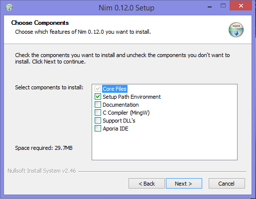
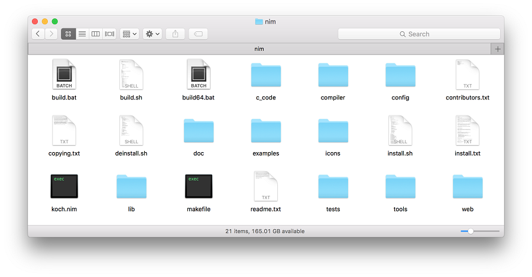
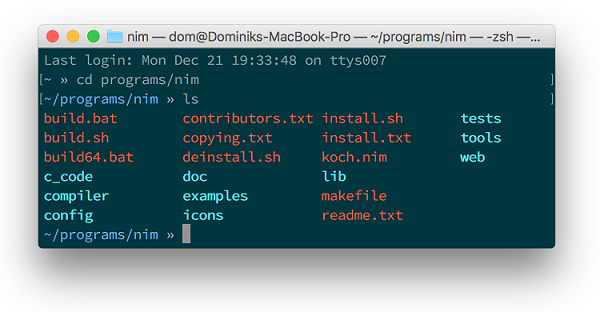
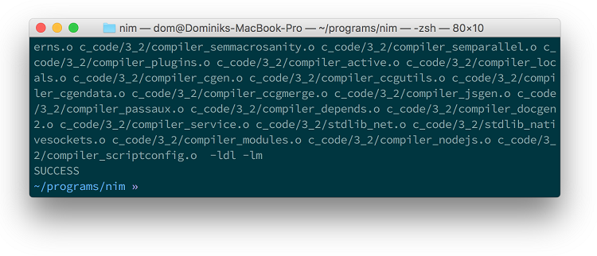
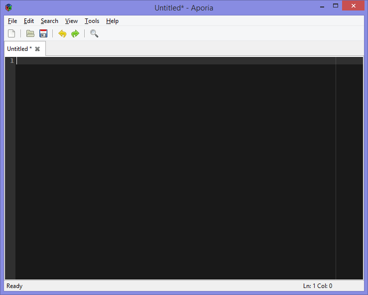

第二章 开始 Nim
==================

本章涵盖：

* 安装 Nim 和 Aporia IDE
* Nim基础知识
* 掌握控制流程
* 使用集合类型
* 处理异常
* 定义数据类型

本章开始时，您将设置 Nim 编译器和一些工具来帮助您编写 Nim 代码。然后，您将了解 Nim 的语法、过程、`for`循环和该语言的其他基本方面。请注意，这一章很长;它包含大量信息，让您尽可能多地体验语言。如果您已经知道某些部分，请随意跳过它们，例如，如果您已经设置了 Nim ，则可以跳过“设置环境”部分。

2.1 设置环境
------------

在开始编写 Nim 代码之前，您必须安装和设置 Nim 编译器。Nim 编译器是一种工具，可将 Nim 源代码转换为二进制格式，然后您的计算机可以执行该格式。它仅在开发过程中使用，因此应用程序的用户不需要它。

您也可以选择安装Nim IDE的Aporia。Aporia对于初学者来说是一个有用的工具，因为它允许他们轻松地编译和运行Nim代码，它也可以用作流行的源代码编辑器（如gEdit，SublimeText或Atom）的以Nim为中心的替代方案。

在以下各节中，您将学习如何安装 Nim 编译器和 Aporia IDE。然后，您将通过编译和执行 Hello World 示例来测试您设置的 Nim 开发环境。现在，拿起任何一台电脑，即使是树莓派也可以工作，[6] 跟我来吧！

2.1.1 安装 Nim 编译器
-------------------

有很多方法可以安装 Nim 编译器。对于Windows操作系统，Nim网站提供了一个安装向导，使安装过程变得容易。安装向导（仅限 Windows）子部分介绍了使用此向导安装 Nim 所需的步骤。对于Mac OS X，Linux和其他支持的操作系统，安装过程有点复杂。存档快照（所有平台）子部分介绍了在这些操作系统上安装 Nim 所需的步骤。

>注意 可能出现的问题
没有什么比无法安装某些东西更烦人的了。下面的安装说明是特别详细说明的，以确保您可以成功安装 Nim，但始终存在遇到麻烦的风险。随着Nim的发展，这些指令可能会过时。如果您遇到麻烦，请不要让这让您气馁。请查阅 Nim 网站 [7] 以获取最新的安装说明，以及在遇到问题时与我们联系的方法。

**安装向导（仅限 Windows）**

安装向导目前仅适用于 Windows。与许多典型的 Windows 安装向导一样，它会指导您逐步完成安装过程。除了 Nim 编译器本身之外，您还可以选择安装许多其他组件，包括：

* Nim文档
* 一个 C 编译器
* 支持应用程序代码
* Aporia IDE

除了 C 编译器之外，这些组件都是可选的。如果没有 C 编译器，Nim 编译器将无法工作。您可以选择要安装的组件。

**下载安装向导**

导航到位于以下URL的Nim下载页面：<http://nim-lang.org/download.html>。

下载页面上的二进制文件部分应列出两个安装程序。这些都是Windows安装程序，它们安装最新版本的Nim编译器和相关工具。下载页面包含指向 32 位和 64 位版本的 Windows 安装程序的链接。32 位版本适用于 32 位和 64 位版本的 Windows，如果您不确定操作系统支持的 CPU 架构，请选择它。

单击与您的操作系统架构匹配的 CPU 架构的下载链接。

**执行安装向导**

执行下载的可执行文件。应出现 Nim 安装向导。

单击标有“下一步”的按钮。您应该会看到一份许可协议。单击“我同意”按钮。然后，您将看到类似于图 2.3 中的组件列表。

图 2.1.安装向导可以安装的组件列表



我建议您选择所有这些组件。您必须选择“C编译器（MingW）”选项，除非您已经安装了 C 编译器。

>[警告]	外部 C 编译器
C 编译器非常重要。没有它，Nim编译器将无法正常工作。如果您已经安装了一个，那么您可能需要编辑 Nim 的配置文件才能使用它。通常最好让安装向导安装 C 编译器。	

选择要安装的组件后，单击“下一步”按钮。您可以选择安装目录等。单击“下一步”按钮，直到安装完成。

**验证安装是否成功**

然后，应验证安装是否成功。为此，请打开新的命令提示符。然后执行`nim -v` 。您应该会看到刚刚安装的 Nim 编译器版本以及其他信息。图 2.5 显示了它可能是什么样子的。

图 2.2.检查 Nim 编译器的版本


故障排除

如果收到错误，则可能需要将`nim.exe`文件所在的目录的文件路径`C:\Program Files\Nim\bin`添加到环境变量`PATH`中。

**将 Nim 添加到您的搜索路径`PATH`中**

您需要访问高级系统设置。您可以通过打开控制面板>系统和安全>系统来执行此操作。然后，您应该在左侧边栏中看到“高级系统设置”，单击它，应该会出现一个对话框。该对话框将包含一个“环境变量”按钮，该按钮将显示另一个对话框，允许您编辑环境变量`Path`。确保在“系统变量”或“用户变量”下编辑变量。确保添加的路径与其他路径用分号 `;` 分隔。

**其他问题**

如果将 Nim 编译器添加到环境变量`PATH`中没有帮助，请验证文件`nim.exe`是否位于添加到`PATH`.

如果你遇到困难，你总是可以在Nim论坛或IRC上获得更多帮助。有关详细信息，请查看获取帮助附录。

如果在安装过程中选择了“Aporia IDE”组件，则可以安全地跳过下面的安装 Aporia IDE 部分。假设您已成功安装 Nim。您现在可以开始开发 Nim 软件了！测试您的新开发环境部分将向您展示如何编译您的第一个 Nim 应用程序！

### 用压缩包存档安装（所有平台）

此安装方法适用于所有平台。它依赖于压缩的存档。此存档包含 C 源代码，该源代码是为特定版本的 Nim 编译器生成的。您将要做的是自己编译 Nim 编译器。这是目前必要的，因为适用于 Mac OS X 和 Linux 的预编译二进制文件不可用。

要编译 C 源代码，您需要在系统上安装 C 编译器。如果您还没有，则需要先安装一个。

**安装 C 编译器**

C 编译器的安装相当简单。推荐的 C 编译器及其安装过程因操作系统而异。

**Mac OS X**

Mac OS X 上推荐的 C 编译器是 clang。Clang可以通过两种方式安装。

如果您有自制软件，那么只需执行`brew install clang`即可安装`clang`。

否则，请按照下列步骤操作。

1.打开终端窗口。
2.执行`clang`或`gcc` .
3.应出现一个对话框，询问您是否要安装“命令行开发人员工具”。或者，您可以执行`xcode-select --install`.

单击安装按钮。等待安装完成，然后通过执行 `clang --version` 来验证安装是否成功。

**Linux目录**

您很可能已经安装了 C 编译器。在尝试安装之前，可以通过运行`gcc --version` 或 `clang --version` 来验证这一点。

推荐用于Linux的C编译器是GCC。安装说明取决于发行版的包管理器。

在基于 yum 的发行版上，您应该能够执行`sudo yum install gcc`以安装 `GCC`。

在基于 Debian 的发行版上，您可以像这样执行：`apt-getsudo apt-get install gcc`。

安装完成后，请确保通过执行`gcc --version`,来验证安装是否成功。

**Windows**

在 Windows 上安装 C 编译器的最简单方法是使用前面提到的 Nim 安装向导。如果失败，您可以通过安装此处提供的MinGW软件包来手动安装GCC：<http://www.mingw.org/>。

**下载 Nim 编译器压缩存档**

安装工作 C 编译器后。是时候下载最新版本的 Nim 编译器的 C 源代码了。

导航到 Nim 下载页面并向下滚动，直到看到为 Linux 和 Mac OS X 生成的 C 源代码的下载链接。

您可能会看到两个下载链接，其中一个是zip存档，另一个是tar.xz存档。如果您不确定选择哪一个，请下载zip存档。

**解压缩文件并将其移动到方便的位置**

下载完成后，解压缩存档。您应该能够简单地双击操作系统文件管理器中的zip存档即可将其解压缩。

您应该会看到一个包含属于Nim编译器的文件的文件夹。此文件夹的名称可能为`nim-<ver>`。其中`＜ver＞`是您下载的Nim编译器的版本。例如`nim-0.12.0`。

将Nim文件夹移至安全位置。在您希望安装它的地方。例如`~/profiles/nim`。

`nim`目录应类似于*图2.7*。

图2.3.从存档中提取`nim`目录后




**编译 Nim 编译器**

现在打开一个终端。使用`cd`命令导航到`nim`目录，例如`cd ~/programs/nim` 。您的终端应类似于图 2.8 中的终端。

图 2.4.导航到`/home/dom/programs/nim`后的终端



您现在可以构建 Nim 编译器。执行其中一个`build`脚本。`build.bat`和`build64.bat`脚本适用于 Windows，`build.sh`脚本适用于所有其他操作系统。要执行`build.sh`脚本，只需在终端中键入`build.sh`即可。

根据计算机的CPU运算能力，可能需要一些时间。但是，除非你在1995年的IBM NetVista上编译Nim，否则它应该不会超过一分钟。

编译成功后，您应该在终端底部看到成功。与图 2.9 类似。

图 2.5.编译成功



>提示 获取帮助 
编译失败了吗？您还有其他问题吗？有很多方法可以获得帮助。最简单的方法之一是在Nim论坛或IRC上提问。有关详细信息，请参阅获取帮助附录。

该`bin`目录现在应包含一个二进制`nim`文件。但是安装尚未完成。

**将 Nim 添加到您的路径**

为了使`nim`二进制文件对其他应用程序（如终端）可见,您需要将`bin`目录添加到`PATH`中。在我上面的示例中，您需要添加的路径是`/Users/dom/products/nim/bin`，因为我的用户名是`dom`。

>注意 Linux上的`~`
请记住，在Linux上，`~`扩展为`/home/<your_username>`，上面的示例也适用于`Mac OS X`


> 提示 如何将 Nim 添加到您的`PATH` 
> **Windows**
有关 Windows 的说明，请参阅安装向导（仅限 Windows）部分。
> **Mac OS X**
在 Mac OS X 上，有多种方法编辑 PATH. 您可以打开 `/etc/paths` 文件 (作为 root用户使用 `sudo nano /etc/paths` 或者使用你喜欢的编辑器。) ，您可以编辑 `~/.profile`文件 并添加 `export PATH=$PATH:/home/user/path/to/Nim/bin` 到底部. 
>**Linux**
如果您希望更改是系统范围的路径，修改`/etc/profile` 文件. 要是更改当前用户的路径，可以修改 `~/.profile`文件。 在这两种情况下，您都应该添加`export PATH=$PATH:/home/user/path/to/Nim/bin` 到这些文件的底部。

**验证安装是否成功**

通过打开新的终端窗口并执行 `nim -v` 来确保已成功完成这些步骤。输出应类似于以下内容：


```bash
Nim Compiler Version 0.14.2 (2016-08-09) [MacOSX: amd64]
Copyright (c) 2006-2016 by Andreas Rumpf

git hash: e56da28bcf66f2ce68446b4422f887799d7b6c61
active boot switches: -d:release
```


假设您已成功安装 Nim。您现在可以开始开发 Nim 软件了！在测试新的开发环境之前，您可以选择安装 Aporia IDE，下一节将介绍安装它的过程。如果您想使用其他 IDE 或文本编辑器编写 Nim 代码，则可以选择跳过此操作。测试您的新开发环境部分将向您展示如何编译您的第一个 Nim 应用程序！

2.1.2 安装 Aporia IDE
--------------------

图 2.6.Aporia主窗口




Aporia的安装是完全可选的，但我强烈建议使用它。Aporia与Nim编译器集成，因此它使Nim的实验更容易。使用Aporia，您将能够通过按键盘上的F5键来编译和运行Nim源代码。在本节的后面，您还将学习如何使用命令行编译 Nim 源代码，因此使用不同的源代码编辑器不会错过。

Aporia的版本可以从GitHub下载，您可以在以下URL找到有关如何在操作系统上安装它的详细说明：https://github.com/nim-lang/Aporia#readme 如果您已经使用了Windows安装程序，那么您可能已经安装了Aporia。

2.1.3 测试新的开发环境
--------------------

现在，您应该已经设置了一个基本的 Nim 开发环境。此设置应包括 Nim 编译器，并且还可能包括 Aporia 或支持 Nim 语法突出显示的其他源代码编辑器。

让我们用我们的第一个 Nim 程序测试我们的新环境：`Hello World！`

打开您选择的源代码编辑器并键入以下简短的代码段。

清单 2.1.世界您好
```nim
echo "Hello World!"
```
现在将文件另存为`hello.nim` .然后在包含您刚刚保存，并在当前目录中打开一个新终端。
```
nim c -r hello.nim
```

**Nim命令语法**

Nim 命令语法采用`nim command [options] projectFile.nim` 的形式，其中  `options` 是可选的。一些常见的命令包括：
|   命令  |   描述   |
|--------|----------|
| `c`, `compile` | 使用默认(`C`)后端将`projectFile.nim`及其所有依赖项编译为可执行文件。 |
| `cpp` | 使用 C++ 后端编译 `projectFile.nim`及其所有依赖项。结果是可执行文件。 |
| `js` | 使用 JavaScript 后端编译  `projectFile.nim`及其所有依赖项。结果是一个 JavaScript 文件。 |
| `check` | 分析`projectFile.nim`文件并检查其错误。显示发现的所有错误。|

对于完整列表，请执行 `nim --help`和`nim --advanced`。使用 C/C++ 进行编译时，传入`-r`标志的后端将在编译后运行生成的可执行文件。此可执行文件的参数可以在`projectFile.nim`参数之后传递：` arg1 arg2`。

>提示 Aporia 
在 Aporia 中，您只需按 F5 即可编译并运行程序。您甚至不必手动保存它！

此命令将编译您编写的文件`hello.nim`，生成一个全新的二进制文件作为输出。实际上，`c`子命令代表`compile` .编译完成后，`-r`将执行二进制文件。如果您指定了代表`run`的选项，则 Nim 编译器会自动执行此操作。

在这一点上，如果您已经按照这些步骤自己执行了这些步骤（我强烈建议您这样做！），您可能想知道如何处理所有这些输出到屏幕的消息。这些消息来自 Nim 编译器。默认情况下，Nim 编译器将显示有关它当前正在处理哪些模块的信息，以通知您进度。其他信息包括由源代码触发的警告、错误和其他消息。清单 2.2 显示了来自 Nim 编译器的注释输出示例。

清单 2.2.编译器输出

```
config/nim.cfg(54, 3) Hint: added path: '~/.nimble/pkgs/' [Path]   ❶
Hint: used config file '~/nim/config/nim.cfg' [Conf]   ❷
Hint: system [Processing]   ❸
Hint: hello [Processing]
CC: hello   ❹
CC: stdlib_system
[Linking]
Hint: operation successful (9407 lines compiled; 1.434 sec total; 14.143MB; Debug Build) [SuccessX]
/Users/dominikp/nim-in-action/examples/hello   ❺
Hello World!   ❻
```

>❶	编译器已将 Nimble 包添加到其模块搜索路径中
❷	编译器使用的配置文件位于`~/nim/config/nim.cfg`
❸	编译器正在解析并将`system`模块编译为`C` 
❹	编译器正在使用 C 编译器将模块编译为二进制格式`hello`
❺	编译器正在执行位于该文件路径上的结果二进制文件
❻	生成的二进制文件执行的输出

您可能会对Hello World示例的简短程度感到惊讶。与 C 等其他编程语言相比，Nim 不需要`main`函数，这大大减少了此示例所需的代码量。在 Nim 中，顶级语句从文件的顶部到底部逐个执行。

>[警告]	性能
通常，顶级main语句更难针对编译器进行优化。为了获得最佳性能，请使用过程并使用标志`-d:release`进行编译。

恭喜你现在开始了！您已成功编写第一个 Nim 应用程序。但更重要的是，您已经成功设置了一个 Nim 开发环境，现在可以开始学习 Nim 编程语言的基础知识了。

>注意 获取帮助
如果您遇到麻烦，请查看附录 A：获取帮助。

[6] 说真的，请不要使用 Raspberry Pi 进行开发。
[7] http://nim-lang.org/

2.2 Nim语法
-------------

编程语言的语法是一组规则，用于控制该编程语言中的程序的编写方式。在上一节中，您略微了解了 *清单2.1Hello World* 中的 Nim 语法 。

大多数语言在语法方面有许多相似之处。对于C语言家族尤其如此，它们恰好也是最受欢迎的。如此之多，以至于4种最流行的编程语言从C中汲取了大量的语法灵感.[8]另一方面，Nim的语法与C语言家族有很大不同。Nim的目标是高度可读，因此它经常使用关键字而不是标点符号。这使得 Nim 与 Python 和 Pascal 非常相似，这正是 Nim 语法的大部分灵感来源。

在本节中，我将教您 Nim 语法的基础知识。学习语法是非常重要的第一步，因为它教会了你编写 Nim 代码的具体方法。

2.2.1 关键字
-------------

大多数编程语言都有一个关键字的概念，Nim也不例外。关键字是与之相关的具有特殊含义的单词;当它在特定上下文中使用时。因此，您不得在源代码中将这些单词用作标识符。

>提示 转义 [Todo]
您可以通过使用*stropping*来克服此限制，请参阅*定义变量和其他存储*以了解更多信息

从版本 0.12.0 开始，Nim 有 70 个关键字。[9] 这听起来可能很多，但你必须记住，你不会使用其中的大多数。这是因为其中一些还没有意义，但保留给该语言的未来版本，而另一些则有次要的用例。

最常用的关键字允许您：

* 指定条件分支
* 定义变量、过程和类型
* 处理代码中的运行时错误

允许此操作的关键字包括`if`, `case`, `of`, `var`, `let`, `proc`, `type`, `object`, `try`, `except` 等。您将在本书的后续部分中确切地了解这些关键字的含义以及如何使用它们。有关关键字的完整列表，请参阅 http://nim-lang.org/docs/manual.html#lexical-analysis-identifiers-keywords 提供的 Nim 手册。

2.2.2 缩进
------------

许多程序员缩进他们的代码以使程序的结构更加明显。在大多数编程语言中，这不是必需的，仅作为代码的人类阅读者的帮助。在这些语言中，关键字和标点符号通常用于分隔代码块。在 Nim 中，就像在 Python 中一样，缩进本身用于分隔代码块。

让我给你一个简单的例子来证明其中的区别。以下 3 个分别用 C、Ruby 和 Nim 编写的代码示例都做同样的事情。但请注意代码块的不同分隔方式。

清单 2.3.C
```c
if (42 >= 0) {
  printf("42 is greater than 0");
}
```
清单 2.4.Ruby
```ruby
if 42 >= 0
  puts "42 is greater than 0"
end
```
清单 2.5.Nim
```nim
if 42 >= 0:
  echo "42 is greater than 0"
```

如您所见，C 使用大括号来分隔代码块，Ruby 使用`end`关键字，而 Nim 使用缩进。Nim 还在缩进开始之前的行中使用冒号字符。这对于 `if` 语句和许多其他语句都是必需的。但是，随着您继续了解 Nim，您会发现并非所有启动缩进代码块的语句都需要冒号字符。

还要注意清单 2.3 C中分号的使用。在某些编程语言中，每行末尾都需要这样做。同样，大多数 C 语言家族都需要这样做。它告诉编译器一行代码的结束位置。这意味着您可以让单个语句跨多行，也可以让多个语句跨同一行。在 C 中，您将分别实现这两个目标，如下所示：

```c
printf("The output is: %d",
  0);
printf("Hello"); printf("World");
```

Nim没有这个要求。分号是可选的，可用于在一行上编写两个语句。将单个语句跨越多行有点复杂，您只能在标点符号后拆分语句，并且下一行必须缩进。例如：

```nim
echo("Output: ",    ❶
  5)
echo(5 +            ❶
  5)

echo(5              ❷
  + 5)
echo(5 +
1)                  ❷
```

>❶	这两个语句都是正确的，因为它们在标点符号之后被拆分，下一行已经缩进。
❷	此语句在标点符号之前被错误地拆分。
❸	拆分后，此语句已错误地缩进。

因为缩进在 Nim 中很重要，所以你需要在其样式上保持一致。该约定规定所有 Nim 代码都应缩进 2 个空格。Nim 编译器目前不允许使用制表符，因为空格和制表符的不可避免的混合会产生不利影响，尤其是在空格显著的编程语言中。

2.2.3 注释
-----------
代码中的注释非常重要。因为它们允许您为代码段添加其他含义。Nim中的注释是使用哈希字符`#`编写的。哈希字符后面的任何内容都将是注释，直到新行的开头。可以通过`#[`和`]#`创建多行注释，也可以使用`when false:`禁用代码。例如：

```nim
# Single line comment
#[
Multi line comment
]#
when false:
  echo("Commented out code")
```

前一种类型的多行注释可用于注释掉文本和代码。后者只应用于注释掉代码。编译器仍将分析代码并确保代码在语法上仍然有效，但代码不会包含在生成的程序中。这是因为编译器在编译时检查`when`语句。

[8] TIOBE指数，http://www.tiobe.com/index.php/content/paperinfo/tpci/index.html

[9] Nim关键词，http://nim-lang.org/docs/manual.html#lexical-analysis-identifiers-keywords

2.3 Nim基础知识
-------------

现在你已经对 Nim 语法有了基本的了解，你已经为学习 Nim 的一些语义打下了良好的基础。在本节中，您将学习每个Nim程序员每天使用的一些基本知识。您将了解 Nim 中最常用的静态类型、可变和不可变变量的详细信息，以及如何通过定义过程将常用代码分离到独立的单元中。

2.3.1 基本类型
-------------

Nim 是一种静态类型的编程语言。这意味着 Nim 中的每个标识符在编译时都有一个与之关联的类型。编译 Nim 程序时，编译器会确保您的代码是类型安全的。如果不是，则编译终止，编译器输出错误。这与动态类型编程语言（如 Ruby）形成对比，后者只能确保代码在运行时是类型安全的。

按照惯例，类型名称以大写字母开头。内置类型不遵循此约定，因此通过检查内置类型和用户定义类型名称大小写的第一个字母，可以轻松地区分内置类型和用户定义类型。Nim 支持许多内置类型，包括用于处理 C 外部函数接口的类型。我不会在这里介绍所有这些，但在本书的后面和本章中，我将教你有关高级内置类型的知识。

>说明 外函数接口(FFI)
外部函数接口允许我们使用用其他编程语言编写的库。Nim 包括 C 和 C++ 原生的类型。这涵盖了广泛的库，因为其中许多库都是用 C 或 C++ 编写的。

大多数内置类型都是在 `system` 模块中定义的，该模块会自动导入到源代码中。您可以限定这些类型，例如，像这样`system.int`，但您不必这样做。

>提示 模块
模块是使用关键字``import``导入的，您将在本书后面了解有关模块的更多信息。

表 2.1.基本类型

| 类型 | 描述和用途 |
|-----|----------|
|int | 整数类型是用于整数的类型，例如52 。|
|float |float是用于带小数点的数字的类型，例如2.5 。|
|string	|用于存储多个字符的类型，通过将多个字符放在双引号内来创建字符串文本，例如："Nim is awesome"。|
|bool	|布尔类型存储两个值之一，要么true或者false。|
|char	|字符类型存储单个 ASCII 字符，字符是通过将字符放在单引号内来创建的，例如。'A'|

**整数**

整数类型表示没有小数分量的数值数据，即整数。此类型可以存储的数据量是有限的，因此在 Nim 中有多个版本，每个版本都适合不同的大小要求。Nim 中的主要整数类型是`int`，它是您应该在 Nim 程序中最常用的类型。

表 2.2.整数类型

|类型	| 大小 |	范围 |	描述 |
|-----|-----|------|------|
| `int` | 取决于体系结构。32 位系统上为32位，64位系统上为64位 | **32bit:** `-2,147,483,648` 至 `2,147,483,647` **64bit:** `-9,223,372,036,854,775,808` 至 `9,223,372,036,854,775,807` | 通用有符号的两种补码整数。通常，您应该在大多数程序中使用此类型 |
| `int8` `int16` `int32` `int64` | 8 bit 16 bit 32 bit 64 bit | `-128` 至 `127` `-32768` 至 `32767` `-2,147,483,648` 至 `2,147,483,647` `-9,223,372,036,854,775,808` 至 `9,223,372,036,854,775,807` | 有符号的补码整数。如果要明确数据的大小要求，可以使用这些类型。 |
| `uint` | 取决于体系结构。32位系统上为32位，64位系统上为64位 | **32 bit:** `0` 至 `4,294,967,295` **64 bit:** `0` 至 `18,446,744,073,709,551,615` | 通用无符号整数。 |
| `uint8` `uint16` `uint32` `uint64` | 8 bit 16 bit 32 bit 64 bit | `0` 至 `255` `0` 至 `65,535` `0` 至 `4,294,967,295` `0` 至 `18,446,744,073,709,551,615` | 无符号整数。如果要明确数据的大小要求，可以使用这些类型 |

Nim 中的整数文字可以使用十进制、八进制、十六进制或二进制表示法表示。

清单 2.6.整数
```nim
let decimal = 42
let hex = 0x42
let octal = 0o42
let binary = 0b101010
```

上面的示例定义了4个整数变量。它使用4种不同的整数字面量格式为它们中的每一个分配不同的整数文字。我没有为我定义的任何变量指定类型。Nim编译器将根据我指定的整数字面量推断正确的类型。在这种情况下，所有变量的类型都为`int`。编译器通过查看整数字面量的大小来确定要使用的整数类型。如果整数字面量超过32位范围，则类型为`int64`，否则为`int`。如果要为变量使用特定的整数类型，该怎么办？有多种方法可以实现这一点。例如：

```nim
let a: int16 = 42   ❶
let b = 42'i8   ❷
```
❶ 显式声明数` a `为类型`int16`。
❷	使用类型后缀指定整数字面量的类型。
 

>[警告]	整数大小
显式使用小整数类型（例如`int8`）可能会导致编译时，或者在某些情况下会导致运行时错误。查看上面的范围，了解整数的大小可以适合哪种整数类型，您应该注意不要尝试分配大于或小于类型可以容纳的整数。

Nim支持所有整数类型的类型后缀，包括有符号和无符号。格式为`X`，其中`X`是有符号整数的大小，`X`中X是无符号整数的尺寸。[注10]

**浮点类型**

浮点类型表示具有分数分量的数值数据的近似值。Nim 中的主要浮点类型是`float`。

清单 2.7.浮点数
```nim
let a = 1'f32
let b = 1.0e19
```

编译器将对浮点字面量隐式使用`float`类型。可以使用类型后缀指定文本的类型。与整数类型类似，浮点有两个类型后缀，分别对应于可用的浮点类型：`f32`和`f64`分别对应于`float32`和`float64`。指数也可以在数字之后指定。示例中的变量`b`将等于`1x10^19`（1乘以10的19次方）。

**布尔值**

布尔类型表示两个值之一：通常是` true `或` false `值。在 Nim 中，布尔类型称为`bool` 。

清单 2.8.布尔

```nim
let a = false
let b = true
```

布尔值的`false`和`true`值必须以小写开头。

**字符**

字符类型表示单个字符。在Nim中，字符类型称为`char`，它不能表示UTF-8字符，而是编码ASCII字符。因为这个`char`实际上只是一个数字。

Nim中的文字是用引号括起来的单个字符。该字符也可以是由`\`反斜杠引入的转义序列。

清单 2.9.字符

```nim
let a = 'A'
let b = '\109'
let c = '\x79'
```

>提示 Unicode
`unicode`模块包含一个`Rune`类型，可以容纳任何`unicode`字符。

表 2.3.常见字符转义序列

| 转义字符 | 结果 |
|--|--|
| `\r`, `\c` | 回车 |
| `\l` | 换行符 |
| `\t` | 制表符 |
| `\\` | 反斜线 |
| `\'` | 单引号 |
| `\"` | 引号 |


>[警告]	换行转义符
换行符`\n`不允许出现在字符文本中，因为在某些平台上它可能由多个字符组成。在Windows上，它是`r\l`（回车后跟换行符），而在Linux上，它只是`\l`（换行符）。显式指定所需的字符，例如`'\r'`以获取回车符，或使用字符串。

**字符串**

字符串类型表示一系列字符。在 Nim 中，字符串类型称为`string` ，它是一个以`'\0'`结尾的字符列表。字符串类型还存储其长度。Nim 中的字符串支持 UTF-8，但为了处理 UTF-8 文本，应使用`unicode`模块。

有多种方法可以定义字符串文本。

```nim
let text = "The book title is \"Nim in Action\""
```
以这种方式定义字符串文字时，必须对其中的某些字符进行转义。例如，双引号字符(`"`)应转义为`\"`，反斜杠字符 (`\`) 转义为`\\`。字符串文字支持与字符文字支持的相同的字符转义序列，请参见上表以获得常见字符转义序列的列表。字符串文字支持的一个主要的附加转义序列是 `\n`，它生成换行符，生成的实际字符取决于平台。

需要转义一些字符会使一些事情变得乏味。一个例子是Windows文件路径：

```nim
let filepath = "C:\\Program Files\\Nim"
```
Nim支持不需要转义序列的原始字符串文本。除了双引号字符 `"` （仍需要转义为 `""`）之外，放在原始字符串文字中的任何字符都将逐字存储在字符串中。原始字符串文字是一个前面有 `r` 的字符串文字：

```nim
let filepath = r"C:\Program Files\Nim"
```

也可以使用三引号字符串文本指定多行字符串。

```nim
let multiLine = """foo
  bar
  baz
"""
echo multiLine
```

清单 2.10.输出

```bash
foo
  bar
  baz
```

这些字符串文本可以包含任何字符，包括没有任何转义序列的双引号字符。三引号字符串文本括在三个双引号字符之间，因此字符串文本可能不会将双引号字符重复 3 次。无法在三引号字符串文本中包含 3 个双引号字符。

添加到定义变量的字符串文本的缩进会导致前导空格出现在每行的开头。这可以通过使用该过程轻松修复，它存在于模块中，因此您必须首先导入它。multiLineunindentstrutils

```nim
import strutils
let multiLine = """foo
  bar
  baz
"""
echo multiLine.unindent
```

清单 2.11.输出

```
foo
bar
baz
```

2.3.2 定义变量和其他存储
--------------------

您已经看到了上一节中如何使用` let `关键字定义存储的一些示例，当时我向您展示了 Nim 支持的许多文字中的一些。Nim的存储是使用 3 个不同的关键字定义的。除了您已经看到使用的关键字` let `之外，您还可以使用` const `和` var `来定义存储。

```
let number = 10
```

通过使用`let`关键字，您将创建所谓的**不可变变量**，一个只能分配给一次的变量。在上面的例子中，创建了一个名为`number`的新不可变变量，标识符绑定到值`10` .如果尝试为此变量分配不同的值，程序将不会编译：

清单 2.12. `numbers.nim`文件

```
let number = 10
number = 4000
```

清单 2.13. `numbers.nim`输出

```bash
numbers.nim(2, 1) Error: 'number' cannot be assigned to
```

Nim 还支持使用`var`关键字的可变变量。如果您打算更改变量的值，请使用它们。上面的示例可以通过将关键字`let`替换为关键字`var`来修复。

```nim
var number = 10
number = 4000
```

在这两个示例中，编译器将根据分配给`number`变量的值推断其类型。在这种情况下，`number`将是`int`。您可以通过在变量名后面写入类型并用冒号字符(`:`)分隔来显式指定类型。通过这样做，您可以省略赋值，这在定义变量时不想为变量赋值时非常有用。

>[警告]	不可变变量
不可变变量在定义时必须赋值，因为它们的值不能更改。这包括`const`和`let`定义的变量。

```nim
var number: int
```

变量的初始值将始终为二进制零，这将根据类型以不同的方式显示。例如，默认情况下，整数为`0`，字符串为`nil`,`nil`是一个特殊的值，它表示没有任何引用类型的值，稍后将对此进行详细介绍。在上面的示例中，`number`将为`0`，因为它是一个整数。

变量的类型不能更改。例如，将`string`分配给`int`变量将导致编译时错误：

清单2.14.`typeMismatch.nim`文件

```nim
var number = 10
number = "error"
```

清单 2.15.输出

```
typeMismatch.nim(2, 10) Error: type mismatch: got (string) but expected 'int'
```

Nim 也支持常量。由于常量的值也是不可变的，因此常量类似于使用` let `定义的不可变变量。但是 Nim 常量在一个重要方面有所不同：它们的值在编译时必须是可计算的。

清单 2.16.常量示例

```
proc fillString(): string =
  result = ""
  echo("Generating string")
  for i in 0 .. 4:
    result.add($i)

const count = fillString()
```

>提示 proc 过程
不要担心还不了解Nim中的程序细节。您将在下一小节中介绍它们。

上面示例中的`fillString`过程将生成一个新字符串，等于`01234`。然后将为常量`count`分配此字符串。

我在`fillString`主体的顶部添加了`echo`，以便向您显示它是在编译时执行的。尝试使用Aporia或在终端中执行`nim c file.nim`来编译示例。您将在输出中看到`"Generating string"`。运行二进制文件将永远不会显示该消息，因为`fillString`过程的结果嵌入其中。

为了生成常量的值，Nim编译器必须在编译时执行`fillString`过程。您必须意识到，并非所有代码都可以在编译时执行。例如，如果编译时过程使用FFI，您将发现编译器将输出类似于`Error: cannot 'importc' variable at compile time`的错误。

使用常量的主要好处是效率。编译器可以在编译时为您计算值，从而节省原本会在程序运行时花费的时间。明显的缺点是编译时间较长，但也可能是更大的可执行文件大小。与许多事情一样，您必须为您的用例找到适当的平衡。Nim 为您提供了工具，但您必须负责任地使用它们。[注11]

您还可以在同一个`var`、`let`或`const`关键字下指定多个变量定义。要执行此操作，请在关键字后添加新行，并在下一行缩进标识符：

```nim
var
  text = "hello"
  number: int = 10
  isTrue = false
```

变量的标识符是其名称。它可以包含任何字符，只要名称不以数字开头且不包含两个连续的下划线即可。这适用于所有标识符，包括过程和类型名称。标识符甚至可以使用 unicode 字符：

```nim
var 火 = "Fire"
let ogień = true
```

**关键字转换**

正如您在*Nim语法*部分中所记得的，Nim中有一些标识符是保留的。这些标识符被称为“关键字”，因为它们具有特殊的含义，所以不能用作变量、类型或过程的名称。

为了绕过此限制，您可以选择其他名称，或使用反引号 **`** 显式标记标识符。后者称为转换。下面的列表显示了如何使用它。

```nim
var `var` = "Hello"
echo(`var`)
```

关键字括在反引号中，允许定义具有该`var`名称的变量。

与许多其他编程语言不同，Nim 中的标识符不区分大小写，标识符的第一个字母除外。这是为了帮助区分变量名（必须以小写字母开头）和类型名称（必须以大写字母开头）。

Nim中的标识符也是“不区分样式”的，这使得写在`camelCase`中的标识符等同于写在`snake_case`中的标识。实现这一点的方法是忽略标识符中的下划线字符，因此`fooBar`等同于`foo_bar`。您可以自由地以您喜欢的任何样式编写标识符，即使它们是以不同的样式定义的。如果您想遵循Nim的风格惯例，那么对变量和过程使用`camelCase`，对类型使用`PascalCase`。

2.3.3 `proc`过程定义
-------------

过程允许您将程序分成不同的代码单元。通常，过程包含执行单个任务的代码。被赋予一些输入数据，通常以一个或多个参数的形式。

在本节中，我们将探讨 Nim 中的过程。在其他编程语言中，过程可能被称为函数、方法或子例程。每种编程语言都赋予这些术语不同的含义，Nim 也不例外。Nim 中的过程可以使用关键字`proc`定义，`=` 后跟过程名称、参数、可选返回类型和过程主体。图 2.11 显示了 Nim 过程定义的语法。

图 2.7.Nim 过程定义的语法


图2.11中名为`myProc`的过程接受一个`string`类型的参数`name`，并返回一个"字符串"类型的值。过程体隐式返回字符串文本`Hello`和参数`name`的连接。

调用过程的方法是将过程的名称写在括号后面：`myProc("Dominik")`。可以在括号内指定任何参数。使用`Dominik`参数调用`myProc`过程将导致返回字符串`Hello Dominik`。

每当调用具有返回值的过程时，必须以某种方式使用其结果。

```nim
proc myProc(name: string): string = "Hello " & name
myProc("Dominik")
```

编译上述示例将导致错误：`file.nim(2, 7) Error: value of type 'string' has to be discarded`。由于`myProc`过程返回的值被隐式丢弃，因此会发生此错误。在大多数情况下，忽略过程的结果是代码中的错误，结果可能会描述发生的错误或给您一条重要信息。您可能希望对结果执行某些操作，例如将其存储在变量中或通过调用将其传递给另一个过程。如果您确实不想对过程的结果执行任何操作，可以使用`discard`关键字告诉编译器保持安静：

```nim
proc myProc(name: string): string = "Hello " & name
discard myProc("Dominik")
```

>[警告] 过程的顺序
需要注意的是，过程和过程调用的顺序很重要。当调用一个过程时，它必须在调用过程之前定义，如上面的示例所示。这可能会在Nim的未来版本中改变。

关键字`discard`只是让编译器知道您很乐意忽略该过程返回的值。

当过程不返回任何值时，可以省略返回类型。在这种情况下，该过程被称为返回`void`。下面是不返回任何值的编写过程的两个示例：

```nim
proc noReturn() = echo("Hello")
proc noReturn2(): void = echo("Hello")
```

避免在过程定义中编写多余的`void`是一种习惯做法。特殊的`void`类型在其他上下文中很有用，例如您将在*第9章*中了解的泛型。

Nim 允许您进一步减少不必要的语法。如果过程不带任何参数，则可以省略括号：

```nim
proc noReturn = echo("Hello")
```

**从过程返回值**

在本节的前面，我已经提到`myProc`过程的主体隐式返回字符串值，因为没有使用`return`关键字，所以它是隐式的。

过程体可以包含多个语句，用分号或换行符分隔。如果过程的最后一个表达式具有与其关联的非空值，则该表达式将从该过程隐式返回。如果愿意，您可以始终使用`return`关键字作为过程的最后一条语句，但这样做不是惯用的或必要的。`return`关键字对于过程的早期返回仍然是必需的。下面的代码列表显示了从过程返回值的不同示例。

```nim
proc implicit: string =
  "I will be returned"

proc discarded: string =
  discard "I will not be returned"

proc explicit: string =
  return "I will be returned"

proc resultVar: string =
  result = "I will be returned"

proc resultVar2: string =
  result = ""
  result.add("I will be ")
  result.add("returned")

proc resultVar3: string =
  result = "I am the result"
  "I will cause an error"

assert implicit() == "I will be returned"
assert discarded() == nil
assert explicit() == "I will be returned"
assert resultVar() == "I will be returned"
assert resultVar2() == "I will be returned"
# resultVar3 does not compile!
```

>注意 断言
上面的代码列表使用`assert`向您显示在调用每个已定义过程时应该得到的输出。在本书后面的章节中，当需要测试代码时，您将了解有关`assert`的更多信息。

就像变量的默认值一样，默认情况下，过程的返回值将为二进制零。Nim 实际上支持许多不同的方法来设置返回值，您可以自由组合它们。

每个返回类型不是`void`的过程都在其主体内隐式声明了一个`result`变量。此`result`变量是可变的，其类型与过程的返回类型相同。它可以像任何其他变量一样使用。两个不同的`resultVar`过程显示了如何利用此变量的一些示例。您应该尽可能使用它，而不是定义自己的变量，然后显式返回它。

组合隐式返回和`result`变量的使用时存在一些限制。这些限制可防止出现歧义。在`resultVar3`过程中，应该返回什么，最后一个表达式还是分配了`result`的值，编译器不会为您选择，它只是告诉您通过显示错误来纠正歧义。

到目前为止，我一直在明确指定过程的返回类型。您可能还记得，这对于变量定义是不必要的。还可以要求编译器为您推断过程的返回类型。为此，您需要使用`auto`类型。

```nim
proc message(recipient: string): auto =
  "Hello " & recipient

assert message("Dom") == "Hello Dom"
```

虽然这很方便，但应尽可能显式指定类型。这使您和其他人可以更轻松地确定过程的返回类型，而无需了解过程的正文。

>[警告]	类型推断
过程的类型推断在 Nim 中仍然有点实验性。您可能会发现它在某些情况下受到限制，特别是如果您习惯于更高级的类型推断形式，例如 Haskell 或 OCaml 中的类型推断形式。

**过程参数**

可以通过以下方式定义具有多个参数的过程，列出参数并使用逗号字符分隔它们。

```nim
proc max(a: int, b: int): int =
  if a > b: a else: b

assert max(5, 10) == 10
```

如果连续指定参数类型，则无需重复参数类型：

```nim
proc max(a, b: int): int =
  if a > b: a else: b
```

默认参数可用于请求参数，这些参数可以选择在调用站点指定。默认参数是通过使用等于字符为参数赋值来引入的，在这种情况下也可以省略类型：

```nim
proc genHello(name: string, surname = "Doe"): string =
  "Hello " & name & " " & surname

assert genHello("Peter") == "Hello Peter Doe"              ❶
assert genHello("Peter", "Smith") == "Hello Peter Smith"   ❷
```

>❶	在这种情况下，使用参数`surname`的默认值。
❷	在这种情况下，默认值将被字符串文本`"Smith"`覆盖。

可以使用以下类型指定采用`varargs`可变数量参数的过程：
```nim
proc genHello(names: varargs[string]): string =
  result = ""          ❶
  for name in names:   ❷
    result.add("Hello " & name & "\n")   ❸

assert genHello("John", "Bob") == "Hello John\nHello Bob\n"
```

>❶	使用新字符串初始化结果变量。
❷	循环访问每个参数。您将在“控制流程”部分中了解有关` for `循环的更多信息。
❸	将与当前参数和换行符连接的字符串`"Hello"`添加到变量`result`中。

**proc 过程重载**

重载过程的行为是您可能尚未遇到过的功能，但在 Nim 中常用。过程重载是定义具有相同名称的过程的不同实现的能力。其中每个过程共享相同的名称，但接受不同的参数。根据传递给过程的参数，编译器会选择适当的参数。

例如，考虑`getUserCity`过程。它可能需要两个参数：`firstName`和`lastName`。

```nim
proc getUserCity(firstName, lastName: string): string =
  case firstName
  of "Damien": return "Tokyo"
  of "Alex": return "New York"
  else: return "Unknown"
```

>注意 `Case` 语句
`Case`语句对您来说可能仍然是新的，稍后将在[2.5 控制流程]部分中进行说明。

这种过程可用于根据指定的名称从数据库中检索一个人的居住城市。您可能还希望提供替代方案，例如 ID 号等更独特的内容。为此，您可以像这样重载`getUserCity`过程：

```nim
proc getUserCity(userID: int): string =
  case userID
  of 1: return "Tokyo"
  of 2: return "New York"
  else: return "Unknown"
```

这样，您可以重用名称，但仍可以使用不同的实现。如下所示：

```nim
doAssert getUserCity("Damien", "Lundi") == "Tokyo"
doAssert getUserCity(2) == "New York
```

**匿名过程**

有时，您可能希望将过程作为参数传递给其他过程。为此，您可以在调用站点创建一个过程，并将其传递给您正在调用的过程。下面的代码清单演示如何完成此操作。

```nim
import sequtils
let numbers = @[1, 2, 3, 4, 5, 6]   ❶
let odd = filter(numbers, **proc (x: int): bool = x mod 2 != 0**)   ❷
assert odd == @[1, 3, 5]            ❸
```

>❶	包含数字列表的不可变变量的定义。
❷	用`filter`筛选出偶数的过程。
❸	断言以显示输出。
 

>注意：符号`@`
该`@`符号创建一个新序列，您将在下一节中了解有关它的更多信息。

匿名过程获取一个类型为`int`的参数` x `，该参数是`numbers`序列中的项之一。这个匿名过程的任务是确定该项是否应该被过滤掉，还是应该保留。当过程返回`true`时，该项不会被过滤掉。

`filter`过程是进行实际过滤的过程，它需要两个参数：一个**序列**和一个**匿名过程**。然后，它遍历每个项，并使用它获得的匿名过程，以查看是过滤掉该项还是保留该项。然后，`filter`过程返回一个新序列，该序列仅包括匿名过程确定应保留而不应过滤掉的项。

在上面的例子中，生成的序列将只包含奇数。这反映在匿名过程中，该过程检查每个项目除以2是否得到余数。如果产生了余数，则返回`true`，因为这意味着数字是奇数。

**匿名过程**的语法有点麻烦。幸运的是，Nim支持一些语法糖来定义匿名过程以及过程类型。为了使用语法糖，必须导入`future`模块。语法糖不是语言的一部分，而是在标准库中定义的。这是通过使用宏实现的，稍后您将在*第9章*中了解这些宏。

>提示 `future`模块在新版Nim已经废弃，请使用`sugar`代替。

比较原件并注意粗体显示的差异。

```nim
import sequtils
let numbers = @[1, 2, 3, 4, 5, 6]   ❶
let odd = filter(numbers, **proc (x: int): bool = x mod 2 != 0**)   ❷
assert odd == @[1, 3, 5]            ❸
```

```nim
import sequtils, **future**
let numbers = @[1, 2, 3, 4, 5, 6]
let odd = filter(numbers, **(x: int) -> bool => x mod 2 != 0**)
assert odd == @[1, 3, 5]
```

**语法糖**实际上并没有使定义更短，但它仍然消除了一些噪音。可以使用类型推断进一步缩短它： `x => x mod 2 != 0`。但请记住，在某些情况下，这可能不起作用。编译器可能无法推断匿名过程的类型。在这种情况下，您需要显式声明类型。上面的示例使用符号`->`来指定类型。

>提示 文档
每个模块的文档在每个过程定义下都包含指向该过程源代码的链接。看看它以了解有关本书中提到的程序的更多信息。该文档可在Nim的网站上找到：<http://nim-lang.org/>

该 ` -> ` 符号也可以单独使用来代替过程类型。例如，当定义一个过程时，该过程将另一个过程作为参数。

```nim
proc isValid(x: int, validator: proc (x: int): bool) =
  if validator(x): echo(x, " is valid")
  else: echo(x, " is NOT valid")
```

```nim
#import future
import sugar
proc isValid(x: int, validator: (x: int) -> bool) =
  if validator(x): echo(x, " is valid")
  else: echo(x, " is NOT valid")
```

关键字`proc`可以省略，用符号`->`替换`:` 。

**Nim基础知识**部分到此结束。你现在已经阅读了这一章的大部分内容，到目前为止，它的信息非常繁重。如果您不记得所读过的所有内容或不理解某些概念，请不要担心，下一章将把这些想法付诸实践并巩固您的知识。随时回顾您到目前为止阅读的内容。现在让我们进入下一节。

[10] http://nim-lang.org/docs/manual.html#lexical-analysis-numerical-constants
[11] 权力越大，责任越大

2.4 集合类型
-----------

列表、数组、集合等集合非常有用。在本节中，我将讨论 Nim 中最常用的三种集合类型 `array`, `seq`, 和 `set`类型。


**Array数组**

该类型表示静态数量的项的列表。此类型类似于 C 数组array，但提供了更高的内存安全性，如以下示例所示：
```nim
var list: array[3, int]
list[0] = 1
list[1] = 42
assert list[0] == 1
assert list[1] == 42
assert list[2] == 0   ❶

echo list.repr   ❷

echo list[500]   ❸
```

>❶	该数组包含 3 个元素，任何尚未设置的元素都会被赋予默认值。
❷	将输出：`[1，42，0]`。当前未为数组定义`$`，因此必须使用`repr`。`repr`过程将任何变量转换为字符串，但生成的字符串有时包含调试信息，如变量的内存地址。
❸	编译将失败，并显示：`"Error: index out of bounds"`

数组是值类型，就像`int`、`float`和许多其他类型一样。这意味着它们是在堆栈上分配的。这与C数组类似，但与Java数组完全不同，Java数组是引用类型，存储在堆上。

数组的大小是静态的，因此数组在声明后不能更改其大小。这就是为什么当我们试图访问超出其边界的索引时，编译器会给我们一个错误。在C语言中，不检查索引边界，因此可以访问数组边界之外的内存。Nim在编译时和运行时执行这些检查。只要`--boundChecks`选项未关闭，就会执行运行时检查。

>[警告]	`-d:release`标志
使用`-d:release`标志编译将关闭边界检查。这将提高性能，但降低安全性。

**关于数组边界的注意事项**

可以使用自定义范围定义数组。默认情况下，它们的范围从数组类型中指定的数字，但您也可以指定下限：`0`

清单 2.17.2 个整数的数组

```nim
var list: array[-10 .. -9, int]
list[-10] = 1
list[-9] = 2
```

当数组索引不从` 0 `开始时，这很有用。

数组构造函数可用于在其定义站点将项列表分配给数组：

```nim
var list = ["Hi", "There"]
```

您可以使用for循环对大多数集合类型进行迭代。在集合类型上迭代将在每次迭代期间从集合中产生单个项。如果您希望遍历每个索引而不是每个项，则可以使用`low` 和 `high`字段访问数组的边界，然后从最低索引到最高索引：

```nim
var list = ["My", "name", "is", "Dominik"]
for item in list:                 ❶
  echo(item)

for i in list.low .. list.high:   ❷
  echo(list[i])
```

❶	循环浏览每个项目
❷	循环遍历每个索引

**序列seq**

数组的大小是静态的。您无法向其添加更多项目，只能用新数据覆盖现有项目。这就是 Nim 序列的用武之地，它们的大小是动态的，可以根据需要增长到任意数量的项目。只要你的记忆允许。

您已经在上一节中看到了序列示例。您将在本节中找到更多详细信息。

序列使用以下类型定义：seq

```nim
var list: seq[int] = @[]
list[0] = 1     ❶

list.add(1)     ❷

assert list[0] == 1
echo list[42]   ❸
```

>❶ 分配给序列中的第一项。这将导致运行时出现索引越界异常，因为序列中当前没有项目`1`。
❷	`1`作为项目追加到序列`list`中。
❸	尝试访问不存在的项目，将引发索引越界异常。

序列存储在堆上，因此被垃圾回收。这意味着它们在使用之前需要初始化，就像字符串一样。

```nim
var list: seq[int]
echo(list[0])
```

访问未初始化序列的项将导致运行时出现分段错误。将上面列出的代码复制到您最喜欢的文本编辑器中，并将其保存为`segfault.nim`，然后编译并运行它。如果您使用Aporia，只需按F5，或打开终端并执行`nim c -r segfault.nim`。您应该会看到您的程序因以下输出而崩溃：

```bash
Traceback (most recent call last)
segfault.nim(2)          segfault
SIGSEGV: Illegal storage access. (Attempt to read from nil?)
```

只要您的程序没有在发布模式下编译，任何崩溃都会显示一个回溯，向您显示导致程序崩溃的过程调用。在这种情况下，括号中的数字对应于源代码中的第2行`echo(list[0])`。这提示`list`是`nil`，必须对其进行初始化。在本书的后面部分，您将了解更多关于此类错误的信息。

序列可以通过两种方式初始化：使用上面示例中使用的序列构造函数语法（`@[]`），以及使用`newSeq`过程。根据使用情况，每种方法或多或少都是合适的。

>[警告]	序列构造函数
使用空序列构造函数时，必须小心指定序列的类型。	

```nim
var list = @[]
```

上面的示例将不起作用，因为编译器无法知道要定义的序列类型！当构建非空序列时，这不是问题：`var-list=@[4，8，15，16，23，42]`。因为编译器知道序列类型是`seq[int]`

`newSeq`过程提供了构造序列的另一种方法。这也是一个重要的优化，当您提前知道要创建的序列的大小时，应该使用它。

```nim
var list = newSeq[string](3)
assert list[0] == nil   ❶
list[0] = "Foo"   ❷
list[1] = "Bar"
list[2] = "Baz"

list.add("Lorem")   ❸
```

>❶	这些项将存在，但不会初始化。
❷	您可以轻松地为它们分配新值。
❸	仍然可以增加`seq`大小，可以添加新项目。

在调用`newSeq`时指定的序列大小将与新序列将包含的项目数量相对应。项目本身不会被初始化，如果您愿意，您仍然可以向序列中添加更多项目。

对序列进行迭代与对数组进行迭代的方式相同。在序列索引上迭代时需要注意的一点是，虽然序列确实有`low` 和 `high`字段，但使用`len`字段更为习惯，因为它可以给出序列的长度。因为与数组不同，`low`字段始终为`0`。

```nim
let list = @[4, 8, 15, 16, 23, 42]
for i in 0 .. <list.len:
  stdout.write($list[i] & " ")
```

清单 2.18.输出

```bash
4 8 15 16 23 42
```

迭代的范围是包含的，因此我们必须从序列长度中减去1，以减少迭代次数。这是通过在它前面加上`<`运算符来实现的，您也可以简单地减去1，但使用`<`操作符更为惯用。

您已经看到了使用`filter`过程操作序列的示例。您可以在`system`和`sequtils`模块中找到更多操作序列的过程。

**集合set**

我将向您展示的第三种集合类型是`set`集合类型。`set`类型存储不同值的集合。例如，`set[int16]`存储不同的整数集合。但由于集合的性质，只能存储唯一的数字。

Nim集合的基类型必须是序数类型。序数类型是具有可计数值的类型。`char`类型是序数的，因为它的值有明确的顺序；`A`后面跟着`B`，`B`后面跟着`C`，依此类推。“字符串”不是序数类型，因为它的值没有明确的顺序。

此限制仅适用于内置的`set`类型。`sets`模块中还有另一个集合类型，称为`HashSet`，它支持任何类型作为其基类型。但内置的`set`类型更有效，因此应尽可能使用。

`set`类型是值类型，因此不需要初始化。

```nim
var collection: set[int16]
assert collection == {}
```

集合是使用`{}`构造的。值列表在大括号内指定，每个项目用逗号分隔。

集合不注意它存储的项目的顺序，因此您无法通过索引访问其中的项目。集合对于要检查集合中是否存在某个值的情况很有用，这就是`in`关键字的用武之地。

```nim
let collection = {'a', 'x', 'r'}
assert 'a' in collection
```

虽然简单，但集合可用于执行一些有趣的检查。

```nim
let collection = {'a', 'T', 'z'}
let isAllLowerCase = {'A' .. 'Z'} * collection == {}
assert(not isAllLowerCase)
```

可以在集合上执行的操作之一是使用运算符将两个集合相交。这将返回一个新集合，其中包含相交集合共有的值。我用它来检查集合是否包含任何大写字母。集合构造函数也可以包含项范围，在上面的示例中，编译器推导范围以包含所有大写字母。

```nim
collection'A' .. 'Z'
```

集合通常在标准库中用于表示唯一标志的集合。在其他语言（如 C）中，这可以由整数表示，该整数被解释为布尔位序列。与集合相比，这种方法非常不安全，并且经常导致错误。

现在，我鼓励您尝试这些集合类型，以更深入地了解它们的工作原理。您将在本书中以及编写 Nim 程序的整个过程中使用这些类型。

2.5 控制流程
--------------

有很多方法可以控制Nim的执行流程。最常见的是if语句，您已经在本章的*Nim语法*部分中看到了它。

`if`语句是一个条件语句，当其条件为`true`时，将执行其主体。Nim的`if`语句与其他语言中的`if`语句相似。它支持使用`elif`关键字指定的多个`else if`块，以及使用`else`关键字的一个`else`块。

```nim
if age > 0 and age <= 10:
  echo("You're still a child")
elif age > 10 and age < 18:
  echo("You're a teenager")
else:
  echo("You're an adult")
```

也支持Switch语句，尽管在Nim中，它们被称为case语句，因为它们以`case`关键字开头。当你需要处理许多不同的情况时，它们可以减少重复。

```nim
case variable
of "Arthur", "Zaphod", "Ford":
  echo("Male")
of "Marvin":
  echo("Robot")
of "Trillian":
  echo("Female")
else:
  echo("Unknown")
```

case语句与其他语言的不同之处在于缺少贯穿性，这在从C派生的许多语言中都存在。case语句中的`of`分支可以包含要匹配的值列表，以及与集合构造函数中使用的值类似的范围。例如，匹配从0到9的每个数字可以这样做：`of 0..9:`.

在Nim，每个语句都可以是一个表达式。一种有用的情况是，您希望根据条件分配值：

```nim
let ageDesc = if age < 18: "Non-Adult" else: "Adult"
```

您可以以类似的方式将 case 语句用作表达式。

程序的流程也可以使用循环来控制。Nim中有两个循环语句。您已经看到了其中之一的示例：`for` 循环。还有一个可以使用的`while`循环。

`while` 循环是最基本的循环语句。它包含一个条件，该条件在每个循环之前进行评估，如果该条件是`true`循环继续。

```nim
var i = 0      ❶
while i < 3:   ❷
  echo(i)      ❸
  i.inc        ❹
```

>❶	声明一个新的可变变量并为其赋值0。
❷ 在变量i小于3时循环。
❸	显示变量i的当前值。
❹ 递增变量i（将变量加 1 到其当前值）。

清单 2.19.输出

```bash
0
1
2
```

与其他语言一样，`continue`和`break`关键字允许您控制循环。`continue`关键字将跳过当前迭代，并从循环体的顶部重新启动。`break`关键字将结束迭代。

您还可以嵌套循环语句。如果你这样做，你可能会发现你不能轻易地同时`break`打破这两个循环。您可以为`break`关键字指定标签，标签与`block`关键字一起引入，然后在`block`正文之后继续执行。

```nim
block label:
  var i = 0
  while true:                 ❶
    while i < 5:              ❷
      if i > 3: break label   ❸
      i.inc                   ❹
                              ❺
```                            

>❶	此循环将永远迭代。
❷ 变量i小于5就循环 。
❸	如果`i`大于` 3，`跳出名为`label`的块。
❹	递增变量`i` 。
❺	`break`调用后，将在`label`此处恢复执行。 

关键字`block`还可用于引入新范围。

Nim 支持`iterators`迭代器的概念。这些类似于过程，但它们使用 `yield` 关键字返回多个值。`for` 语句对每个循环迭代使用迭代器，当被调用的迭代器产生新值时，就会发生迭代。

`for`循环最常用于遍历值列表。有许多通用迭代器可以处理序列和其他集合类型，但也有特定迭代器，如`walkFiles`迭代器。当给定模式时，`walkFiles`迭代器会迭代当前目录中与该模式匹配的文件。例如，为了查找当前目录中以`.nim`扩展名结尾的所有文件，您可以执行以下操作：

```nim
import os          ❶
for filename in walkFiles("*.nim"):   ❷
  echo(filename)   ❸
```

>❶	导入定义`walkFiles`迭代器的模块`os`。
❷	使用扩展名`.nim`循环访问每个文件名。
❸	在每次迭代期间显示文件名。

Nim 中的 `for` 循环与 Python 最相似：

图 2.8.对于 Nim 中的循环语法


在Python中，您可以对定义`__iter_`方法的任何对象进行迭代，这可以隐式完成，而无需在for循环中调用`__iter_`方法。Nim支持类似的机制：

```nim
for item in @[1, 2, 3]:
  echo(item)
```

在上面的示例中，Nim将通过`items`的名称隐式调用迭代器。将调用的特定`items`迭代器将取决于在`in`关键字之后指定的值的类型，在本例中为`seq[int]`。

如果找不到与类型匹配的`items`迭代器，则编译将失败，并出现类型不匹配错误：

```nim
for i in 5:
  echo i
```

清单 2.20.编译输出

```nim
file.nim(1, 10) Error: type mismatch: got (int literal(5))
but expected one of:
system.items(a: array[IX, T])
system.items(E: typedesc[enum])
system.items(s: Slice[items.T])
system.items(a: seq[T])
system.items(a: openarray[T])
system.items(a: string)
system.items(a: set[T])
system.items(a: cstring)
```

在本书的后面，您将学习如何定义自己的迭代器。

只有当您在`for`循环中指定一个变量时，才会调用`items`迭代器，否则会为两个变量调用`pairs`迭代。`pairs`迭代器通常返回的值是当前迭代索引和该索引处的当前项：

```nim
for i, value in @[1, 2, 3]: echo("Value at ", i, ": ", value)
```

清单 2.21.输出

```nim
Value at 0: 1
Value at 1: 2
Value at 2: 3
```

生成三个或更多值的迭代器没有默认名称。

2.6 异常处理
-----------

异常是控制流程的另一种方法。引发异常将导致程序停止执行，直到捕捉到异常或程序退出。

Nim中的异常处理与Python非常相似。使用`try`语句捕获异常，其中一个或多个`except`分支指定要处理的异常类型。

使用`raise`关键字引发新异常。异常是由描述发生错误的消息组成的对象。可以使用`newException`过程创建新的异常。Nim最强大的功能之一是其出色的回溯，当出现异常且从未捕获时，程序将显示堆栈回溯并退出：

示例 2.22.引发异常

```nim
proc second() =
  raise newException(IOError, "Somebody set us up the bomb")

proc first() =
  second()

first()
```

清单 2.23.输出

```bash
Traceback (most recent call last)
file.nim(7)              file
file.nim(5)              first
file.nim(2)              second
Error: unhandled exception: Somebody set us up the bomb [IOError]
```

回溯为我们提供了导致程序崩溃的事件列表。它是一个非常有用的调试工具。回溯中的每一行都是对过程的调用，括号中的数字是调用的行号，右边的名称是调用的过程。

这些回溯将是您在使用Nim编程语言期间最好的朋友。

为了防止程序崩溃，您必须处理异常，并决定当这些异常发生时，程序应该做什么。您可以通过在try语句中包装受影响的代码来处理异常。try语句的顶部由`try`关键字组成，后跟冒号，后跟缩进代码。try语句的底部由一个或多个`except`分支组成。每个`except`分支都匹配应捕获的特定异常，如果`except`分支忽略了异常类型，则捕获所有异常。当匹配异常时，执行相应的`except`分支代码。

清单2.24.try语句

```nim
try:
    ❶
except ErrorType:
    ❷
except:
    ❸
```

>❶	将检查异常的代码语句。
❷	当`try`下的代码引发`ErrorType`异常时将执行的代码语句
❸	当`try`下的代码引发另一种类型的异常时将执行的代码语句

让我们重写示例 2.24 以使用 try 语句处理异常。

清单 2.25.使用 try 语句处理异常

```nim
proc second() =
  raise newException(IOError, "Somebody set us up the bomb")   ❶

proc first() =
  try:      ❷
    second()
  except:   ❸
    echo("Cannot perform second action because: " &            ❹
      getCurrentExceptionMsg())   ❺

first()
```

>❶ `IOError`引发新的异常。
❷	该`try`语句将捕获其正文中提出的任何异常。
❸	捕获所有异常。
❹	显示一条消息，指出无法执行第二个操作，并显示捕获的异常的消息。
❺	该`getCurrentExceptionMsg()`过程返回刚刚捕获的异常的消息。

清单 2.26.输出

在`second`过程中引发异常。但因为它是在`try`语句下调用的，所以异常被捕获。然后执行`except`分支，得到上面所示的输出。


您现在应该了解了 Nim 中异常处理的基础知识，并且能够自行调试和处理简单的异常。异常是 Nim 编程语言的一个非常重要的特性。你对例外情况的了解将在本书中不断扩展。

2.7 用户自定义类型
----------------

在许多编程语言中，定义自定义数据结构的能力至关重要。在Nim中定义它们很简单，虽然它们支持一些OOP特性，但它们的语义不会不必要地让您陷入任何OOP概念。

Nim中的基本对象定义相当于C结构类型，可以通过FFI传递给C。所有类型都在`object`部分下定义。对象定义可以放在`type`关键字下或旁边。定义以类型名称开头，后跟`=`、`object`关键字、新行，然后是缩进的字段列表：

```nim
type
  Person = object
    name: string
    age: int
```

`object`部分可以定义多个类型，您应该在它下面收集相关类型。与过程一样，类型必须在使用它们的代码之上定义。

使用上面定义的`Person`类型的变量可以像任何其他变量一样声明：

```nim
var person: Person
```

我们可以使用对象构造语法初始化`Person`类型：

```nim
var person = Person(name: "Neo", age: 28)
```

您可以指定所有、部分或全部字段。该类型是一个对象`object`，因此其内存将在堆栈上分配。因为此类型的任何实例都存在于堆栈中，所以它们不能是`nil`，就像存在于堆栈上的其他类型一样。

无论何时定义一个新变量，都不能更改它的确切分配位置。必须更改类型定义本身。您可以使用`ref object`关键字来定义将存在于堆中的数据类型。

用`ref`关键字定义的类型称为引用类型，因为当它们作为参数传递给过程时，它们不会被复制，而是始终通过引用传递。这允许您从过程内部修改存储在传递变量中的原始数据。作为参数传递给过程的非`ref`类型是不可变的，不能修改。

清单2.27.可变和不可变参数

```nim
type
  PersonObj = object          ❶
    name: string
    age: int
  PersonRef = ref PersonObj   ❷

proc setName(person: PersonObj) =
  person.name = "George"      ❸

proc setName(person: PersonRef) =
  person.name = "George"      ❹
```

>❶	当定义了非ref和ref类型时，惯例是对非ref名称使用`Obj`后缀，对ref名称使用一个`Ref`后缀。
❷	在这种情况下，您无需重复定义。
❸	这将失败，您不能修改非ref参数，因为它在传递到过程之前可能已被复制。该参数是不可变的。
❹	这将起作用，因为`PersonRef`被定义为引用。

上面列出的代码让您对`ref`和`非ref`类型表现出的行为有了一点了解。它还介绍了用于访问对象的字段以及为这些字段分配新值的语法。

对象不是定义数据类型的唯一方法。还有两种类型：元组和枚举。元组与对象相似，主要区别在于它们使用结构类型，而对象使用主格类型。

**object类型与结构类型**

`Object`类型和结构类型之间的主要区别在于确定类型等价性的方式。

请考虑以下示例。

```nim
type
  Dog = object
    name: string

  Cat = object
    name: string

let dog: Dog = Dog(name: "Fluffy")
let cat: Cat = Cat(name: "Fluffy")

echo(dog == cat)   ❶
```

>❶	`Error: type mismatch: got (Dog, Cat)`

编译器给出错误，因为`Dog`和`Cat`类型不等效。这是因为它们是用两个不同的名称分别定义的。

让我们将对象`object`替换为元组`tuple`。

```nim
type
  Dog = tuple
    name: string

  Cat = tuple
    name: string

let dog: Dog = (name: "Fluffy")
let cat: Cat = (name: "Fluffy")

echo(dog == cat)   ❶
```

>❶ 输出 `true` 

在这种情况下，编译器很乐意编译此代码。生成的可执行文件显示消息`true`，因为`dog`和`cat`变量包含相同的数据。编译器不查看类型的名称，而是查看它们的结构以确定它们是否等效。

这就是元组和对象之间的根本区别。

有许多不同的方法可以定义元组。下面的代码列表显示了两种最紧凑的方式。

```nim
type
  Point = tuple[x, y: int]
  Point2 = (int, int)
```

您会注意到，元组不需要定义其字段的名称。只要两个元组中值的顺序和类型匹配，那么它们就是等效的。

```nim
let pos: Point = (x: 100, y: 50)
doAssert pos == (100, 50)
```

当元组的字段没有名称时，仍然可以使用索引运算符`[]`访问它们。如果定义了名称，则可以以与访问对象字段相同的方式访问字段。

Nim还支持*元组解包*。元组的字段可以直接分配给多个标识符。例如：

```nim
let pos: Point = (x: 100, y: 50)
let (x, y) = pos      ❶
let (left, _) = pos   ❷
doAssert x == pos[0]
doAssert y == pos[1]
doAssert left == x
```

>❶	您可以指定任何名称，只要等号左侧的字段数与元组中的字段数相同即可。
❷	您可以使用单个`_`（下划线）来丢弃字段。


元组对于字段较少的轻量级类型很有用，它们最常用作从过程返回多个值的方法。

**枚举类型**

枚举或枚举类型是我将在本节中向您介绍的第三种也是最后一种类型。它与ANSI C的枚举非常相似。枚举定义了标识符的集合，这些标识符具有一定的含义。在Nim中，枚举有一个附加的顺序，这意味着它们是序数类型，可以在case语句中使用，也可以作为集合的基本类型。

清单 2.28.枚举类型

```nim
type
  Color = enum
    colRed,
    colGreen,
    colBlue

let color: Color = colRed
```

在上面的代码列表中，我定义了一个新的Color枚举。您将注意到，当指定此枚举中的值时，不需要在它们前面加上此枚举的名称。我为每个值添加了前缀，以使它们更易于区分。有一个名为`pure`的pragma编译指示，它强制在枚举的每个值前面加上该枚举的名称，后跟一个点。

```nim
type
  Color {.pure.} = enum
    red, green, blue

let color = Color.red
```

根据您的用例，您可能希望手动使用比枚举名称短的前缀给枚举值加前缀，或者您可以让Nim使用`pure` pragma自动强制前缀。

枚举可用于创建有意义的标识符的集合，它们最常用于表示标志。

本节让您稍微了解了在Nim中定义类型的不同方式。Nim的类型系统非常强大，这绝不是对它的全面描述。

2.8 总结
-------

* Nim编译器可以从Nim网站下载。
* Nim使用缩进来分隔作用域和注释的`#`。
* 基本类型包括`int`, `float`, `char`, `string` 和 `bool`。
* 可变变量和不可变变量可以分别使用`var`和`let`关键字定义。
* 分配给常量的值必须在编译时可计算。
* 使用`proc`关键字定义过程。
* 在每个具有返回类型的过程中都隐式定义了`result`变量。
* 数组存储恒定数量的项。
* 序列可以在运行时动态增长。
* 可以通过`if`或`case`语句控制应用程序的流。
* 可以使用`while`语句多次执行一个或多个语句。
* 可以使用`for`语句迭代集合类型。
* `try`语句可用于在运行时处理异常。
* 可以在单个`type` 部分下定义多个不同的数据类型。
* 不能从过程内部修改**非引用**`ref`类型。
* 元组可用于从单个过程返回多个值。