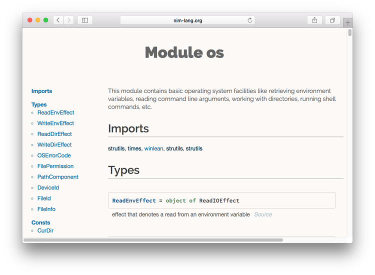
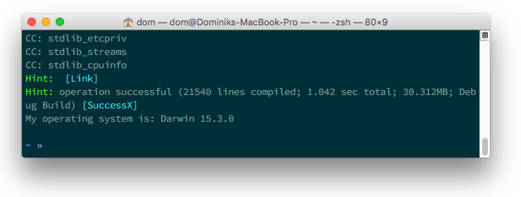
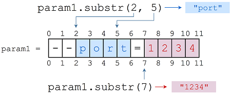

第四章 标准库之旅
==================================

本章包括：
* 什么是标准库？
* 更深入地了解模块
* Nim标准库中的模块
* 如何使用Nim标准库中的模块的示例

每种编程语言都支持库*lib*的概念。库是预先编写的软件的集合，它实现了一系列行为。其他库或应用程序可以通过库定义的接口访问这些行为。

例如，诸如“libogg”之类的音乐播放库可以定义“播放”和“停止”过程，前者将开始播放音乐，后者停止播放音乐。“libogg”库“接口可以说是由这两个过程组成的。
像上面这样的库可以被多个应用程序重用，这意味着库实现的行为不必为每个应用程序重新实现。

*标准库* 是作为编程语言的一部分始终可用的库，因此，您会发现标准库通常包括通用算法、数据结构和与操作系统交互的机制的定义。

标准库的设计因语言的不同而不同，Python的标准库以“包含电池”的理念而闻名，该理念包含了包容性的设计。另一方面，C的标准库采用了更保守的方法。因此，例如，在Python中，您将找到允许您处理XML、发送电子邮件和使用SQLite库的包。而在C标准库中，就没有这些。

Nim标准库遵循类似的“包含电池”原则。在这方面它与Python类似，因为它还包含用于处理XML、发送电子邮件和使用SQLite库的包。这当然不是尼姆标准库的范围，它是一个包含大量模块的非常丰富的库。本章专门介绍它，并将向您展示它最有用的部分。

除了描述标准库的每个部分的功能外，我还将展示如何使用标准库中的每个模块的示例。让我们从更详细地了解模块是什么以及如何导入模块开始。

*图4.1*和图4.2*显示了Nim标准库中一些最有用的模块。

图4.1. 最有用的纯Nim模块


图 4.2. 最有用的不纯模块


4.1再看模块
============================

Nim标准库由模块组成。Nim中的*模块*是包含Nim代码的文件，模块内的代码与所有其他代码隔离。隔离限制了不同模块中定义的代码可以访问哪些类型、过程、变量和其他定义。

当在模块内创建新定义时，默认情况下，任何其他模块都看不到该定义。它是“私人的”。定义可以设置为*public*，这意味着它对其他模块可见，使用`*` 字符。

清单4.1.模块`example.nim`

```nim
var moduleVersion* = "0.12.0"
var randomNumber* = 42
```

上面定义的`example.nim`模块包含定义 `moduleVersion` 变量的代码。此变量由 `*` 字符*公开*。

您可能还记得上一章中的`*`字符，我在其中引入了`*`访问修饰符，并使用它导出`protocol`模块中的标识符。我想在这里详细介绍模块的不同导入方式。您应该记住基本的“import”关键字，该关键字可以用于导入上面定义的`example.nim` 模块。

清单4.2.模块`main.nim`

```
import example   ❶
echo(moduleVersion)   ❷
```
>❶ 导入语法中，扩展名`.nim`不是必需的。
❷ 导入`example`模块后，我们可以访问`moduleVersion`变量，因为它是公共的。


“import”关键字的作用非常简单，它从指定的模块中导入所有公共定义。但是，它如何找到指定的模块可能不是很明显。

Nim编译器有一个可配置的目录列表，用于搜索模块。此列表在一个通常名为`nim.cfg`的特殊配置文件中配置。编译器可以使用多个配置文件，但编译器定义的配置文件中有一个始终使用。它通常位于`$nimDir/config`中，其中`$nimDir` 是Nim编译器的路径*清单4.3*显示了默认Nim配置的一小部分。在*清单4.3*中，每一行都指定了一个目录，Nim编译器在搜索模块时会查看该目录。

清单4.3.Nim配置文件中的一些目录
```
path="$lib/pure"   ❶
path="$lib/impure"
path="$lib/arch"
path="$lib/core"
...   ❷
```
>❶ Nim编译器将`$lib`扩展为完整路径，该路径指向安装Nim标准库的位置
❷ 配置文件包含更多选项，您可能希望查看一下，看看可以配置编译器的哪些位

>提示项目配置文件
您可以创建特定于项目的配置文件。然后，您可以使用它自定义编译项目时编译器的行为。只需创建一个“main.nim.cfg”文件，其中“main”是您正在编译的文件的名称。配置文件必须放在Nim源代码文件旁边。然后，您可以将命令行上传递的任何标志逐字放置在该文件中，例如“--threads:on”

使用“import”语句导入模块时。Nim编译器按顺序搜索每个目录。当这些目录不包含指定的模块时，编译器将搜索当前正在编译的模块旁边的文件。因此，为了编译*清单4.2*中的代码，*清单4.1*中的“example.nim”模块应该放在*清单4.2**中的‘main.nim’模块旁边。*图4.3*显示了编译“main.nim”时编译器如何搜索“example”模块。


图4.3.编译器如何搜索模块


每个导入的模块（包括从标准库导入的模块）都与主模块一起编译。编译`main.nim`时，在成功编译`main.nim`之前，将编译本地`example`模块和标准库`system`模块。

模块也可以放在子目录中。例如，考虑图4.4*所示的目录结构。

图4.4.“example.nim”文件被移动到“misc”目录中。


`example` 模块已移动到  `misc` 目录中。因此，需要修改`main`模块，如*清单4.4*所示。

清单4.4.从子目录导入
```nim
import misc/example
echo(moduleVersion)
```

 `misc` 目录已简单地添加到 `import` 语句中。

 4.1.1 命名空间
------------------
命名空间在许多编程语言中都很常见。它们充当标识符的上下文，允许从两个不同的上下文中使用相同的标识符。命名空间的语言支持差异很大。C不支持它们，C++包含用于定义它们的显式关键字，Python使用模块名称作为命名空间。

为了更好地了解名称空间的用途，我们来看一个示例用例。假设您希望加载两种不同格式的图像：PNG和BMP。另外，假设有两个库可用于读取此类文件，一个称为“libpng”，另一个名为“libbmp”。恰好两个库都定义了一个`load`加载过程，为您加载图像。如果要同时使用两个库，如何区分这两个“加载”过程？

如果这些库是用C语言编写的，那么它们需要模拟名称空间。他们将通过在过程名称前面加上库的名称来实现这一点，因此过程将被命名为“png_load”和“bmp_load”以避免冲突。这些库的C++版本可能会定义名称空间，如“png”和“bmp”，然后可以分别通过“png:：load”和“bmp:：load”调用“load”过程。这些库的Python版本不需要显式定义命名空间，模块名称就是命名空间。在Python中，如果PNG库在“PNG”模块中定义其“加载”过程，而BMP库在“BMP”模块中对其进行定义，则可以分别通过“PNG.load”和“BMP.load”调用“加载”程序。

就像Python中一样，Nim中的命名空间是由各个模块定义的。但有一个很大的区别，默认情况下，导入模块时，其所有公共定义都放在导入模块的命名空间中。您仍然可以指定完全限定的名称，但不需要这样做。

```nim
import example
echo(example.moduleVersion)   ❶
```
>❶ 通过写下模块名称后跟点字符来显式指定模块名称空间

仅当从两个不同的模块导入了相同的定义时，才需要指定模块命名空间。假设导入了名为`example2.nim`的新模块，`example2.nim`还定义了一个公共`moduleVersion`变量。在这种情况下，代码需要显式指定模块名称。

清单4.5.模块`example2.nim`

```nim
var moduleVersion* = "10.23"
```

清单4.6. 消除标识符的歧义

```nim
import example, example2   ❶
echo("Example's version: ", example.moduleVersion)
echo("Example 2's version: ", example2.moduleVersion)
```


>❶ `import` 语句可以导入多个模块，您只需用逗号分隔它们

编译并运行*清单4.6*中的代码将产生以下输出。
```nim
Example's version: 0.12.0
Example 2's version: 10.23
```

但是，如果试图显示`moduleVersion`的值而不对其进行限定：

```nim
import example, example2
echo(moduleVersion)
```
然后您将收到一个错误：

```nim
main.nim(2,6) Error: ambiguous identifier: 'moduleVersion' -- use a qualifier
```

通过使用特殊的`import` 语法，可以防止将所有定义导入导入模块的命名空间。

清单4.7.将模块导入其自己的命名空间
```nim
from example import nil       ❶
echo(moduleVersion)           ❷
echo(example.moduleVersion)   ❸
```
>❶ 导入`example`模块，而不将其任何定义导入此文件的命名空间
 ❷ 这将不再有效，因为 `moduleVersion`不再在此文件的命名空间中
 ❸ 可以通过显式写入模块名称空间来访问 `moduleVersion`变量

使用 `from` 语句时，可以在 `import` 关键字之后列出要导入的特定定义。

清单4.8.仅从模块中导入一些定义

```nim
from example import moduleVersion   ❶
echo(moduleVersion)                 ❷
echo(example.randomNumber)          ❸
```


>❶ 这将`moduleVersion`导入到此文件的命名空间，所有其他公共定义都需要通过 `example`命名空间访问
❷ 可以在不显式写入模块名称空间的情况下再次访问`moduleVersion`变量
❸ 必须限定`randomNumber`变量

可以使用`except`关键字排除某些定义。

清单4.9.导入时排除某些定义

```nim
import example except moduleVersion
echo(example.moduleVersion)   ❶
echo(moduleVersion)           ❷
echo(randomNumber)            ❸
```

>❶ 通过模块的命名空间访问“moduleVersion”变量仍然有效
❷ 在不限定名称的情况下访问“moduleVersion”变量不起作用
❸ 但访问“randomNumber”变量确实如此

在Nim中，惯用的做法是导入所有模块，以便所有标识符都在导入模块的命名空间中，并且只有在名称不明确时才显式指定命名空间。这与Python相反，Python要求通过模块的命名空间访问导入的每个标识符。除非使用`from x import *`语法导入模块。

这是因为Nim灵活的统一函数调用语法和运算符重载。这还有一个好处，即您不需要经常重新键入模块名称。

您可能不记得*第1章*中的UFCS是什么。它相当简单，它允许对对象调用任何过程，就像函数是对象类的方法一样。看看*清单4.10*，看看UFCS是什么样子。

清单4.10.统一函数调用语法

```nim
proc welcome(name: string) = echo("Hello ", name)

welcome("Malcolm")    ❶
"Malcolm".welcome()   ❶
```
>❶ 两种语法都有效，并执行相同的操作

这应该能让你更好地了解Nim的模块系统。现在让我们更详细地看看Nim的标准库。

4.2 标准库概述
=====================================

Nim的标准库分为三大类：纯的、不纯和包装器。

本章将从这些类别中选择一些模块。最后还将探讨不纯模块。

4.2.1 纯模块
-------------------

Nim标准库的很大一部分由纯模块组成。这些模块完全用Nim编写，不需要依赖性，因此首选它们。纯模块本身被进一步划分为多个类别。

其中一些类别包括：
* 核心 Core
* 集合和算法
* 字符串处理
* 通用操作系统服务
* 数学库
* Internet协议
* 分析器：Parsers

4.2.2 不纯模块
---------------------

另一方面，不纯模块由使用外部C库的Nim代码组成。例如，“re”模块实现处理正则表达式的过程和类型。它是一个不纯的库，因为它依赖于作为外部C库的PCRE。这意味着，如果应用程序导入“re”模块，除非用户在其系统上安装PCRE库，否则它将无法工作。

共享库
诸如“re”之类的不完整模块利用了所谓的共享库，通常是已编译为共享库文件的C库。在Windows上，这些文件使用“.dll”扩展名，在Linux上使用“.so”扩展名；在Mac OS X上使用“.dylib”扩展名。[[16]]（#ftn.d5e44477）

当您导入一个不纯的模块时，您的应用程序需要能够找到这些共享库。它们需要通过操作系统的软件包管理器或与应用程序捆绑安装。在Linux上，使用软件包管理器是很常见的，在Mac OS X上两者都很常见，而在Windows上，将依赖项与应用程序绑定是最流行的。

4.2.3 包装器
---------------
包装器是允许使用这些外部C库的模块。它们为这些库提供了一个接口，在大多数情况下与C接口完全匹配。impre模块构建在包装器之上，以提供更惯用的接口。您可以直接使用包装器，但这样做并不容易，因为您需要使用Nim的一些不安全特性，例如指针和位转换。直接使用包装器可能会导致错误，因为在大多数情况下，您需要手动管理内存。impre模块定义抽象以提供内存安全接口，您可以在源代码中轻松使用该接口，而不必担心C的低级细节。

4.2.4 在线文档
---------------------------
在我开始详细讨论不同模块之前，我想提到Nim网站包含完整标准库的文档。可以使用以下URL查看标准库中所有模块的列表：<http://nim-lang.org/docs/lib.html>. 此URL始终显示Nim最新版本的文档，还包含每个模块的文档链接。

每个模块的文档包含每个定义旁边的链接，这些链接指向该定义的实现。例如，它可以指向实现过程的代码行，向您展示它的功能。Nim的每个部分都是开源的，包括它的标准库。通过查看标准库的源代码，您可以看到由Nim开发人员自己编写的Nim代码，还可以真正了解标准库每个部分的行为，这意味着您甚至可以根据自己的喜好对其进行修改。


图4.5 `os`模块的文档


除此之外，上面链接中给出的模块列表还包括社区创建的模块。在页面底部有一个灵活的软件包列表。Nimble是一个Nim包管理器，它使这些包的安装变得容易，您将在下一章中了解更多信息。

Nimble软件包列表分为官方和非官方两个列表，官方软件包是由核心Nim开发人员官方支持的软件包，因此它们比一些非官方软件包更稳定。官方软件包实际上包含了一些模块，这些模块曾经是标准库的一部分，但为了使标准库更加精简，这些模块已经被转移出去了。

现在让我们更详细地看一下纯模块。我们将从核心模块开始。

[[16]]（#d5e44477）<https://en.wikipedia.org/wiki/Dynamic_linker#Implementations>

4.3 核心模块
=====================
标准库核心中最重要的模块是“系统”模块。此模块是唯一隐式导入的模块，因此您不需要在每个模块的顶部包含“import system”。为您自动导入此模块的原因是它包含常用的定义。

“system”模块包括所有基元类型的定义，例如这里定义了“int”和“string”。本模块还定义了通用程序和运算符*表4.1*显示了这些示例。

表4.1.“系统”模块中的一些定义示例


定义|目的|示例
|--|--|--|
| `+`, `-`, `*`, `/` | 分别对两个数字进行加法、减法、乘法和除法。 | `doAssert(5 + 5 == 10)` `doAssert(5 / 2 == 2.5)` |
| `==`, `!=`, `>`, `<`, `>=`, `<=` | 比较运算符| `doAssert(5 == 5)` `doAssert(5 > 2)` |
| `and`, `not`, `or` | 按位和布尔运算符 | `doAssert(true and true)` `doAssert(not false)` `doAssert(true or false)` |
| `add` | 向字符串或序列添加值。 | `var text = "hi"` `text.add('!')` `doAssert(text == "hi!")` |
| `len` | 返回字符串或序列的长度。 | `doAssert("hi".len == 2)` |
| `shl`, `shr` | 按位向左和向右移动。 | `doAssert(0b0001 shl 1 == 0b0010)` |
| `&` | 连接运算符，将两个字符串连接为一个。 | `doAssert("Hi" & "!" == "Hi!")` |
| `quit` | 使用指定的错误代码终止应用程序。 | `quit(QuitFailure)` |
| `$` | 将指定值转换为字符串。这在`system`模块中为一些常见类型定义。 | `doAssert($5 == "5")` |
| `repr` | 获取任何值并返回其字符串表示形式。这与`$`不同，因为它适用于任何类型，不需要定义自定义`repr`。| `doAssert(5.repr == "5")` |
| `substr` | 返回指定字符串的切片。 | `doAssert("Hello".substr(0, 1) == "He")` |
| `echo` | 在终端显示指定值。 | `echo(2, 3.14, true, "a string")` |
| `items` | 循环遍历序列或字符串项的迭代器。 | `for i in items([1, 2]): echo(i)` |
| `doAssert`, `assert` [[a]](#ftn.d5e4665) | 如果指定的值为`false`，则引发异常。 | `doAssert(true)` |

[[a]](#d5e4665) `doAssert` 和 `assert` 之间的区别在于，当使用 `-d:release` 编译时，`assert`调用被删除，而`doAssert`调用始终存在|


除了上面列出的定义之外，“system”模块还包含直接映射到C类型的类型，请记住Nim默认编译为C，这些类型是与C库接口所必需的。与C的接口是一个高级主题，我将在*第8章*中详细介绍。

系统模块还包括“线程”和“通道”模块，只要编译时指定了“--threads:on”标志，这些模块中的定义就包含在“系统”模块中。Nim中的线程默认处于关闭状态，必须显式打开。这些模块实现线程，这些线程是并发执行的有用抽象。并发性将在*第6章*中详细介绍。

核心类别中的其他模块包括“线程池”和“锁”，它们都实现了不同的线程抽象，“宏”实现了元编程API，以及其他一些模块。

核心中您应该感兴趣的主要模块是“系统”模块。其他任务则不那么重要，您只能将它们用于诸如并发之类的特殊任务。

本节应该让您了解一些核心模块实现了什么，特别是隐式导入的“系统”模块中定义的过程和类型。现在让我们来看看实现数据结构和通用算法的模块，以及如何使用它们。

4.4数据结构和算法
===================================

“系统”模块中定义了大量的数据结构，包括您在*第2章*中已经介绍过的数据结构：“seq”、“array”和“set”。

其他数据结构在标准库中作为单独的模块实现，这些模块列在标准库文档中的“集合和算法”类别下。它们包括 表`tables`, 集合`sets`, 列表`lists`, 队列`queues`, `intsets`, 和 `critbits`模块。

这些模块中的许多都有特定的用例，因此我不会详细介绍它们。我将讨论的模块是表`tables`和 集合`sets`模块。我还将研究一些模块，这些模块实现了处理这些数据结构的不同算法。

4.4.1 `tables`表格模块
--------------------------
假设您正在编写一个存储不同种类动物平均寿命的应用程序。添加所有数据后，您可能希望查找特定动物的平均预期寿命。数据可以存储在许多不同的数据结构中。

可以用于存储数据的一种数据结构是序列。让我先给你一点关于序列类型的概述。序列类型`seq[T]`定义了类型`T`的元素列表。它可以用来存储任何类型的元素的动态列表，动态指的是序列在运行时可以增长以容纳更多项*清单4.11*显示了一种存储描述不同动物平均寿命的数据的方法。

清单4.11.定义整数和字符串列表。

```nim
var numbers = @[3, 8, 1, 10]   ❶
numbers.add(12)   ❷
var animals = @["Dog", "Racoon", "Sloth", "Cat"]   ❸
animals.add("Red Panda")       ❹
```

>❶ 定义一个`seq[int]`类型的新变量，该变量包含一些数字
 ❷ 将数字“12”添加到列表 `numbers`中
 ❸ 定义一个`seq[string]`类型的新变量，该变量包含一些动物
 ❹ 将动物 `"Red Panda"`添加到列表 `animals`中

 在*清单4.11*中，“numbers”变量包含每个“动物”年龄。然后将动物的名字存储在“动物”序列中。存储在“数字”序列中的每个年龄都与它对应的动物在“动物”中的位置相同，但这不是直观的，存在很多问题。例如，可以将动物的平均预期年龄添加到“数字”中，而不将相应的动物名称添加到“动物”中，反之亦然。更好的方法是使用称为哈希表的数据结构。

哈希表是一种将键映射到值的数据结构。它存储（键、值）对的集合，并且键在集合中只出现一次。您可以添加、删除和修改这些对，以及基于关键字查找值。哈希表通常支持任何类型的键。它们比任何其他使用它们的查找结构都更有效*图4.6*显示了如何通过基于关键字执行查找来从哈希表中检索有关动物的数据。

图4.6.在“animalAges”哈希表中查找键“Dog”的值


 `tables`  模块实现了一个哈希表，允许您编写以下内容。

清单4.12.创建哈希表


```nim
import tables   ❶
var animalAges = toTable[string, int](  ❷
  {             ❸
    "Dog": 3,
    "Racoon": 8,
    "Sloth": 1,
    "Cat": 10
  })

animalAges["Red Panda"] = 12   ❹
```

>❶ 请记住，哈希表位于`tables`模块中，因此需要导入它。
❷ 从上面定义的映射中创建新的 `Table[string, int]`，需要指定键和值类型，因为编译器在所有情况下都无法可靠地推断它。
❸ 使用 `{:}` 语法定义从 `string`和`int` 的映射对。
❹ 将一只相当老的红熊猫添加到`animalAges`哈希表中。


There are multiple different types of hash table defined in the `tables` module. The generic version defined as `Table[A, B]`, the `OrderedTable[A, B]` which remembers the insertion order, and the `CountTable[A]` which simply counts the number of each key. The ordered and count tables are used much less often than the generic table because their use cases are far more specific.


 `tables` 模块中定义了多种不同类型的哈希表。定义为 `Table[A, B]`的通用版本，记住插入顺序的 `OrderedTable[A, B]`，以及简单计算每个键的数量的`CountTable[A]` 。有序表和计数表的使用频率远低于一般表，因为它们的用例更加具体。

`Table[A, B]` 类型是一种泛型类型，在其定义中，`A`指哈希表的键类型，`B`指哈希值的类型。键或值的类型没有限制。也就是说，只要为指定为键的类型定义了`hash`过程。除非您尝试使用自定义类型作为键，否则不会遇到此限制，因为标准库中的大多数类型都定义了`hash`过程。

清单4.13.使用自定义类型作为哈希表中的键

```nim
import tables
type             ❶
  Dog = object   ❷
    name: string

var dogOwners = initTable[Dog, string]()   ❸
dogOwners[Dog(name: "Charlie")] = "John"   ❹
```

>❶ `type` 关键字开始一段可以定义类型的代码
❷ 使用`string`类型的 `name`字段定义新的`Dog`对象
❸ `initTable`过程可用于初始化新的空哈希表
❹ 创建`Dog`对象的新实例，并将其用作键，将`dogOwners`哈希表中该键的值设置为`"John"`

编译*清单4.13*将产生以下输出。

```bash
file.nim(7, 10) template/generic instantiation from here   ❶
lib/pure/collections/tableimpl.nim(92, 21) template/generic instantiation from here   ❷
lib/pure/collections/tableimpl.nim(43, 12) Error: type mismatch: got (Dog)            ❷
but expected one of:   ❸
hashes.hash(x: T)
hashes.hash(x: pointer)
hashes.hash(x: T)
hashes.hash(x: float)
hashes.hash(x: set[A])
hashes.hash(x: T)
hashes.hash(x: string)
hashes.hash(x: int)
hashes.hash(aBuf: openarray[A], sPos: int, ePos: int)
hashes.hash(x: int64)
hashes.hash(x: char)
hashes.hash(sBuf: string, sPos: int, ePos: int)
hashes.hash(x: openarray[A])
```


>❶](#CO12-1) | This refers to `dogOwners[Dog(name: "Charlie")] = "John"`, where we are trying to use the `Dog` as the key. |
❷](#CO12-2) | These errors are inside the standard library because that is where the call to `hash(key)` is made. |
❸](#CO12-4) | The list below shows all the available definitions of the `hash` procedure. As you can see, there is no definition for the `Dog` type present in that list. |


>❶ 这是指 `dogOwners[Dog(name: "Charlie")] = "John"`，我们试图使用`Dog`作为键
❷ 这些错误在标准库中，因为这是调用 `hash(key)` 的地方
❸ 下面的列表显示了`hash` 过程的所有可用定义。如您所见，该列表中没有“狗”类型的定义

编译器拒绝代码，理由是找不到`Dog`类型的`hash` 过程的定义。谢天谢地，为自定义类型定义`hash`过程很容易。

清单4.14.为自定义类型定义`hash` 过程。

```nim
import tables, **hashes**       ❶
type
  Dog = object
    name: string

**proc hash(x: Dog): Hash =**   ❷
  **result = x.name.hash**      ❸
  **result = !$result**    ❹

var dogOwners = initTable[Dog, string]()
dogOwners[Dog(name: "Charlie")] = "John"
```

>❶ 导入定义哈希计算过程的`hashes`模块
❷ 为`Dog`类型定义一个`hash`过程
❸ 使用`Dog`的`name`字段计算哈希
❹ 使用`!$`运算符来完成计算的哈希

*清单4.14*中的代码显示了使示例以粗体编译的附加内容。`hashes`模块有助于在 `hash` 过程中计算哈希。它定义了`Hash`类型、许多常见类型的`hash` 过程，包括`string`和`$!` 操作符。`$!` 运算符完成计算的哈希，这是编写自定义 `hash` 过程所必需的。使用`$!` 运算符确保计算的哈希是唯一的。

4.4.2 `set`集合模块
------------------------
现在，让我们快速查看另一个称为集合的数据结构。*第2章*中介绍的基本`set`类型在 `system` 模块中定义。此`set`类型有一个限制，`set[int64]`其基本类型限制为特定大小的序数类型，特别是以下类型之一：


* `int8`, `int16`
* `uint8`/`byte`, `uint16`
* `char`
* `enum`

尝试使用任何其他基类型（例如`set[int64]`）定义 `set` 将导致错误。

`sets`模块定义的 `HashSet[A]` 类型没有此限制。就像  `Table[A,B]` 类型一样，`HashSet[A]` 类型需要定义类型 `A` 的 `hash` 过程*下面的清单4.15*创建了一个新的`HashSet[string]`变量。

清单4.15.使用`HashSet`对访问列表进行建模。

```nim
import sets   ❶
var accessSet = toSet(["Jack", "Hurley", "Desmond"])   ❷
if "John" notin accessSet:   ❸
  echo("Access Denied")
else:         ❹
  echo("Access Granted")
```

>❶ 导入定义了`toSet` 过程的 `sets`模块。
❷ 使用名称定义一个新的`HashSet[string]`列表。
❸ 检查John是否在访问集中，如果他不在，则显示"Access Denied"拒绝访问消息。
❹ 如果John在访问集中，则显示"Access Granted"消息。

确定元素是否在集合中比在序列或数组中更有效，因为不需要检查集合中的每个元素。当元素列表增加时，这会产生很大的差异。

除了 `HashSet[A]` 类型之外，`sets` 模块还定义了记住插入顺序的`OrderedSet[A]` 类型。

4.4.3 算法
---------------------
Nim的标准库还包括一个 `algorithm` 算法模块，该模块定义了一系列算法，这些算法适用于迄今为止提到的一些数据结构，特别是序列和数组。

 `algorithm`模块中有许多算法。最有用的是`sort` 过程中定义的排序算法。该过程采用数组或值序列，并根据指定的比较过程对它们进行排序。让我们直接跳到一个示例，该示例对名称列表进行排序，以便您可以按字母顺序向用户显示，或者使搜索列表的过程更加简单。

清单4.16.使用 `algorithm` 模块进行排序

```nim
import algorithm   ❶
var numbers = @[3, 8, 67, 23, 1, 2]   ❷
numbers.sort(system.cmp[int])         ❸
doAssert(numbers == @[1, 2, 3, 8, 23, 67])   ❹

var names = ["Dexter", "Anghel", "Rita", "Debra"]   ❺
let sorted = names.sorted(system.cmp[string])       ❻
doAssert(sorted == @["Anghel", "Debra", "Dexter", "Rita"])   ❼
doAssert(names == ["Dexter", "Anghel", "Rita", "Debra"])     ❽
```

>❶ 导入`algorithm` 模块，它定义了 `sort` 和 `sorted` 过程。
❷ 定义一个 包含了一些数的  `seq[int]` 类型的 `numbers` 变量。
❸ 按`numbers`顺序排序。排序时，对 `system`中定义的整数使用标准的 `cmp` 过程。
❹ `numbers`序列现在按升序包含元素。
❺ 用一些值定义`array[4, string]` 类型的新`names`变量。
❻ 将`names`数组的副本作为元素排序的序列返回。排序时，对`system`中定义的字符串使用标准的 `cmp` 过程。
❼ `sorted`序列包含按字母升序排列的元素。
❽ 尚未修改`names`数组。

*清单4.16*中的代码显示了排序序列和数组的两种不同方式。使用 `sort` 过程，将列表排序到位。或者，使用`sorted`过程返回原始列表的副本，其中元素已排序。前者效率更高，因为不必复制原始列表。

考虑“sort”调用中使用的 `system.cmp[int]` 过程。请注意缺少`()`，如果没有它，过程将不会被调用，而是作为值传递给 `sort` 过程。`system.cmp`过程的定义实际上非常简单。

清单4.17.泛型`cmp`过程的定义

```nim
proc cmp*[T](x, y: T): int =   ❶
  if x == y: return 0
  if x < y: return -1
  else: return 1

doAssert(cmp(6, 5) == 1)       ❷
doAssert(cmp(5, 5) == 0)       ❸
doAssert(cmp(5, 6) == -1)      ❹
```

>❶ 定义一个新的泛型`cmp`过程，它接受两个参数并返回一个整数。
❷ `sort` 过程要求指定的 `cmp` 过程在`x>y`时返回大于0的值。
❸ 当`x==y`时，返回0。
❹ 当`x<y`时，返回一个小于0的值。

 `cmp`过程是通用的，它接受两个参数：`x`和`y`，都是`T`类型。在*清单4.16*中，当第一次将 `cmp`过程传递给`sort`过程时，`T`绑定到`int`，因为在方括号中指定了`int`。在*清单4.17*中，编译器可以为您推断`T`类型，因此无需显式指定类型。您将在第8章中了解有关泛型的更多信息。

 `cmp`过程将适用于任何`T`类型，只要为其定义了`==`和`<`运算符。对于大多数用例，预定义的`cmp`应该足够了，但您当然可以编写自己的 `cmp`过程并将其传递给`sort`。

 `algorithm` 模块包括许多其他对数组和序列都有效的定义。例如，反转序列或数组元素顺序的反转`reverse`过程，以及用指定值填充数组中每个位置的填充`fill`过程。有关完整的过程列表，请务必查看 `algorithm` 模块文档：<http://nim-lang.org/docs/algorithm.html>.

4.4.4其他模块
--------------------
Nim的标准库中还有许多其他模块实现数据结构。在决定自己实现数据结构之前，请务必查看Nim标准库中的模块列表。它包括链接列表(list)、队列(queues)、绳索(ropes)等。模块的完整列表位于以下URL：<http://nim-lang.org/docs/lib.html>.

还有更多的模块专门用于处理数据结构。`sequtils`模块就是其中的一个例子。它包括许多操作序列和其他列表的有用过程。如果您以前有任何函数式编程的经验，您应该熟悉这些过程。例如，`apply`允许您将过程应用于序列的每个元素，`filter`返回包含满足指定谓词的元素的新列表，等等。要了解更多信息，请查看其文档：<http://nim-lang.org/docs/sequtils.html>.

本节为您提供了Nim标准库中最有用的数据结构和算法的一些示例。现在我们可以进入下一节，在这里我们将研究允许我们使用操作系统提供的服务的模块。

4.5与操作系统的接口
==========================================

在大多数情况下，您创建的程序需要操作系统才能运行。操作系统管理计算机的硬件和软件，并为计算机程序提供通用服务。

这些服务使用许多操作系统API提供，Nim标准库中的许多模块抽象了这些API，以便提供跨平台且易于在Nim代码中使用的单一Nim API。几乎所有这样做的模块都列在标准库模块列表中的“通用操作系统服务”类别下。这些模块实现了一系列操作系统服务，包括：
* 访问文件系统
* 文件和文件夹路径的操作
* 环境变量的检索
* 读取命令行参数
* 外部过程的执行
* 访问当前系统时间和日期
* 时间和日期的操纵
  
这些服务中的许多是成功实现某些应用程序所必需的。在上一章中，我向您展示了如何读取命令行参数以及如何通过网络与应用程序通信。这两种服务都是由操作系统提供的，后者不在上述列表中，因为它在标准库中有自己的类别。我将在本章稍后讨论处理网络和互联网协议的模块。

4.5.1使用文件系统
-----------------------------------

典型的文件系统主要由文件和文件夹组成。谢天谢地，这是三个主要操作系统都同意的。但你不需要看太远就可以看到差异，像文件路径这样简单的东西甚至不一致。看看*表4.2*，它显示了用户主目录中`file.txt`文件的文件路径。

表4.2.不同操作系统上的文件路径

| 操作系统 | 主目录中文件的路径 |
|-|-|
| Windows | `C:\Users\user\file.txt` |
| Mac OS X | `/Users/user/file.txt` |
| Linux | `/home/user/file.txt` |

注意不同的目录分隔符以及所谓“主目录”的不同位置。当想要编写适用于所有三种操作系统的软件时，这种不一致性被证明是有问题的。

`os`模块定义常量和过程，允许我们编写跨平台的代码。下面的示例显示了如何在*表4.2*中定义的每个文件路径上创建并写入新文件，而不必为每个操作系统写入三次。

清单4.18.将"Some Data"写入主目录中的“file.txt”


```nim
import os   ❶
let path = getHomeDir() / "file.txt"   ❷
writeFile(path, "Some Data")           ❸
```

>❶ `os`模块定义了`getHomeDir`过程以及第二行中使用的`/` 运算符。
❷ `getHomeDir`过程返回主目录的路径，根据当前操作系统返回不同的路径。`/`运算符类似于`&`串联运算符，但它在主目录和“file.txt”之间添加了路径分隔符。
❸ `writeFile`过程实际上是在`system`模块中定义的，它只是将指定的数据写入指定路径的文件。


为了让您更好地了解如何计算“路径”，请查看*表4.3*。

表4.3.路径操作程序的结果

|表达式 | 操作系统 | 结果 |
| -- | -- | --
| `getHomeDir()` | Windows | `C:\Users\username\` |
| `getHomeDir()` | Mac OS X | `/Users/username/` |
| `getHomeDir()` | Linux | `/home/username/` |
| `getHomeDir() / "file.txt"` | Windows | `C:\Users\username\file.txt` |
| `getHomeDir() / "file.txt"` | Mac OS X | `/Users/username/file.txt` |
| `getHomeDir() / "file.txt"` | Linux | `/home/username/file.txt` |


> 提示 `joinPath` 过程
如果您愿意，也可以使用等效的 `joinPath` 代替 `/` 运算符，例如 `joinPath(getHomeDir(), "file.txt")`


The `os` 模块包括用于处理文件路径的其他过程，包括 `splitPath`, `parentDir`, `tailDir`, `isRootDir`, `splitFile`等。*清单4.20*中的代码显示了如何使用其中的一些，在每一行 `doAssert` 中， `==` 的右侧显示了预期的结果。

清单 4.19.路径管理过程

```nim
import os                  ❶
doAssert(splitPath("usr/local/bin") == ("usr/local", "bin"))   ❷
doAssert(parentDir("/Users/user") == "/Users")      ❸
doAssert(tailDir("usr/local/bin") == "local/bin")   ❹
doAssert(isRootDir("/"))   ❺
doAssert(splitFile("/home/user/file.txt") == ("/home/user", "file", ".txt"))   ❻
```

>❶ 导入`os` 模块，以便访问`import` 语句下面使用的过程
❷ 将路径拆分为包含头和尾的元组
❸ 返回指定路径的父目录的路径
❹ 删除路径中指定的第一个目录并返回其余目录
❺ 如果指定的目录是根目录，则返回 `true`
❻ 将指定的文件路径拆分为包含指定路径的目录、文件名和文件扩展名的元组

除此之外， `os`模块还定义了`existsDir` 和 `existsFile`过程，用于确定是否存在指定的目录或文件。还有许多迭代器允许您在指定的目录路径中迭代文件和目录。

清单4.20.显示主目录的内容

```nim
import os     ❶
for kind, path in walkDir(getHomeDir()):      ❷
  case kind   ❸
  of pcFile: echo("Found file: ", path)       ❹
  of pcDir: echo("Found directory: ", path)   ❺
  of pcLinkToFile, pcLinkToDir: echo("Found link: ", path)   ❻
```

❶ 导入`os`模块以访问`walkDir`迭代器和`getHomeDir`过程。
❷ 使用`walkDir`迭代器遍历主目录中的每个文件，每当找到新文件、目录或链接时，迭代器都会产生一个值。
❸ 检查 `path`变量引用的内容：文件、目录或链接。
❹ 当 `path`引用文件时，显示消息`"Found file: "`以及文件路径。
❺ 当 `path`引用目录时，显示消息`"Found directory: "`以及目录路径。
❻ 当 `path`引用指向文件的链接或指向目录的链接时，将消息`"Found link: "`与链接路径一起显示。


除此之外，“os”模块还实现了许多处理文件系统的过程、迭代器和类型等。Nim开发人员确保实现是灵活的，并且可以在所有操作系统和平台上运行。本模块中实现的功能量太大，无法在本章中全面介绍，因此我强烈建议您深入了解本模块，以充分了解其功能范围。您可以通过查看“os”模块的文档来做到这一点。文档包括该模块中定义的所有程序的列表，以及解释如何有效使用这些程序的示例和说明。可以通过以下URL访问“os”模块的文档：<http://nim-lang.org/docs/os.html>.

4.5.2执行外部过程
------------------------------------

您可能偶尔希望应用程序开始执行另一个程序。例如，您可能希望在用户的默认浏览器中打开网站。执行此操作时需要记住的一件重要事情是，在外部程序执行完成之前，应用程序的执行将被阻止。因此，执行过程目前是完全同步的，就像上一章中介绍的标准输入读取一样。

执行进程的功能都在“osproc”模块中定义。该模块定义了用于执行流程的多个过程，其中一些过程比其他过程更简单。更简单的程序非常方便，但它们并不总是允许与更复杂的程序提供的外部流程执行方式相同的定制。

执行外部进程的最简单方法是使用“execCmd”过程，它将命令作为参数并执行它。命令执行完成后，它将返回该命令的退出代码。标准输出、标准错误和标准输入都是从应用程序的过程中继承的。因此，您无法捕获流程的输出。

“execCmdEx”过程与“execCmd”过程几乎相同，但它同时返回进程的退出代码和输出。请查看*清单4.22*以了解如何使用它。

清单4.21.使用“execCmdEx”检测有关操作系统的一些信息


```nim
import osproc            ❶

when defined(windows):   ❷
  let (ver, _) = execCmdEx("cmd /C ver")   ❸
else:
  let (ver, _) = execCmdEx("uname -sr")    ❹

echo("My operating system is: ", ver)      ❺
```

>❶ 导入定义了`execCmdEx`进程的`osproc`模块
❷ 检查此Nim代码是否正在Windows上编译
❸ 如果此Nim代码是在Windows上编译的，则使用`execCmdEx`执行 `cmd /C ver`并将其返回的元组解包为两个变量
❹ 如果此Nim未在Windows上编译，则使用`execCmdEx`执行`uname -sr`并将其返回的元组解包为两个变量
❺ 显示执行上述命令的输出


编译并运行此应用程序，然后查看显示的内容*图4.7*显示了MacBook上*清单4.22*的输出。

图4.7*清单4.22的输出*



请记住，这可能不是检测当前操作系统的最佳方式。[[17]]（#ftn.d5e5337）

**编译时if语句**

在*第2章*中，向您简要介绍了“when”关键字。在*清单4.22中，“when”用于确定编译当前模块的操作系统。“defined”过程在编译时检查指定的符号是否已定义。当前正在为Windows编译代码时，将定义“Windows”符号。因此，在Windows上，“when”语句下面的代码是编译的，而“else”分支中的代码不是编译的。在其他操作系统上，编译“else”分支中的代码，并忽略上面的代码。

作用域规则也有点不同，“when”语句不会创建新的作用域。这就是为什么可以访问其外部的“ver”变量。

*清单4.22*还显示了在解包元组中使用下划线作为标识符之一，它告诉编译器我们对元组的一部分不感兴趣。这很有用，因为它消除了编译器发出的有关未使用变量的警告。

这是使用“osproc”模块执行进程的基础。加上一些新的Nim语法和语义。“osproc”模块包含其他过程，允许对进程进行更多的控制，包括写入进程的标准输入和一次运行多个进程。请务必查看“osproc”模块的文档以了解更多信息。

4.5.3其他操作系统服务
--------------------------------------
当然，还有更多的模块允许您使用操作系统提供的服务。这些模块是标准库“通用操作系统服务”类别的一部分。其中一些将在后面的章节中使用；其他你可以自己探索。这些模块的文档是一个很好的资源，可以了解更多信息，要了解有关这些模块的更多信息，请查看以下URL：<http://nim-lang.org/docs/lib.html#pure-libraries-generic-operating-system-services>

[[17]]（#d5e5337）在线提供了一个`osinfo`包，它直接使用OS API获取此信息<https://github.com/nim-lang/osinfo>


4.6理解和操作数据
========================================

每个程序都处理数据，因此理解和处理数据至关重要。您已经在*第2章*和本章前面了解了在Nim中表示数据的方法。

表示数据最常用的类型是“字符串”类型，因为它可以表示几乎任何一段数据，整数只能表示为“46”，日期可以表示为“6月26日”，值列表可以表示为‘2，Bill，King，Programmer’。

我们的程序需要有一种方法来理解和处理这些数据。可以使用解析器来理解数据。解析器将查看一个值，在许多情况下是“string”类型的文本值，并从中构建数据结构。当然，该值可能不正确，因此解析器将在解析该值时检查语法错误。

Nim标准库中充满了解析器，它们太多了，以至于有一个名为“解析器”的完整类别专门用于它们。标准库中提供的解析器可以解析以下内容：命令行参数、`.ini` 格式的配置文件、XML、JSON、HTML、CSV、SQL等等。您已经在*第3章*中看到了如何使用JSON解析器，在本节中，我将向您展示如何使用其他一些解析器。

许多实现解析器的模块的名称都以单词“parse”开头，例如`parseopt`和`parsexml`。其中一些模块在上面实现了更直观的API。其中的一些示例是XML模块： `xmldom`, `xmltree`, `xmldomparser`, 和`xmlparser`。后两个模块使用“parsexml”模块的输出创建一个树形数据结构。然后使用前两个模块来操作树状数据结构。“xmldom”模块提供了一个类似web DOM的API，而`xmltree`模块提供一个更惯用的Nim API。`json`模块定义了一个用于处理json对象的高级API和一个用于解析json并发出表示当前解析数据的对象的低级解析器。

4.6.1分析命令行参数
-------------------------------------
描述这些模块中的每一个如何用于解析需要有自己的章节。相反，我将研究一个特定的数据解析问题，并向您展示使用Nim标准库中可用的模块解决此问题的一些方法。

我将研究的问题是命令行参数的解析。在*第3章*中，您使用`paramStr()`过程检索了命令行参数，并直接使用返回的“string”值。这很好，因为应用程序不支持任何选项或标志。

假设您希望应用程序在命令行上支持一个可选的“端口”标志，该标志要求后面跟着一个端口号。例如，您可能正在编写一个服务器应用程序，并想让用户选择服务器将在其上运行的端口。使用这样的参数执行名为“parsingex”的应用程序如下：`./parsingex --port=1234`。可以使用`paramStr()`过程调用访问 `"--port=1234"`，如*清单4.23*所示。

清单4.22.使用`paramStr`检索命令行参数

```nim
import os                  ❶

let param1 = paramStr(1)   ❷
```

>❶ `os`模块定义`paramStr`过程，因此必须导入。
❷ 假设应用程序如上所示执行，索引1处的命令行参数将等于`"--port=1234"`。

现在，在“param1”变量中有一个“string”值，该值包含标志名和与其关联的值？

有很多方法可以做到这一点。有些人不如其他人有效。我将向您展示其中的几个，因为在这样做的过程中，我会向您展示许多不同的方法，让您的程序可以操纵和理解“字符串”类型。

让我们从原始字符串值的子字符串开始。在“system”模块中定义的“substr”过程允许我们这样做。它接受一个“字符串”值、一个起始索引和一个结束索引，它们都表示为整数。然后，它返回字符串的新副本，从指定的第一个索引开始，到指定的结束索引结束。

>提示更多操作字符串的方法|
|尼姆字符串可以在运行时修改，因为它们是可变的。这意味着可以就地修改它们，而无需分配字符串的新副本。您可以使用“add”过程将字符和其他字符串附加到它们上，使用“delete”（在“strutils”模块中定义）从它们中删除字符|

清单4.23.使用`substr`解析标志
```nim
import os

let param1 = paramStr(1)
let flagName = param1.substr(2, 5)   ❶
let flagValue = param1.substr(7)     ❷
```

>❶ 获取`param1`的子字符串，从索引2到索引5。`port`将保存到结果。
❷ 获取从索引7到字符串末尾的`param1`子字符串。`1234`将保存到结果。

*图4.8*显示了传递给`substr` 的索引如何确定返回的子字符串。

图4.8`substr` 过程


**切片运算符**

一组的两个点，也称为 `..`运算符可用于创建`Slice`切片对象。然后可以将`Slice`输入`[]`运算符，该运算符将返回子字符串。这类似于`substr` 过程，但它支持使用  `^` 运算符进行反向索引。


```nim
doAssert("--port=1234"[2 .. 5] == "port")    ❶
doAssert("--port=1234"[7 .. ^1] == "1234")   ❷
doAssert("--port=1234"[7 .. ^3] == "12")     ❸
```

❶ 与使用`substr(2, 5)`相同，返回从索引2到索引5的子字符串。
❷ 返回从索引7到字符串末尾的子字符串。`^` 运算符从字符串末尾开始倒数。
❸ 返回从索引7到字符串末尾减去2个字符的子字符串。


*清单4.24*中的代码将起作用，但仅当传递的标志正好是`"--port=1234"`时。一旦用户将端口更改为`"--port="` ，它就会中断。

为了改进这一点，让我向您介绍 `strutils`模块。此模块包含许多用于处理字符串的过程定义。例如，`toUpper` 和 `toLower` 分别用于将字符串中的每个字符转换为大写或小写，`parseInt`用于将字符串转换为整数，`startsWith`用于确定字符串是否以另一个字符串开头，等等。有一个特定的过程可以帮助我们正确地拆分字符串，该过程称为`split`。

清单4.24.使用`split`解析标志


```nim
import os, strutils                     ❶

let param1 = paramStr(1)
let flagSplit = param1.split('=')       ❷
let flagName = flagSplit[0].substr(2)   ❸
let flagValue = flagSplit[1]            ❹
```

>❶ 必须导入`strutils`模块，因为`split`过程是在那里定义的。
❷ `param1`字符串值在出现“=”的位置被分成多个不同的字符串。`split`过程返回字符串序列，在本例中为`@["--port", "1234"]`。
❸ 取得`split`返回的序列中的第一个字符串，并删除前两个字符。
❹ 取得`split`返回的序列中的第二个字符串。

这仍然是穷人的解析，但它确实有效。没有错误处理，但代码应该适用于许多不同的标志。但是，当需求发生变化时，比如说，我们的一个用户喜欢使用 `:` 符号将标志名与值分开。这实际上很容易实现，因为`split`过程接受一个`set[char]`，因此我们可以指定`{'=', ':'}`，并且字符串将在 `=` 和 `:`上进行拆分。

因此，`split`实际上非常适合解析像这样简单的东西，但我相信你可以想象它不是一个好选择的情况。例如，如果我们的需求发生了变化，使得标志名现在可以包含“=”，我们就会遇到麻烦。

我就到此为止，您将在*第6章*中了解有关解析的更多信息，在这里您将看到如何使用`parseutils`模块执行更高级的解析。

谢天谢地，您不需要自己解析这样的命令行参数。正如我之前提到的，Nim标准库包含一个`parseopt`模块，它可以为您执行此操作*清单4.26*显示了如何使用它来解析命令行参数。

清单4.25.使用`parseopt`解析命令行参数

```nim
import parseopt        ❶

for kind, key, val in getOpt():       ❷
  case kind            ❸
  of cmdArgument:      ❹
    echo("Got a command argument: --", key)
  of cmdLongOption, cmdShortOption:   ❺
    case key
    of "port": echo("Got port: ", val)
    else: echo("Got another flag --", key, " with value: ", val)
  of cmdEnd: discard   ❻
```

❶ 导入定义`getOpt`迭代器的`parseopt`模块
❷ 迭代每个命令行参数标志，`getOpt`迭代器产生3个值，即解析的参数类型、键和值
❸ 检查分析的参数类型
❹ 如果解析了一个没有值的简单标志，只需显示标志名称
❺ 如果解析了带有值的标志，请检查它是否为`--port`，如果它显示的是端口值，则显示一条特定消息，否则显示一条显示标志名称和值的通用消息
❻ 命令参数解析已结束，因此我们什么也不做

代码有点冗长，但它为我们处理错误，支持其他类型的标志，并通过每个命令行参数。这个解析器非常乏味，不幸的是，标准库没有包含任何构建在它之上的模块。有许多第三方模块使解析和检索命令行参数的工作更加容易，这些模块可以通过Nimble包管理器获得，我将在下一章中向您介绍。

现在编译并运行上面*清单4.26*中的代码。尝试向程序传递不同的命令行参数，并查看它输出的内容。

4.6.2结论
-----------------
本节将为您提供一些关于如何操作最常见和最通用的类型的想法：“字符串”。我已经讨论了Nim标准库中可用的不同解析模块，并向您展示了如何使用其中一个模块解析命令行参数。除此之外，我还向您介绍了“strutils”模块，它包含许多用于处理字符串的有用过程，请务必稍后查看其文档和其他模块的文档。

4.7网络和互联网
================================

Nim标准库提供了大量可用于网络的模块。已经向您介绍了异步事件循环以及分别在`asyncdispatch`和`asyncnet`模块中定义的异步套接字。这些模块为标准库“Internet协议和支持”类别中的许多模块提供了构建模块。

标准库还包括`net`模块，它是`asyncnet` 模块的同步等效模块。它还包含一些可用于异步套接字和同步套接字的过程。

更有趣的模块是实现某些internet协议的模块，如HTTP、SMTP和FTP。HTTP代表超文本传输协议，它是web浏览器用于从internet上的web服务器请求资源（如网页）的协议。SMTP代表简单邮件传输协议，用于传输电子邮件。FTP代表文件传输协议，用于在多台计算机之间传输文件。实现这些协议的模块分别称为 `httpclient`、`smtp`和`asyncftpclient`。还有一个`asynchttpserver`模块，它实现了一个高性能HTTP服务器，这允许Nim应用程序向客户端（如web浏览器）提供网页。

 `httpclient`模块的主要目的是能够从internet请求资源，例如，可以使用该模块检索Nim网站，如*清单4.27*所示。

清单4.26.使用 `httpclient`模块请求Nim网站


```nim
import asyncdispatch     ❶
import httpclient        ❷

let client = newAsyncHttpClient()   ❸
let response = waitFor client.get("http://nim-lang.org")   ❹
echo(response.version)   ❺
echo(response.status)    ❻
echo(response.body)      ❼
```

>❶ 需要`asyncdispatch`模块。它定义了使用异步http客户端所必需的异步事件循环。它定义了运行事件循环的`waitFor`过程
❷ `httpclient`模块定义异步HTTP客户端和相关过程
❸ 创建`AsyncHttpClient`类型的新实例
❹ 使用检索网站的HTTP GET请求Nim网站。`waitFor`过程将运行事件循环，直到 `get`过程完成
❺ 显示服务器响应的HTTP版本。可能是`"1.1"`
❻ 显示服务器响应的HTTP状态。如果请求成功，则`"200 OK"`
❼ 显示响应正文。如果请求成功，这将是Nim网站的HTML


清单4.27*中的代码适用于任何请求的资源。您还应该能够使用它请求任何网站URL。

这些模块都很容易使用。确保查看他们的文档，了解他们定义的程序以及如何使用这些程序的详细信息。可能有标准库遗漏的协议，或者您希望自己实现的自定义协议。有大量的网络协议已作为标准库之外的库实现，这些模块已由其他Nim开发人员实现，可以使用Nimble包管理器找到，您将在下一章中了解这些模块。

4.8 总结
============
* 库是模块的集合，模块依次实现行为列表。
* Nim中的标识符默认为私有，可以使用`*`导出。
* 默认情况下，模块被导入到导入模块的全局命名空间中。
* 只能使用`from module import x`语法导入某些符号。
* 标准库分为纯、不纯和包装类别。
* `system`模块是隐式导入的，包含许多常用的定义。
* `tables`模块实现了一个可以用于存储关联数据的哈希表。
* `algorithms`“算法”模块定义了一个`sort`过程，可用于对数组和序列进行排序。
* `os`模块包含许多访问计算机文件系统的过程。
* 可以使用`httpclient`模块检索网页。