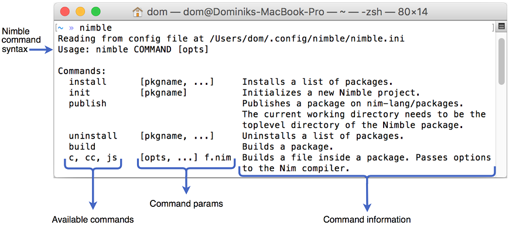
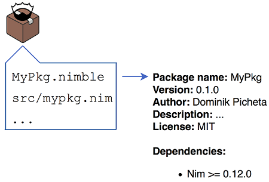
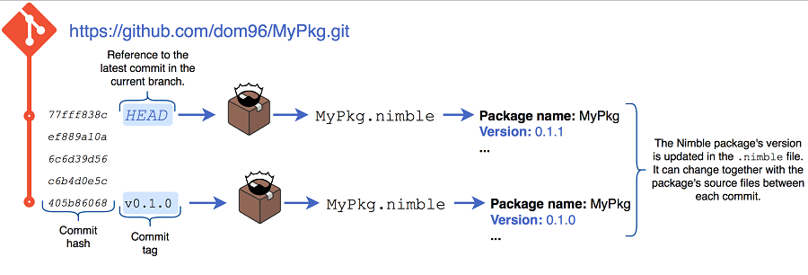

第五章 包管理
==================

本章包括：
* 什么是Nimble？它如何帮助我开发软件？
* 使用Nimble软件包开发软件
* 创建Nimble包并发布它们

如今，软件包经理在软件开发中扮演着核心角色。事实并非总是如此；综合Perl存档网络（或CPAN）是第一个仅为特定编程语言而存在的大型软件存储库之一。它由超过150000个Perl代码模块组成，是单一编程语言中最大的软件模块库之一。它也是此类软件存储库的最早示例之一；它的成功影响了许多人。今天，几乎所有编程语言都有软件存储库。

包是对模块集合的抽象术语；这些模块可以形成库或应用程序。包管理器自动化了下载、安装、更新和删除包的过程。库包含可以使用定义良好的接口调用的不同行为的实现。这些实现通过一个或多个模块存储和公开。

软件存储库分发许多不同的包，允许这些包自由下载。您可以手动下载软件包，但这样做会很乏味。例如，许多软件包都有依赖关系：其他软件包需要提前安装，才能使软件包正常工作。包管理器确保自动正确安装依赖项*下图5.1*显示了包、库、应用程序和软件存储库之间的相互关系。

图5.1.软件包、库、应用程序和软件存储库之间的比较


大多数编程语言至少有一个包管理器，有些甚至有多个。Nim的包管理器很重要，因为它是一个工具，可以让您访问Nim包存储库中包含的数百个开源包。

5.1 Nim包管理器
============================

现在有许多包管理器，但并非所有的包管理器都是为相同的目的而设计的。包管理器主要分为两类，系统级包管理器和应用程序级包管理。

系统级包管理器通常与操作系统捆绑在一起。它们允许用户安装用许多不同编程语言编写的一组流行的应用程序和库。应用程序级别的包管理器更具体，它们专注于用单一编程语言编写的库和应用程序。

想象一下，你有一台全新的电脑，你想在上面看一些电影。观看视频最常用的应用程序之一是VLC，但电脑没有预装它。你可以指示软件包管理器安装VLC，以及VLC需要运行的任何缺失的库。一个系统级的包管理器将是完美的。

VLC附带一个名为`libvlc`的库，该库允许任何应用程序以与VLC本身相同的精度播放视频。您可能希望在Nim应用程序中使用此库，为此，您需要一个Nim包，该包实现该库的Nim接口。这样的包将通过应用程序级包管理器安装。

图5.2.系统级与应用程序级包管理器


包管理器在分发包的方式上也有所不同。一些以二进制文件的形式分发包，而另一些则分发源代码。在后一种情况下，必须使用编译器在用户的计算机上编译包。

Nim的包管理器叫做`Nimble`。Nimble是一个应用程序级包管理器，它以源代码的形式分发包。这类似于其他应用程序级包管理器，如Python的pip和NodeJS的npm。Nimble已经被许多Nim程序员使用，尽管它还不稳定，而且还缺少一些功能。本节将向您展示当前版本的Nimble（截至编写时为0.7.2）如何用于管理Nim库和应用程序。请记住，Nimble每天都在发展，本节中提到的一些事情将来可能会发生变化。

5.2安装Nimble软件包管理器
==========================================
好消息是，您很可能已经安装了Nimble。Nim安装包从0.15.0版本开始包含Nimble，因此如果安装了Nim，也应该安装Nimble。

您可以通过在终端中运行 `nimble -v` 来轻松检查情况是否如此。请记住，为了安装软件包，Nimble可能会执行一个名为Git的外部应用程序，您还必须在PATH中安装并提供该应用程序。

有关Nimble安装的更多详细信息，请参阅本文档：<https://github.com/nim-lang/nimble#installation>


5.3  `nimble`命令行工具
===================================
现在应该在系统上安装了Nimble。在新的终端窗口中运行`nimble` 应该会显示一个由.Nimble支持的命令列表*图5.4*仅显示了其中的一些命令。

图5.3.Nimble支持的一些命令




您还可以在*图5.4*中看到将命令传递给Nimble的顺序。一个命令写在`nimble` 之后，用空格隔开。接下来是传递给该命令的标志和参数，每个标志和参数之间用空格隔开。例如，要搜索与Linux相关的任何软件包，可以执行`nimble search linux`。您还可以指定一个`--ver`标志，它将显示每个包的可用版本*图5.5*显示了使用`--ver`标志搜索`linux`的结果。

图5.4.搜索包含版本信息的`linux`包


注意*图5.5*中的"versions:" 后面是两个不同版本的列表。这些是可以安装的`daemonize` 守护进程包的版本。

Nimble的命令行界面是安装、搜索、升级和删除软件包的主要方式。在我向您展示如何安装软件包之前，让我们详细了解软件包的实际含义。


5.4 什么是Nimble包？
==============================

软件几乎总是由不同类型的文件组成，包括源代码、图像、声音等。例如，假设您正在创建一个视频游戏。视频游戏需要大量的资源才能运行，这些资源需要与游戏的可执行文件捆绑在一起。软件包提供了一种将此类文件与软件捆绑在一起的便捷方式。

从最简单的意义上讲，一个最小的*Nimble包*是一个目录，其中包含一个 `.nimble`文件和一个或多个Nim模块。

 `.nimble`文件包含有关包的元数据。它指定包的名称、版本、作者、依赖项等。 `.nimble`只是一个文件扩展名，每个 `.nimble`文件的文件名都与包的名称相同。*清单5.2*显示了一个简单的 `.nimble`文件清单。

清单5.1.`MyPkg.nimble`清单 `.nimble`文件。

```
[Package]
name          = "MyPkg"     ❶
version       = "0.1.0"     ❷
author        = "Dominik Picheta"
description   = "Example .nimble file."
license       = "MIT"

[Deps]
Requires: "nim >= 0.12.0"   ❸
```

>❶ 此处指定的名称必须与文件名加上 `.nimble`扩展名相同，即 `MyPkg.nimble`。
❷ 版本通常由3个数字组成，由句点分隔，其含义遵循语义版本控制[[18]]（#ftn.d5e5758）。您可以指定任意数量的数字，但不支持其他字符，
❸ 这指定包至少需要0.12.0版的Nim编译器才能成功编译。


`.nimble`文件的格式与*ini*配置文件格式相似。节由方括号分隔，键和值对使用`key=`value``语法或`key: "value"`语法指定*下图5.6*显示了典型的独立Nimble包的内容。

图5.5.典型的Nimble包



在*清单5.2*中的`MyPkg.nimble`文件中指定的数据是必需的，您还可以在`.nimble`文件中指定许多其他选项。有太多的项目无法在这里一一列举，但您将在本章稍后部分了解其中的一些。有关完整列表，请查看Github上的Nimble文档：<https://github.com/nim-lang/nimble#readme>

**另一种`.nimble`格式**

Nimble最近获得了对基于Nim的全新配置格式的支持。它被称为Nimscript，是完整Nim语言的一个子集。这种语法使得使用Nim代码定义更复杂的包变得非常容易。

Nimscript允许的一个重要用例是基于运行Nimble的操作系统指定依赖项。

类似于`MyPkg.nimble`，而使用Nimscript的，如下所示：

```
# Package information
version       = "0.1.0"
author        = "Dominik Picheta"
description   = "Example .nimble file."
license       = "MIT"


# Dependencies
requires "nim >= 0.12.0"
```

如您所见，语法基本相同。两个最大的区别是缺少`name`字段（无论如何都是冗余的），以及指定依赖项的语法略有不同。用方括号分隔的部分也消失了，不再需要。

Nimscript的亮点在于能够指定自定义任务，例如：

```
task tests, "Run the packages tests!":
  exec "nim c -r tests/mytest.nim"
```

将该代码段放在 `.nimble`文件的底部，将允许您执行 `nimble tests`，该测试将执行为该任务指定的代码。在这种情况下，代码将编译并运行 `mytest.nim`文件。

假设您在本地文件系统的某个位置有一个Nimble包，那么您可以很容易地在该包的目录中打开终端并执行 `nimble install`。执行此操作时，Nimble将尝试安装当前目录中包含的包。这对于您可能自己创建的本地包非常有用。但是，对于其他开发人员创建的包，您需要手动下载这些包吗？

谢天谢地，这个问题的答案是`不`。作为`install`命令的一部分，可以指定指向要安装的包的URL。目前，该URL必须指向Git或Mercurial存储库。这带来了`外部`包的定义，即可以通过互联网访问的包。外部Nimble包是一个Git或Mercurial存储库，包含一个 `.nimble`文件和一个或多个Nim模块。

**什么是Git和Mercurial？**

Git和Mercurial都是分布式版本控制系统（DVCS）的示例。DVCS使一个软件开发团队能够在一个软件项目上协同工作，它有助于处理两个或多个开发人员最终编辑相同文件的情况。它通过跟踪每个文件的历史记录来做到这一点，而不是简单地覆盖文件并存储最新版本。

Git（或Mercurial）*存储库*是存储软件项目历史的地方。这些存储库可以上传到远程服务器，然后分别使用git和Mercurial的`git`和`hg`命令行工具下载。这允许其他开发人员处理项目并上传他们的更改，然后您可以下载这些更改。

下载存储库后，可以查看文件的历史记录。例如，您可以看到一周前存储库的状态，一直到第一次创建存储库时。

Git和Mercurial存储库可能包含其他信息，例如它们支持标记。标记标识存储库历史记录中的特定修订。包含Nimble包的存储库必须包含标识该包的每个版本的标记*下图5.7*显示了外部Nimble包的内容在不同版本之间的变化。


图5.6外部Nimble包的演变



在上一节中，我向您展示了 `search`命令的工作原理。使用 `--ver` 标志， `search`命令将列出每个包存储库的标记。Nimble将每个标记解释为一个版本。

Nimble包与存储库耦合，因为大多数库和应用程序都已存储在存储库中。将该存储库转换为一个Nimble包很容易，它只需要一个`.nimble` 文件。其他软件包管理器将其软件包存储在单个集中服务器上，这有其优点，也是Nimble最终也将支持的。

[[18]](#d5e5758) <http://semver.org>


5.5 安装Nimble的软件包
===============================

安装Nimble包可能是您将使用Nimble执行的最常见任务。您已经在上一节中看到了`install`命令的示例。此命令提供了安装软件包的主要方法。
install命令功能强大，它可以：

* 在本地文件系统上安装软件包。
* 从指定的URL安装程序包。
* 按名称安装软件包。
* 安装软件包的特定版本。
* 一次安装多个软件包。


5.5.1使用  `install` 命令
----------------------------------

本地软件包的安装很简单。只需在本地软件包的目录中打开一个新终端`cd` （例如，键入`cd /home/user/MyPkg` ），然后执行`nimble install`。

要从URL安装软件包：只需打开一个新终端并执行`nimble install <your_url_here>`，用要安装的软件包的URL替换`<your_URL _here>。当前，URL必须指向非空的Git或Mercurial存储库。

Nimble为您省去了记住不同包的一堆URL的麻烦。可以使用包含Nim社区创建的包列表的包存储库。Nimble下载此列表，其中包含有关每个包的一些基本信息，例如包的URL和名称。还记得 `search` 命令吗？它会搜索此列表。可以安装搜索结果中列出的任何软件包，只需在`install`命令后指定其名称即可。例如，要安装*图5.5*中搜索结果中显示的 `daemonize`包，只需执行`nimble install daemonize`即可。

通过在包的名称后使用特殊的 `@` 字符，可以安装包的特定版本。例如，要安装`守护进程`包的`0.1.0`版本，请执行`nimble install daemonize@0.1.0`. 除了指定特定版本，您还可以指定版本范围，例如，如果您希望安装高于版本`0.1.0`的最新版本，则可以执行`nimble install daemonize@>=0.1.0`。在 `@` 字符后使用 `#`字符也支持指定存储库修订，例如`nimble install daemonize@#b4be443`。


>警告 命令行终端=中的特殊字符
根据您的shell，某些字符（如`@`、`>`或`=`）可能被视为shell语法的一部分。您可能需要对它们进行转义，或者像这样引用包名和版本：`nimble install "daemonize@>=0.1.0"`

为`install`命令指定多个参数将导致Nimble安装多个包。这些参数只需要用空格隔开。

5.5.2 `install` 命令如何工作？
-------------------------------------------

要了解`install` 命令的作用，让我们看一下上面的示例命令：`nimble install daemonize`。如果尚未执行，请尝试立即执行。您应该看到类似于*图5.8*中的输出。

图5.7.`nimble install daemonize`的输出。


Nimble的输出目前相当冗长，但它试图提供尽可能多的安装信息。您在*图5.8*中看到的输出在您的Nimble版本中可能有所不同。但关键信息应该保持不变。*图5.8*中所示的消息显示了`daemonize`包中的每个文件都被复制到`/Users/dom/.nimble/pkgs/daemonize-0.0.2/`中。

在终端窗口中向上滚动，您将看到Nimble首先执行的操作；开始下载包。但在我说到这之前，让我先提一下它实际上做了什么。在开始下载之前，Nimble需要知道从哪里下载`daemonize`包。它通过查阅包裹清单来做到这一点*图5.9*显示了整个安装过程及其许多子过程。

图5.8. Nimble的安装过程


包列表当前托管在Git存储库中，可以通过以下URL在名为GitHub的网站上访问该列表：<https://github.com/nim-lang/packages>. 包列表存储库存储一个`packages.json`文件，其中包含有关不同包的元数据列表。元数据包括每个包的名称、URL、描述等。Nimble可以读取此列表，找到您在命令行中指定的包并检索该包的URL。这样，Nimble就能知道该包存储库的位置，并可以轻松下载。*图5.10*显示了如何在`packages.json`文件中找到`daemonize`包。

图5.9.在`packages.json`文件中查找有关`daemonize`包的信息


>[注释] 包列表
存储在中的程序包列表<https://github.com/nim-lang/packages>是Nimble的官方包清单。您可以很容易地创建自己的包列表，其中包含您可能希望保密的包。从0.7.0版开始，Nimble支持多个软件包列表，因此您可以轻松地将自己的软件包列表与官方软件包列表结合使用。Nimble自述文件的*配置Nimble*部分解释了如何做到这一点：<https://github.com/nim-lang/nimble#configuration>

下载使用Git或Mercurial完成。作为下载过程的一部分，Nimble检查在远程存储库上创建的标记。它解析每个标签，并确定哪个满足用户指定的版本要求。如果有多个标签满足版本要求，那么它将选择最高版本*下图5.11*显示了Nimble如何决定安装Nimble包的哪个提交。

图5.10.Nimble如何决定要安装哪个版本的软件包


下载完成后，将读取包的 `.nimble`文件。Nimble验证此文件的有效性。在开始安装之前，必须检查并验证以下内容是否正确：

* `.nimble`文件的名称必须与 `.nimble`文件中指定的`name`字段相对应。
* 在 `.nimble`文件中指定的`version`版本字段必须与存储库中标记的版本相对应。
* 将要安装的文件必须遵循特定的目录布局。
* 必须安装 `.nimble`文件中指定的正确依赖项。
  
这些是Nimble执行的一些最常见的检查。如果前三个失败，将导致错误，并且无法安装软件包。缺少的依赖项实际上将由Nimble自动安装。在下一节中，您将了解有关这些检查的更多信息，我将向您展示如何创建自己的Nimble包。

成功验证软件包后，安装开始，Nimble会将软件包中的所有文件复制到`~/.nimble/pkgs/pkg-ver` ，其中`ver`是软件包的版本，`pkg`是软件的名称。

这只是对安装Nimble包过程的简单概述。此过程可能会变得更加复杂，具体取决于 `.nimble`文件中指定的选项。

5.6 创建 Nimble 的软件包
==============================
您可能遇到过这样的情况：应用程序中的一组功能可以在另一个应用程序中重用。例如，在*第3章*中，您开发了一个`protocol`模块，它定义了对聊天消息进行编码和解码的过程。您可能希望该模块可用于其他应用程序。

最简单的方法是从该模块创建一个包。然后，您的应用程序可以将该包添加为依赖项，并轻松使用同一模块。

从Nim库或应用程序创建一个Nimble包有很多优点。其中包括使依赖项的安装更加容易，并允许其他人将您的包用作自己包的依赖项。

创建Nimble包也相当简单。你所需要做的就是创建一个`.nimble` 文件，你就可以开始了。Nimble包含一个命令，该命令使创建此文件更加容易。`init`命令将询问您有关包的一些问题，并根据您对这些问题的回答为您创建一个`.nimble` 文件。您可能仍然需要手动编辑生成的 `.nimble`文件，以进一步自定义选项。但一旦你了解了这些选项的作用，这也变得简单明了。

这就是创建本地Nimble包所需的全部内容，但您也可能希望打开包的源代码并将其发布到Nimble的包列表中。为此，您需要初始化一个新的Git或Mercurial存储库。如果你从未使用过任何一个，那么我建议选择Git，因为它受到更广泛的支持。在本章稍后，我将向您展示如何发布Nimble包。

在本节中，我将向您展示如何从单独的Nim项目中创建Nimble包。但为什么要花时间创建Nimble包呢？

想象一下，您正在编写一个全新的库，其中包含一些操作数字的简单过程。您有两个应用程序，一个是简单的计算器应用程序，另一个是更专业的计算税款的应用程序。您希望在这两个应用程序中都使用您的库，此外，您还希望允许其他人在自己的应用程序中使用它。

您可以简单地将库复制并粘贴到两个应用程序旁边。然后通过压缩它并通过电子邮件发送最终的zip存档，将其分发给其他开发人员。这种方法存在许多问题，例如：

* 开发人员依靠您向他们发送您的库，浪费了宝贵的时间。
* 开发人员无法轻松地发现您的库存在。
*  您必须手动确保应用程序具有最新版本的库。

使用Nimble打包库可以解决许多这些问题。开发人员可以使用Nimble的搜索功能轻松查找库。您只需上传一次您的库，完成后，您和其他人可以轻松使用最新版本的库。

考虑到所有这些，让我们创建一个简单的Nimble包。

5.6.1选择名称
----------------------

包的名称非常重要。它需要尽可能简短，并理想地描述包实现的功能。

>|[注释] 唯一性
当选择一个名称时，最好确保它是唯一的，特别是当您打算将这样的包发布到Nimble包存储库时。

您必须选择不包含任何连字符或at符号（`-`或`@`）的名称。这些字符由Nimble唯一处理，因此不允许在包名称中使用。

作为本章的一部分，您将创建的包将实现一些非常简单的操作数字的过程。您可以选择您希望的任何包名称，但在本章中，我将使用名称`NimbleExample`，并假设您也这样做了。

现在在文件系统的某处创建一个`NimbleExample`目录，其中包含Nimble包。

5.6.2 Nimble包的目录布局
------------------------------------------

所有Nimble包都必须遵循特定的目录布局。这种目录布局对于库比应用程序更重要，因为应用程序将被编译，在大多数情况下，所有需要安装的都是应用程序的可执行文件。

对于库，最重要的规则是将所有模块放在以包命名的单独目录中。因此，在已创建的
`NimbleExample`目录中创建另一个`NimbleExample`目录。放置在该目录中的任何模块都可以使用`NimbleSample/`前缀导入，例如`import NimbleSexample/module`。

此规则的一个例外是，您可以将包含库主要功能的单个模块放在包的根目录中。但它必须共享您的包的名称。在这种情况下，模块的文件名为`NimbleExample.nim`。*图5.12*显示了`NimbleExample`的最终目录结构。

图5.11. `NimbleExample` 目录布局


出于本示例的目的，在`NimbleExample`目录中创建以下文件。

清单5.2.`math.nim`模块。

```nim
proc add*(a, b: int): int = a + b   ❶
```

>❶ 定义新的 `add`过程，取两个整数并返回这两个整数的和。此过程使用 `*`导出


*清单5.3*中的代码非常简单，它定义了一个新的`add`过程，将两个整数相加。注意用于导出过程的 `*`，它确保可以从其他模块访问`add`过程。将*清单5.3*中的代码保存为`NimbleExample/NimbleExample`中的`math.nim`。

对于包中的模块，有一个额外的约定，这些模块只能由该包使用。它们应该放在`private` 模块中，就像下面*清单5.4*中定义的`utils` 模块一样。

清单5.3.`utils.nim`模块。

```nim
proc mult*(a, b: int): int = a * b   ❶
```

>❶ 定义一个新的`mult`过程，取两个整数，当这些数字相乘时返回结果。此过程使用`*`导出。

在`NimbleExample/NimbleExample` 目录下创建一个新的`private`目录，在  `NimbleExample/NimbleExample/private`目录下，保存 *清单5.4* 的代码为`utils.nim` 。

清单 5.4.  `data.nim` 模块。

```nim
import NimbleExample/math            ❶
import NimbleExample/private/utils   ❷
let age* = mult(add(15, 5), 2)       ❸
```


>❶ 从`NimbleExample`包导入`math`模块
❷ 从`NimbleExample`包导入私有`utils`模块
❸ 使用`utils`和`math`模块中定义的过程计算年龄。`age`变量使用`*`导出

清单5.5*中的代码有点复杂。它导入`NimbleExample`包中定义的两个模块。第一个是在*清单5.3*中定义的`math`模块，另一个是在*清单5.4*中定义了`utils`模块。将*清单5.5*中的代码保存为`NimbleExample/NimbleExample`中的`data.nim`。

*图5.13*显示了最终目录布局应该是什么样子，确保本地目录布局相同。

图5.12.`NimbleExample`目录布局


5.6.3 编写`.nimble`文件并整理依赖关系
--------------------------------------------------------------


现在模块都已放置在正确的目录中，是时候创建`NimbleExample.nimble` 文件了。您可以执行`nimble init`这将为您创建一个简单的`NimbleExample.nimble`。图 5.14 显示了生成清单 5.6 所示`NimbleExample.nimble`文件所需的问题和答案的示例。

图 5.13.`nimble init`命令


清单 5.5.`NimbleExample.nimble` 的开头

```nim
# Package

version       = "0.1.0"
author        = "Your Name"
description   = "Simple package to learn about Nimble"
license       = "MIT"

# Dependencies

requires "nim >= 0.12.0"
```

在执行`nimble init`后，将清单 5.6 的内容保存为`NimbleExample.nimble`之后，您应该能够执行`nimble install`。这应该成功安装您的软件包！

这就是如何创建 `Nimble` 包，多么简单。但是创建 Nimble 软件包只是开发 Nimble 软件包的一小步。软件包在不断发展，需求也会随之变化，那么 Nimble 如何在开发过程中帮助我们呢？

在开发软件包时，您可能有一天会意识到您需要另一个 Nim 库的功能。在许多情况下，此库将是一个 Nimble 包。例如，您可能希望为非常大的整数创建一个版本的`add`，这些整数大于 Nim 标准库中可以存储的最大整数类型。该`bigints`包提供此功能。

打开包中的文件并对其进行更改，使其内容与清单 5.7 中的内容相同。更改以粗体突出显示。math.nimNimbleExample

清单 5.6. 在`math`模块中使用`bigints`包 

```nim
import bigints   ❶
proc add*(a, b: int): int = a + b
proc add*(a, b: BigInt): BigInt = a + b   ❷
```

>❶	从bigints包中导入模块。无需显式声明bigints包名称和模块名称。
❷	为bigints模块中定义的BigInt类型定义add过程。

现在尝试通过执行`nim c NimbleExample/mathmath.nim`来编译它。编译器应输出类似于`(1, 8) Error: cannot open 'bigints'bigintsbigints` 的内容。这指向导入模块的代码行。编译失败的原因是尚未安装包。立即通过执行 `nimble install bigintsNimbleExample/math` 安装它。现在再次编译。这次编译应该会成功。

这是否意味着NimbleExample包的每个用户都需要手动安装bigints包？目前，是的。但这就是NimbleExample.nimble文件中的依赖规范的来源。

使用 Nim 编译器编译任何 Nim 源代码时，您使用 Nimble 安装的每个软件包都将可用于该源代码。这就是为什么在安装`bigints`包后立即导入`bigints`模块的原因。

**全局 Nimble 包和 Nim 编译器**

默认情况下，使用 Nimble 安装软件包时，该软件包将安装到当前用户的 Nimble 软件包存储区中，该存储区位于`~/.nimble/`. 每次使用 Nim 编译器编译 Nim 模块时，该模块都可以导入属于 Nimble 包存储区中任何包的任何模块。

但是，如果安装了同一软件包的两个版本怎么办？在这种情况下，Nim将只使用最新的。

现在尝试使用 Nimble 编译相同的文件。Nimble支持一个方便的命令`c`，它完全按照Nim编译器的作用，编译指定的文件。现在执行`nimble c NimbleExample/math`并记下结果。您可能会对失败感到惊讶，但它说明了直接使用 Nim 编译器编译和使用 Nimble 编译之间的关键区别。Nimble 不允许您导入任何未在项目文件中指定为依赖项的`.nimble`模块。

让我们更改`NimbleExample.nimble`文件，使其包含`bigints`包作为依赖项。清单 5.8 显示了`NimbleExample.nimble`文件现在的样子，差异以粗体突出显示。

清单 5.7.添加对`bigints`包的依赖关系

```nim
# Package

version       = "0.1.0"
author        = "Your Name"
description   = "Simple package to learn about Nimble"
license       = "MIT"

# Dependencies

requires "nim >= 0.12.0, **bigints**"
```

清单 5.8 中的依赖关系没有指定对该`bigints`包的版本的要求。在这种情况下，Nimble 将尝试安装该库的最新标记版本，即假设尚未安装该库。

>开发版本依赖:您可以在包名称后指定`#head`，例如`bigints#head` 。这将使 Nimble 始终使用该包的最新版本编译您的包。下面的图 5.15 显示了指定和不指定`#head`之间的区别。

图 5.14. 有`#head`与无`#head` 安装标签之间的区别


一旦你更改了`NimbleExample.nimble`文件以匹配清单 5.8，你应该能够使用 Nimble 成功编译`math`模块。如果检测到`bigints`软件包未安装，Nimble 甚至会自动为您安装该软件包！下面的图 5.16 显示了使用`nim c`和`nimble c`的差异，这取决于是否安装了`bigints`软件包。

图 5.15. `nim c`与`nimble c`


您现在应该对 Nimble 如何处理依赖项有了基本的了解，并且应该具备创建更多 Nimble 包所需的知识。仍然缺少一条知识，那就是发布 Nimble 包所涉及的流程。

在进入下一节讨论发布 Nimble 包之前，我想给你一个快速的挑战。在此包的某些模块中为此 Nimble 包编写一些简单的测试，然后使用 Nimble 的`c` 命令运行这些测试。这应该可以帮助您入门：`nimble c -r NimbleExample/math`，`-r`标志将意味着生成的可执行文件在编译后自动运行。请记住将您的测试放在`when isMainModule:`语句下，此语句可确保仅在直接编译`math`模块时执行其主体中的任何代码。使用它的原因是，在应用程序中导入`math`模块时不会执行测试。

### 5.7 发布Nimble包

将 Nimble 软件包发布到官方软件包列表的过程相当简单。但在发布包之前，它必须首先经过审批过程。目前，审批过程不是很严格，只要您的包的名称不与列表中已有的任何现有包冲突，它就会被接受。

如前所述，在发布包之前，必须先将其上传到 Git 或 Mercurial 存储库托管服务，例如 Github 或 BitBucket。

因此，您需要做的第一件事是在软件包的目录中初始化 Git 或 Mercurial 存储库。我将向您展示如何创建 Git 存储库。存储库类型的选择并不重要，主要是偏好问题。但是现在 Git 被广泛采用，所以让我向您展示如何使用它创建存储库。

>[注]	版本控制
分布式版本控制、Git 和 Mercurial 的细节不在本书的讨论范围之内。如果您不熟悉这些技术，我建议您进一步阅读它们。	

在我们开始之前，如果您还没有帐户，则需要在 http://github.com 上创建一个帐户。现在就去那里吧。

设置帐户并登录后，通过单击标记为`新建存储库`的按钮在 GitHub 上创建新的 Git 存储库。如果您找不到这样的按钮，您可以导航到以下 URL：https://github.com/new。您应该会看到类似于图 5.17 中的屏幕截图的内容。

图 5.16.在 Github 上创建新的存储库


指定"NimbleExample"作为`存储库名称`，然后单击绿色的`创建存储库`按钮。然后，您将看到另一个网页，该网页将让您知道如何在命令行上创建存储库。网页上的指令非常通用，清单 5.9 显示了类似于网页上的命令，但这些命令是为成功将`NimbleExample`包上传到 GitHub 而定制的。立即执行这些命令。

清单 5.8.用于将`NimbleExample`包上载到 GitHub 的命令。

```bash
git init
git add NimbleExample.nimble NimbleExample/data.nim NimbleExample/math.nim NimbleExample/private/utils.nim
git commit -m "first commit"
git remote add origin git@github.com:<your-user-name>/NimbleExample.git   ❶
git push -u origin master
```


>❶	记得把 `<your-user-name>` 改成你的Github用户名！

成功执行这些命令后，导航到 [https://github.com/\<your-user-name>/NimbleExample](https://github.com/<your-user-name%3E/NimbleExample)  应会显示`NimbleExample.nimble`文件列表。这些文件应包括 `NimbleExample`文件、目录及其内容。

只剩下一件事要做。该软件包是公开的，但 Nimble 尚未找到它，因为它尚未添加到其软件包列表中。这意味着您将无法通过执行`nimble install NimbleExample`来安装它。

Nimble可以使用多个软件包列表，但官方软件包列表是使用最广泛的。官方软件包列表存储在位于此处的 GitHub 存储库中：<https://github.com/nim-lang/packages>。每当用户想要将包添加到此包列表时，都会创建称为拉取请求的内容。创建拉取请求后，Nim 社区确保可以将包添加到包列表中。检查包的某些方面，例如包的名称，以确保它不会与列表中已有的任何其他包的名称冲突。

在发布包之前，最好确保可以成功安装包。在包的目录中执行以验证是否可以成功安装。
`nimble install`

然后，包就可以发布了。您可以手动创建拉取请求，也可以使用 Nimble 的 `publish`命令。立即执行`nimble publish`并按照屏幕上的提示进行操作。

该过程有些复杂，因为它需要您为 Nimble 创建新的 GitHub 访问令牌。但是一旦你这样做了，它就会大大简化发布 Nimble 包的过程。

当您的软件包被接受并添加到软件包列表中时，您将能够通过执行 `nimble install NimbleExample` 来安装它。

请记住，发布 Nimble 包只执行一次。在开发新版本包时，无需再次发布包，而是标记版本，您将在下一节中找到。

## 5.8 开发一个Nimble软件包

软件项目通常被赋予版本来确定其状态。软件不断发展，新的开发使用不断增加的版本号进行标记。`NimbleExample`软件包也不例外。该软件包以`0.1.0`版本开始其生命，如果继续开发，它有一天可能会达到版本`1.0`甚至`10.3`.版本可帮助用户区分和识别包的不同状态。

包的版本信息存储在包的`.nimble`文件中。它是使用键值`version`指定的。版本必须至少包含一个数字，多个数字必须用句点分隔。例如`version = "1.42.5"`。

### 5.8.1 赋予版本号含义

版本号的分配和递增方式不同。在某些情况下，`1.0`版本号除了表示版本比`0.5`版本新之外几乎没有其他意义。在其他情况下，例如使用语义版本控制，版本号会告诉您有关不同版本软件的 API 兼容性的更多信息。

语义版本控制是用于指定由三部分组成的版本号的约定：主要版本、次要版本和修补程序。对于不影响软件 API 的小错误修复和更改，修补程序将递增。当对软件进行向后兼容的添加时，次要内容将递增。最后，当软件的 API 更改为不向后兼容的内容时，主要版本将递增。完整的语义版本控制规范可在  <http://semver.org> 中找到。

您可能想为包版本控制方案提出自己的规则。但我绝对建议对你的 Nimble 包使用语义版本控制。

### 5.8.2 存储单个软件包的不同版本
对于版本控制和 Nimble 包，您需要记住一些事情。

没有与之关联的 Git 或 Mercurial 存储库的本地 Nimble 包具有与之关联的特定版本。这是文件中的版本。.nimble

具有与之关联的 Git 或 Mercurial 存储库的本地 Nimble 包是相同的。但是可以检索这些包的不同版本，因为它们的存储库包含包的完整历史记录。这使得检索以前版本的包变得容易。这也适用于远程 Nimble 包，它们目前都存储在此类存储库中。可以下载此存储库，为您提供一个包含每个版本的 Nimble 包的本地存储库。

图 5.17.没有存储库的本地 Nimble 包与具有 Git 存储库的本地 Nimble 包


在开发 Nimble 软件包时，重要的是要记住一件事。Nimble使用存储在Nimble软件包存储库中的标签来识别存储某个版本的历史记录点。

每当你想要发布新版本的包时，你需要按照以下步骤操作：

  * 1.递增`.nimble`文件中的版本号。
  * 2.将这些更改提交到存储库中。例如：`git commit -am "Version 0.1.2"`。
  * 3.标记您刚刚进行的提交，使用新版本号作为标记名称。例如：`git tag v0.1.2`。
  * 4.将更改上传到远程存储库，确保也上传标签。例如：`git push origin master --tags`。

首先执行步骤 1 非常重要。如果标记的名称与标记对应的历史记录点的`.nimble`文件中指定的版本不匹配，则会出现不一致，Nimble 将拒绝安装软件包。

标记上述版本所需的步骤特定于 Git。你会发现，为了开发 Nimble 包，你至少需要对 Git 或 Mercurial 有非常基本的了解。

## 5.9 总结

Nimble 不是开发 Nim 软件的必要条件，但它是一个有用的工具，可让您访问数百个软件包，从而使实现软件的工作更容易。

您现在应该知道如何使用 Nimble 命令行工具，包括如何安装 Nimble 软件包、如何搜索软件包以及如何创建新软件包。您将成功创建自己的 Nimble 软件包，并且应该能够与 Nim 社区的其他成员共享它。

本章涵盖：

* 概述什么是包管理器以及可用的不同包管理器。
* 有关如何安装Nimble包的说明。
* 使用`nimble`命令行界面。
* 使用`install`该命令安装 Nimble软件包。
* 创建 Nimble 包。
* 发布 Nimble 包。
  

在下一章中，您将了解并发在 Nim 中的工作原理。通过查看大量示例并了解如何利用并发性，您将了解 Nim 中的并发功能以及在哪些情况下应该使用这些功能。


