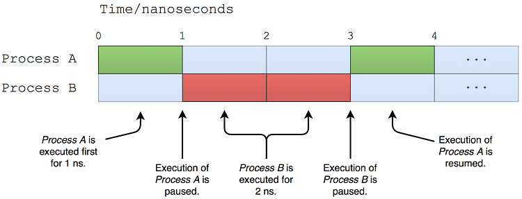

6 并发性
===========

本章包括：
* 并发性的重要性
* 并发与并行
* Nim语言的Thread 线程
* 使用正则表达式和其他方法对数据进行高级分析
* 并行分析大型数据集

每个计算机程序执行一个或多个计算。这些计算通常按顺序执行。也就是说，当前计算必须在下一个计算开始之前完成。例如，考虑一个简单的计算`（2+2）*4`，其中必须首先计算加法得到`4`，然后再进行乘法得到 `16`。在该示例中，依次执行计算*并发*允许多个计算进行，而无需等待所有其他计算完成。这种计算形式在许多情况下都很有用。一个示例是输入/输出应用程序，如您在*第3章*中开发的聊天应用程序。当按顺序执行时，此类应用程序将浪费时间等待输入或输出操作完成。并发性允许将此时间用于其他任务，从而大大减少应用程序的执行时间。


Nim提供了许多内置的并发功能。其中包括`Futures`和`await`形式的异步I/O功能，以及用于创建新线程的`spawn`等。您已经看到了 *第3章* 中使用的一些。

Nim中的并发性仍在不断发展，这意味着本章中描述的功能可能会发生变化或被新的更健壮的功能所取代。但是Nim中并发的核心概念应该保持不变，本章将学习的内容也适用于其他编程语言。

除了向您展示Nim的并发特性之外，本章还将带领您完成一个简单解析器的实现，它将向您展示创建解析器的不同方法。然后，本章将通过优化解析器来结束，以便它是并发的，并且可以在多个CPU内核上并行运行。

6.1并发与并行
================================
如今，几乎所有操作系统都支持“多任务处理”，即在一定时间内执行多个任务的能力。任务通常称为“进程”，它是正在执行的计算机程序的实例。每个CPU一次只执行一个进程。多任务允许操作系统改变当前在CPU上执行的进程，而不必等待进程完成其执行*图6.1*显示了如何在多任务操作系统上同时执行两个进程。

图6.1.两个过程的并发执行



由于CPU速度极快，进程A可以执行1纳秒，然后进程B可以执行2纳秒，然后过程A可以执行另一纳秒。这给人一种“同时”执行多个进程的印象。但这不可能发生，因为CPU一次只能执行一条指令。这种同时执行多个进程的明显现象称为并发。

近年来，多核CPU变得流行起来。这些类型的CPU由两个或多个独立的单元组成，它们可以同时运行多个指令。这允许多任务操作系统同时并行运行两个或多个进程*图6.2*显示了如何在双核CPU上并行执行两个进程。


Figure 6.2. 并行执行两个进程


与单核CPU相反，双核CPU实际上可以同时执行两个进程。这种类型的执行被称为并行，它只能在多个物理CPU上实现。请记住，尽管并发和并行之间有明显的相似之处，但两者并不相同。

除了进程之外，操作系统还管理*线程Thread*的执行。线程是进程的一个组件，同一进程中可以存在多个线程。它可以像进程一样并发或并行执行，尽管与进程不同，线程之间共享内存等资源。

为了充分利用多核CPU的能力，CPU密集型计算必须并行化。这可以通过使用多个进程来实现，尽管线程更适合于需要共享大量数据的计算。

您在*第3章*中看到的异步等待是严格并发的。因为异步代码总是在单个线程上运行，所以它不是并行的。这意味着它目前无法使用多核CPU的全部功能。

>便条：并行异步等待
Nim的未来版本很可能包括并行异步等待。

与异步等待不同，`spawn`是并行的，专门为CPU密集型计算而设计，可以从在多核CPU上执行中受益。

>便条 其他编程语言中的并行性
一些编程语言（如Python和Ruby）不支持线程级并行，因为它们的解释器中存在全局解释器锁。这防止了使用线程的应用程序使用多核CPU的全部功能。有一些方法可以克服这种限制，但它们需要使用不像线程那样灵活的进程

6.2在Nim中使用线程
=========================

既然您已经了解了并发和并行之间的区别，那么就可以学习如何在Nim中使用线程了。


在Nim中，有两个模块用于处理线程。 `threads` 模块[[19]]（#ftn.d5e6428）公开了手动创建线程的能力，使用此方法创建的线程立即执行指定的过程，并在该过程的运行时间内运行。还有实现*线程池*的  `threadpool` 模块[[20]]（#ftn.d5e6432），它公开了将指定过程添加到线程池的*任务队列*的 `spawn`。 `spawn`过程的行为并不意味着它将立即在单独的线程中运行。线程的创建完全由线程池管理。

接下来的部分将向您介绍两个不同的线程模块，因此不要对上一段中介绍的新术语感到不知所措。


6.2.1  `threads`线程模块和GC安全
-----------------------------------------

在本节中，我将查看`threads` 模块。但在开始之前，我必须解释Nim中线程的工作方式，特别是您将了解Nim中的**垃圾收集器安全性**。Nim和大多数其他编程语言中线程的工作方式有一个非常重要的区别。Nim的每个线程都有自己的独立内存堆。线程之间的内存共享受到限制，这有助于防止竞争条件并提高效率。

由于每个线程都有自己的垃圾收集器，因此效率得到了提高。在共享内存的线程中，执行其他业务代码时， 需要在垃圾收集器暂停所有线程。这可能会给应用程序添加有问题的暂停。

让我向您展示这个线程模型在实践中是如何工作的*清单6.1*显示了一个未编译的代码示例。

清单6.1.使用`Thread`更改全局变量。

```Nim
var data = "Hello World"               ❶

proc showData() {.thread.} =           ❷
  echo(data)                           ❸

var thread: Thread[void]               ❹
createThread[void](thread, showData)   ❺
joinThread(thread)                     ❻
```

>❶ 定义一个新的全局变量 `data` 并赋值文本为 `"Hello World"`
❷ 定义一个新的函数，将在新线程中执行. 用`{.thread.}` 编译指示标识。
❸ 尝试显示 `data` 变量的值。
❹ 定义一个变量来存储新线程，泛型参数表示线程过程采用的参数类型。在这种情况下，`void` 表示过程不接受参数
❺  `createThread` 函数在新线程中执行指定的函数。
❻ 等待 `thread` 线程结束。


> 便条 `threads`模块
 `threads` 模块是 `system`系统模块隐式导入的一部分，因此你不用再导入。 

这个示例说明了Nim中的 *GC安全* 机制所不允许的内容，稍后您将看到如何修复该示例以便进行编译。将*清单6.1*中的代码保存为`listing01.nim`，然后执行`nim c--threads:on listing01.nim`以编译它。`--threads:on` 标志是启用线程支持所必需的。您应该看到一个类似于*清单6.2*中的错误。


清单6.2. *清单6.1的编译输出*
```
listing01.nim(3, 6) Error: 'showData' is not GC-safe as it accesses 'data' which is a global using GC'ed memory
```

该错误很好地描述了问题。全局变量“data”已在主线程中创建，因此它属于主线程的内存。“showData”线程无法访问另一个线程的内存，如果它试图访问，则编译器不认为它是“GC安全”的。编译器拒绝执行GC不安全的线程。

只要一个过程不访问任何包含垃圾回收内存的全局变量，编译器就认为它是GC安全的。赋值或任何类型的变异也算作访问，是不允许的。垃圾回收内存包括（但不限于）以下类型的变量：

* `string`
* `seq[T]`
* `ref T`


还有其他在线程之间共享内存的方式是GC安全的。例如，可以将“data”的内容作为参数之一传递给“showData”*清单6.3*显示了如何将数据作为参数传递给线程，*清单6.3*和*清单6.1*之间的差异以粗体显示(**两个星直间的参数**)。

清单6.3.将数据安全地传递给线程

```nim
var data = "Hello World"

proc showData(**param: string**) {.thread.} =   ❶
  echo(**param**)   ❷

var thread: Thread[ **string** ]   ❸
createThread[ **string** ](thread, showData, **data**)   ❹
joinThread(thread)
```

>❶ 这次在过程定义中指定了“string”类型的参数
❷ 过程参数传递给“echo”，而不是全局变量“data”。
❸“void”已被“string”替换，以表示“showData”过程采用的参数类型
❹“data”全局变量被传递给“createThread”过程，该过程将将其传递给“showData”。


保存 *清单 6.3* 的代码为 `listing2.nim` 文件, 然后运行命令编译 `nim c -r --threads:on listing2.nim`。 编译成功后运行会显示 `"Hello World"`。

`createThread`过程只能将一个变量传递给它正在创建的线程。为了将多个单独的数据段传递给线程，必须定义一个新类型来保存数据。下面的列表显示了如何做到这一点。

```nim
type
  ThreadData = object
    param: string
    param2: int


var data = "Hello World"

proc showData(**data: ThreadData**) {.thread.} =
  echo(**data.param, data.param2**)

var thread: Thread[**ThreadData**]
createThread[**ThreadData**](thread, showData, **ThreadData(param: data, param2: 10)**)
joinThread(thread)
```


### 线程的执行
到目前为止，上面清单中创建的线程还没有做太多。让我们来检查这些线程的执行情况，看看当同时创建两个线程并被指示显示几行文本时会发生什么情况——在下面的示例中，显示了两个整数序列。

清单6.4.执行多个线程

```nim
var data = "Hello World"

proc countData(param: string) {.thread.} =
  for i in 0 .. <param.len:   ❶
    stdout.write($i)          ❷
  echo()                      ❸

var threads: array[2, Thread[string]]               ❹
createThread[string](threads[0], countData, data)   ❺
createThread[string](threads[1], countData, data)   ❺
joinThreads(threads)          ❻
```

>❶  循环迭代从0到参数`param`的长度减去1。
❷ 显示当前迭代计数器而不显示新行字符。
❸ 运行到下一行
❹ 这次有两个线程，它们存储在一个数组中。
❺ 创建一个线程并将其分配给“threads”数组中的一个元素。
❻ 等待所有线程完成。


保存*清单6.4*的代码为 `listing3.nim`，然后编译运行，*清单6.5*显示了大多数情况的输出，*清单6.6*显示了有时的输出。

清单6.5.执行*清单6.4*中的代码时的第一个可能输出：
```
001122334455667788991010
```

清单6.6.执行*清单6.4*中的代码时的第二个可能输出
```
012345678910
012345678910
```

线程的执行完全取决于所使用的操作系统和计算机。在我的机器上，*清单6.5*中的输出可能是两个线程在两个CPU内核上并行运行的结果。而*清单6.6*中的输出是第一个线程在第二个线程启动之前完成的结果。您的系统可能会显示完全不同的结果*图6.3*显示了第一组和第二组结果的执行情况。


图6.3.*清单6.4的两种可能执行*


使用“线程”模块创建的线程相当耗费资源。它们消耗大量内存，因此您不应该创建大量的内存，因为这样做效率很低。如果您希望完全控制应用程序正在使用的线程，那么它们很有用，但在大多数使用情况下，“线程池”模块更优越。让我们看看“线程池”模块现在是如何工作的。


6.2.2  使用线程池
-------------------------

使用多线程的主要目的是代码的并行化。CPU密集型计算应尽可能多地使用CPU算力，这包括使用具有多核CPU的系统中所有内核的算力。


单个线程可以利用单个CPU内核的功能。因此，为了利用所有内核的功能，您可以简单地为每个内核创建一个线程。最大的问题是确保这些线程都很忙。您可能有100个任务，这些任务并不都需要相同的时间来完成，在线程之间分发它们并不简单。

或者，可以为每个任务创建一个线程。但这本身也有问题，其中之一是线程创建非常昂贵。大量线程将消耗大量内存。


**什么是线程池**
`threadpool` 线程池模块实现了一个抽象，它管理多个线程上的任务分配。线程本身也由线程池管理。

`spawn`过程允许以过程的形式将任务添加到线程池中。线程池在其管理的一个线程中执行给定的过程。它确保程序使所有线程保持忙碌状态，从而以最佳方式利用CPU的功率*图6.4*显示了线程池如何在后台管理任务。


图6.4.Nim线程池


**使用`spawn`**
`spawn`过程接受表达式。在大多数情况下，表达式是过程调用`Spawn`返回类型为`FlowVar[T]`的值，该值保存所调用过程的返回值。与线程不能返回任何值的 `threads` 模块相比，这是一个优势。

*清单6.7*显示了相当于*清单6.4*中代码的“派生”。

清单6.7.使用`spawn`执行多个线程
```nim
import threadpool   ❶
var data = "Hello World"

proc countData(param: string) =   ❷
  for i in 0 .. <param.len:
    stdout.write($i)
  echo()

spawn countData(data)   ❸
spawn countData(data)

sync()   ❹
```

>❶ 需要显式导入`线程池`模块才能使用`spwan`。
❷ 传递给“派生”的过程不需要`｛.thread.｝`编译指示。
❸ *spwan* 过程的语法要简单得多。
❹ `sync` 过程用于等待所有派生过程完成。


将*清单6.7*中的代码保存为`listing4.nim`，然后编译并运行它。请记住，仍然需要指定`--threads:on` 标志。输出应与*清单6.5和6.6*中所示的输出大致相同。

使用 `spawn` 执行的过程也必须是GC安全的。


**正在从`FlowVar` 类型检索返回值**

让我们看一个示例，它显示了如何从派生过程中检索返回值。这涉及处理`FlowVar[T]`类型。这种类型可以被认为是一种容器，类似于您在*第3章*中使用的`Future[T]`类型。起初，容器内没有任何内容。当派生过程在单独的线程中执行时，在将来的某个时刻，它会返回一个值。发生这种情况时，返回的值被放入`FlowVar`容器中。

*清单6.8*显示了*第3章*中的`readLine`过程，其中有一个while循环，用于从终端读取文本而不阻塞。


清单6.8.使用 spwan 从终端读取输入

```nim
import threadpool, os   ❶

let lineFlowVar = spawn stdin.readLine()   ❷
while not lineFlowVar.isReady:   ❸
  echo("No input received.")     ❹
  echo("Will check again in 5 seconds.")   ❹
  sleep(5000)           ❺

echo("Input received: ", ^lineFlowVar)     ❻
```


>❶ `spwan` 需要导入 `threadpool`模块。`os` 模块定义`sleep`过程。
❷ 将`readLine`过程添加到线程池中，`spawn`将返回一个`FlowVar[string]`类型，该类型将分配给“lineFlowVar”变量。
❸ 循环直到`lineFlowVar`包含`readLine`返回的字符串值。
❹ 显示有关程序正在执行的操作的一些状态消息。
❺ 暂停主线程5秒，`sleep`参数以毫秒为单位。
❻ 当循环完成时，可以使用`^`运算符立即读取`lineFlowVar`。该行显示由`readLine`读取的输入。

将*清单6.8*保存为`listing5.nim`，然后编译并运行它。应用程序将等待您向终端输入一些输入。它只会每隔5秒检查输入是否已输入。

使用`FlowVar`类型很简单。读取包含在其中的值是使用`^`运算符完成的，请记住，使用此运算符将阻塞它所使用的线程，直到调用它的`FlowVar`包含值为止。您可以使用`isReady`过程检查`FlowVar`是否包含值。*清单6.8*检查`lineFlowVar`变量是否每隔5秒周期性地包含一个值。

请记住，*清单6.8*旨在演示`FlowVar[T]`是如何工作的。该示例并不实用，因为程序仅每5秒检查一次输入。

当然，在这种情况下，您也可以在主线程上调用`readLine`，因为它主线程上没有运行任何其他程序。这样做的目的是用一些其他过程替换`sleep(5000)`语句，这些过程在主线程中做一些有用的工作，例如，您可以绘制应用程序的用户界面，或调用异步I/O事件循环的`poll`过程，如*第3章*所示。


6.2.3 线程异常
----------------------------

异常在单独线程中的行为方式可能令人惊讶。当线程因未处理的异常而崩溃时，应用程序将随之崩溃。无论是否读取`FlowVar` 的值都无关紧要，*清单6.9*显示了这种行为。


清单6.9.spawn过程中的异常。

```nim
import threadpool

proc crash(): string =
  raise newException(Exception, "Crash")

let lineFlowVar = spawn crash()
sync()
```

将*清单6.9*保存为“listing6.nim”，然后编译并运行它。您应该在输出中看到一个回溯，指向`crash` 过程中的`raise`语句。


>提示`raise`编译指示
* `{.raises.}`编译指示可用于确保线程处理所有异常。要使用它，可以定义“crash”过程，如下所示：`proc crash() :string {.raises:[].} = … `
* traceback：回溯，追溯，可以查看错误代码的位置。

总之，向派生过程传递参数和接收过程结果的简单性，使“`spawn`派生”适用于运行时间相对较短的任务。这样的任务通常在执行结束时产生结果，因此在执行停止之前不需要与其他线程通信。

对于需要定期与其他线程通信的**长时间运行**的任务，应改用“线程`threads`”模块中定义的`createThread`过程。

  

[[19]](#d5e6428) <http://nim-lang.org/docs/threads.html>
[[20]](#d5e6432) <http://nim-lang.org/docs/threadpool.html>


6.3 解析数据
=================
既然您知道了如何在Nim中使用线程，那么让我们来看一个如何使用线程的实际示例。本节所示的示例将涉及解析器。

解析器可以从并行化中受益匪浅，因为它能够利用所有CPU内核，从而更高效地解析数据。因此，除了了解解析器如何工作外，本节还将向您展示并行化的实际用例，更重要的是，如何在这种用例中利用Nim的并发性和并行性特性。

每天都会产生大量数据；这些数据来自许多不同的来源，并用于许多不同的应用。计算机是处理数据的非常有用的工具。但为了使用这些数据，计算机必须理解数据存储的格式。

*解析器*是软件的一个组件，它接收输入数据并从中构建数据结构。数据通常是文本形式。在*第3章*中，您已经了解了JSON数据格式，以及如何使用`json`模块将其解析为数据结构，然后可以查询该数据结构以获取特定信息。

经常会遇到为简单数据格式编写自定义解析器的任务。Nim有很多方法可以解决这一问题。

在本节中，我将向您展示如何为维基百科的页面视图数据编写解析器。[[21]](#ftn.d5e6783) 这些数据对许多不同的应用程序都很有用，但本节的目的是创建一个应用程序，该应用程序将在英语维基
百科中找到最受欢迎的页面。在本节中，您将：
* 了解维基百科页面计数文件的结构和格式。
* 使用不同的技术为页计数格式编写解析器。
* 通过将大文件拆分成大小方便的小块或片段来读取大文件。

> 便条 维基百科API
维基百科最近推出了一个Pageview API[[22]](#ftn.d5e6797)，它补充了原始页面视图数据。这个API使查找英语维基百科中最受欢迎的页面变得更加容易。如果您正在编写一个应用程序，需要专门查找维基百科上最受欢迎的页面，那么您可能需要使用API。手动解析原始数据的效率较低，但您希望发现该示例适用于其他任务。
在本节末尾，我还将向您展示如何并行化解析器。这将使它在具有多核CPU的系统上表现得更好。

6.3.1 了解维基百科页面计数格式
-----------------------------------------------------
原始页面计数数据可以从以下URL下载：<https://dumps.wikimedia.org/other/pagecounts-all-sites/>。

数据文件被组织成特定的年份和月份。例如，2016年1月的页面计数数据可从以下URL获得：<https://dumps.wikimedia.org/other/pagecounts-all-sites/2016/2016-01/>. 然后，页面计数数据被进一步细分为一天和一小时。位于上述URL中的每个文件表示一小时内的访问者。这些文件都是gzip的，以减小它们的大小。

下载以下文件，然后解压缩：<https://dumps.wikimedia.org/other/pagecounts-all-sites/2016/2016-01/pagecounts-20160101-050000.gz>


>Windows用户注意
在Windows上，您可能需要安装7zip或其他应用程序来提取gzip存档
该文件可能需要一段时间才能下载，具体取决于您的网速。这个文件在提取之前大约是92MB，提取之后大约是428MB，所以它是一个相当大的文件。解析器需要尽可能高效，以便及时解析该文件。
文件由换行符分隔的文本行填充，每行文本由以下4个空格分隔的字段组成：

```
domain_code page_title count_views total_response_size
```

`domain_code`包含缩写域名，例如`en.wikipedia.org`缩写为`en`。`page_title` 包含请求页面的标题，例如`Dublin`表示`http://en.wikipedia.org/wiki/Dublin`。`count_views`包含一小时内查看页面的次数。最后，`total_response_size`包含页面请求引起的总响应大小。

例如，下面的行：
```
en Nim_(programming_language) 1 70231
```

表示有1个请求`"http://en.wikipedia.org/wiki/Nim\_(programming\_language)"`，总共响应请求返回了70231个字节。

你下载的文件是一月份的小文件之一。它包含从2016年1月1日下午4:00 UTC到2016年1月份1日下午5:00 UTC在维基百科上访问的页面的数据。

6.3.2解析维基百科页面计数格式
-----------------------------------------------

在解析上述数据格式时，有许多不同的选项。在本小节中，我将使用两种不同的方法实现解析器：正则表达式和`parseutils`模块。


**使用正则表达式**

解析数据的常用方法是使用正则表达式。如果您曾经以任何方式处理过字符串处理，那么很可能遇到过它们。正则表达式非常流行，在许多情况下，当开发人员面临需要他们解析字符串的任务时，他们会立即使用正则表达式。

正则表达式决不是每个解析问题的神奇解决方案。例如，编写正则表达式来解析任意HTML实际上是不可能的。但是对于解析上面定义的简单数据格式的任务，正则表达式工作得很好。

深入解释正则表达式超出了本章的范围。如果你不熟悉它们，我们鼓励你在网上阅读它们。
Nim通过`re`模块支持正则表达式。它定义了使用正则表达式解析和操作字符串的过程和类型。

> 注意：外部依赖性
`re` 模块是一个不纯的模块，这意味着它依赖于外部C库。 在`re`的情况下，库称为`PCRE`，它必须安装在应用程序旁边，以便应用程序正常运行。


让我们先来分析一行。*清单6.10*显示了如何使用`re`模块实现这一点。

清单6.10.使用`re`模块分析数据
```nim
import re   ❶

let pattern = re"([^\s]+)\s([^\s]+)\s(\d+)\s(\d+)"    ❷

var line = "en Nim_(programming_language) 1 70231"
var matches: array[4, string]   ❸
let start = find(line, pattern, matches)   ❹
doAssert start == 0             ❺
doAssert matches[0] == "en"                           ❻
doAssert matches[1] == "Nim_(programming_language)"   ❻
doAssert matches[2] == "1"                            ❻
doAssert matches[3] == "70231"                        ❻
echo("Parsed successsfully!")
```

❶ `re` 模块定义了下面使用的`find`过程
❷ 使用`re` 构造函数构造新的正则表达式模式
❸ 此`matches`数组将保存`line`的匹配子字符串
❹ `find`过程用于查找正则表达式中子组指定的匹配子字符串。子字符串被放入`matches`数组中
❺ 返回值表示匹配字符串的起始位置，如果没有匹配，则返回“-1”|
❻ 第一个匹配组将捕获子字符串`en`，然后是第二个匹配组，它将捕获`Nim_（programming ing_language）`，依此类推

> 警告 `re`构造函数
构造正则表达式是一项昂贵的操作，当使用同一正则表达式执行多个正则表达式匹配时，请确保重用`re`构造函数返回的值

将*清单6.10*另存为`listing7.nim`，然后编译并运行它。程序应能成功编译并运行。程序应显示“解析成功！”。

> 提示 PCRE问题
如果程序退出时出现类似`无法加载：pcre.dll`的错误，则您缺少pcre库，必须安装它。

用正则表达式解析字符串的代码很简单。只要您知道如何创建正则表达式，使用它应该不会有任何问题。

`re`模块还包括用于解析和操作字符串的其他过程。例如，可以使用“replace”过程替换匹配的子字符串。请查看`re`模块的文档以了解更多信息。[[23]](#ftn.d5e6900)

**使用`split`拆分手动分析数据`**

您还可以用许多不同的方式手动解析数据。这有多种优点，但也有一些缺点。与使用正则表达式相比，最大的优点是您的应用程序不依赖PCRE库。手动解析还可以让您更精确地控制解析过程。在某些情况下，最大的缺点是手动解析数据需要更多的代码。

对于这样一种简单的数据格式，您可以使用`strutils`模块中定义的`split`过程。*清单6.11*显示了如何使用`split`解析`en Nim_(programming_language) 1 70231`。

清单6.11.使用`split进行分析`
```nim
import strutils   ❶

var line = "en Nim_(programming_language) 1 70231"
var matches = line.split()       ❷
doAssert matches[0] == "en"      ❸
doAssert matches[1] == "Nim_(programming_language)"   ❸
doAssert matches[2] == "1"       ❸
doAssert matches[3] == "70231"   ❸
```

❶ `strutils`模块定义`split`过程|
❷ 默认情况下，`split`过程在找到空格时拆分字符串。返回的序列将是`@["en", "Nim_(programming_language)", "1", "70231"]`
❸ 生成的`matches` 变量的内容与之前相同

这将非常适合这个用例。但对于更复杂的数据格式，您可能希望使用更灵活的格式。解析字符串最灵活的方法是使用while循环遍历字符串中的每个字符。这种解析方法也非常冗长，但在某些情况下非常有用，例如在解析更复杂的数据格式（如HTML）时。Nim提供了一个`parseutils` 模块，该模块定义了使用此类方法进行解析的过程。


**Parsing the data manually using `parseutils`**


*Listing 6.12* shows how the `parseutils` module can be used to parse "en Nim\_(programming\_language) 1 70231".


Listing 6.12. Parsing using `parseutils`


**使用 `parseutils` 手动分析数据`**

*清单6.12*显示了如何使用`parserutils` 解析 `"en Nim\_(programming\_language) 1 70231"`。

清单6.12.使用`parseutils`进行分析

```nim
import parseutils     ❶

var line = "en Nim_(programming_language) 1 70231"

var i = 0             ❷
var domainCode = ""   ❸
i.inc parseUntil(line, domainCode, {' '}, i)   ❹
i.inc                 ❻
var pageTitle = ""    ❸
i.inc parseUntil(line, pageTitle, {' '}, i)    ❹
i.inc                 ❻
var countViews = 0    ❸
i.inc parseInt(line, countViews, i)            ❺
i.inc                 ❻
var totalSize = 0     ❸
i.inc parseInt(line, totalSize, i)             ❺


doAssert domainCode == "en"
doAssert pageTitle == "Nim_(programming_language)"
doAssert countViews == 1
doAssert totalSize == 70231
```
>❶导入定义“parseUntil”的“parseutils”
❷ 定义一个计数器，以跟踪程序当前在字符串中的位置
❸ 定义一个字符串或int变量，用于存储解析的令牌
❹ 将从索引“i”开始的字符从字符串“line”复制到第二个参数中指定的字符串，直到“line[i]==”。返回的值是捕获的字符数
❺ 分析字符串“line”中从索引“i”开始的int。解析的int存储在第二个参数中。返回值是捕获的字符数
❻ 通过简单地递增“i”来跳过空白字符
