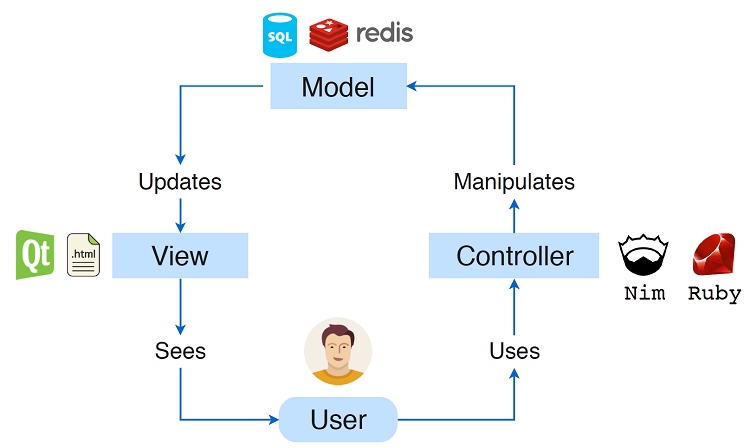
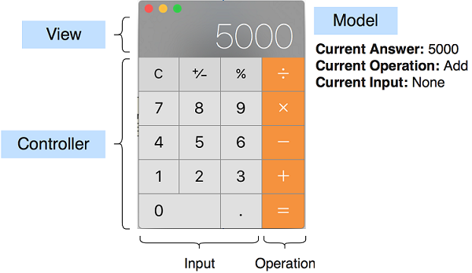

第七章 构建Twitter克隆
========================

本章包括：
* 用Nim开发Twitter克隆
* 在SQL数据库中存储和查询数据
* 生成HTML并将其发送到用户的浏览器
* 部署web应用程序

由于Web浏览器的广泛使用和大多数Web应用程序的便利性，Web应用程序近年来变得非常流行。Web应用程序很方便，因为它们可以立即使用，而无需安装任何附加软件。

基于Web的电子邮件是使用最广泛的Web应用程序类型之一。Gmail、Outlook、Yahoo和ProtonMail等电子邮件提供商都提供作为web应用程序实现的自定义电子邮件客户端。桌面电子邮件客户端也被广泛使用，但大多数用户选择使用更方便的基于web的电子邮件客户端。您以前可能至少使用过一个这样的基于web的电子邮件客户端。

开发人员已经创建了许多类型的web应用程序。其中许多应用程序一直以web应用程序的形式使用，而其他应用程序最初是桌面应用程序。Web浏览器正在不断发展，它们包含了比以往更多的功能。Web浏览器现在甚至可以使用计算机的图形卡实时渲染3D图形。这些特性使开发web本地应用程序变得更容易，而web浏览器的跨平台特性使web应用程序的开发更具吸引力。

许多技术和编程语言支持web应用程序的开发。一些编程语言甚至专门设计用于web开发。PHP是此类语言中最著名的例子。其他编程语言的设计考虑到了其他用例。但由于它们的一个或多个特性，程序员发现这些语言非常适合web开发。

由许多组件组成的大型web应用程序通常用多种不同的编程语言编写。选择的语言和技术应符合该组件的要求。在大多数情况下，核心基础设施是用一种语言编写的，少数小型专用组件是用一或两种不同的编程语言编写的。例如，YouTube使用C、C++、Java和Python作为其许多不同的组件，但核心基础设施是用Python编写的。


由于Python提供了巨大的开发速度，YouTube能够快速响应变化并快速实现新想法，从而快速发展。起初，性能不是一个重要因素，而且在需要更高性能的情况下，可以使用C扩展实现。

较小的web应用程序通常用单一编程语言编写。编程语言的选择有所不同，但它通常是Python、Ruby或PHP等脚本语言。这些语言因其表达和解释特性而备受青睐，这使得web应用程序可以快速迭代。

不幸的是，用这些语言编写的应用程序通常很慢。这导致一些主要网站出现问题。例如，Twitter最初是用Ruby编写的，但最近被转移到了Scala，因为Ruby太慢，无法处理用户每天发布的大量推文。

网站也可以用C++、Java和C#等编译语言编写。这些语言产生了非常快的应用程序，但其开发速度不如Python或其他脚本语言。这是因为这些语言的编译时间很慢，这意味着在对应用程序进行一些更改后，您必须花更多时间等待测试。这些语言也不像Python或其他脚本语言那样富有表现力。

Nim是一种混合语言，它既是一种编译语言，也是一种脚本语言。在许多方面，它与任何脚本语言一样富有表现力，也与任何编译语言一样快。尼姆的编译时间也很快。这使得Nim成为优雅地开发高效web应用程序的好语言。

本章将引导您完成web应用程序的开发。具体来说，它将向您展示如何开发与Twitter非常相似的web应用程序。当然，开发一个完整的Twitter克隆将花费太多的时间和精力，本章将开发的版本将大大简化。

在本章中，您需要一些SQL知识。具体来说，您需要知道如何理解常见SQL语句的结构和语义，包括`CREATE TABLE` 和`SELECT`。

7.1 web应用程序的体系结构
======================================
开发人员在设计web应用程序时使用了许多不同的体系结构模式。许多web框架基于非常流行的模型-视图-控制器(MVC)模式及其变体。MVC框架的一个例子是RubyonRails。

模型视图控制器是一种体系结构模式，传统上用于桌面上的图形用户界面。事实证明，这种模式对于包含呈现给用户的界面的web应用程序也非常有用。MVC模式由三个不同的组件组成。这些部件经过专门选择，使它们彼此独立。MVC中的三个组件是充当数据存储的*model*、向用户呈现数据的*view*和赋予用户控制应用程序能力的*controller*，*图7.1*显示了三个不同组件的通信方式。

图7.1.MVC架构中的三个不同组件及其交互方式


想象一个由多个按钮和一个显示器组成的简单计算器应用程序。在这种情况下，*模型*将是一个简单的数据库，它存储已输入计算器的数字，*视图*将是显示当前计算结果的显示器，*控制器*将检测任何按钮按下并相应地控制*视图*和*模型*，*图7.2*显示了一个带有不同组件标签的简单图形计算器。

图7.2.计算器GUI上的三个不同MVC组件



使用此模式设计web应用程序是一个好主意。尤其是在编写非常大的web应用程序时。使用此模式可以确保代码不会将数据库代码、HTML生成代码和逻辑代码混合在一起。这使得大型web应用程序更易于维护。根据用例的不同，也可以使用这种模式的变体，即以不太严格的方式分隔代码，反之亦然。

在设计web应用程序的架构时，您可能已经很自然地将代码划分为逻辑独立的单元。这样做可以获得与使用MVC模式相同的好处，另外还有一个好处，就是让代码库更具体地解决您正在解决的问题。并不总是需要遵守架构模式，而且有些web框架是模式无关的。这些类型的框架更适合小型web应用程序，或者不需要包含MVC模式的所有组件的应用程序。

对于每一个强制使用MVC模式的web框架，至少有一个web框架没有这样做。Sinatra就是这种框架的一个例子。它是用Ruby编写的，就像RubyonRails一样，但与RubyonRails不同，它被设计成极简主义。与RubyonRails相比，Sinatra要轻得多，因为它缺乏成熟的web应用程序框架中常见的许多功能，例如：

* 帐户、身份验证和授权。
* 数据库抽象层。
* 输入验证和输入整洁性。
* 模板化引擎。
  
这使得Sinatra非常容易使用，但意味着它不支持RubyonRails那样多的开箱即用功能。Sinatra反而鼓励其他开发人员开发实现缺失功能的附加包。

术语“微框架”是指像Sinatra这样的极简web应用程序框架。存在许多微框架，其中一些基于Sinatra并用各种编程语言编写。甚至有一个是用Nim写的，叫做Jester。

《Jester》是一部以Sinatra为原型的微框架作品。在撰写本文时，它是目前最流行的Nim web框架之一。本章将使用Jester开发web应用程序，因为它很容易上手，并且是所有Nim web框架中最成熟的。Jester托管在Github上，网址如下：<https://github.com/dom96/jester>. 在本章稍后，您将看到如何使用Nimble包管理器安装Jester，现在让我解释如何使用Jester这样的微框架来编写web应用程序。

7.1.1 微框架中的路由
---------------------------------
成熟的web框架通常需要在开始开发web应用程序之前创建一个大的应用程序结构。微框架可以立即使用，所需要的只是对路由的简单定义，*清单7.1*显示了Jester中的一个简单路由定义。

清单7.1.使用Jester定义的`/`路由

```nim
routes:
  get "/":
    resp "Hello World!"
```

为了更好地理解“路由”是什么，让我先解释一下web浏览器如何从web服务器检索网页*图7.3*显示了对twitter.com的HTTP请求。

图7.3.对twitter.com的HTTP请求


当您浏览互联网并导航到不同的网站或网页时，Web浏览器会使用特定的URL请求该页面。例如，当导航到Twitter的首页时，您的web浏览器首先连接到`Twitter.com`，然后要求Twitter服务器向其发送首页的内容。交换使用HTTP协议进行，看起来类似于*清单7.2*中所示的协议。

清单7.2.一个简单的 HTTP GET 请求


```
GET / HTTP/1.1      ❶
Host: twitter.com   ❷
  ❸
```

>❶ 此行指定三条信息。第一个是使用的HTTP请求类型，第二个是请求的页面的*路径*，第三个是HTTP协议版本。
❷ HTTP请求可能包含一个或多个标头信息。“主机”标头指定web浏览器连接到的域名
❸ 发送空行请求服务器响应。

请注意*清单7.2*和*清单7.1*中的信息之间的相似之处。两个重要的信息是`GET `（HTTP请求的一种类型）和`/`（请求的网页的路径）。`\`路径是指首页的特殊路径。

在web应用程序中，路径用于区分不同的路线。这允许您根据请求的页面使用不同的内容进行响应。Jester接收到类似于*清单7.2*中的HTTP请求，它检查路径并相应地执行适当的路由*下图7.4*显示了此操作的实际情况。


一个普通的web应用程序将定义多个这样的路由，这些路由将包括`/register`、`/login`、`/search`等。您将开发的web应用程序将包括类似的路线。一些路由将执行某些操作，例如推特，而其他路由将简单地检索信息。


7.1.2 Tweeter的架构
----------------------------------
推特是我将用来指推特的简化版本的名字，您将在本章中开发它。显然，实现Twitter的每一项功能都需要花费太多的时间和精力，因为这样的Twitter将包含以下功能：
* 发布最多140个字符的消息。
* 在Twitter和许多其他社交媒体网站上订阅另一个用户的帖子，称为`following`关注。
* 查看您关注的其他用户发布的消息。

某些将明确不实现的功能包括：
* 用户身份验证：用户只需输入用户名并登录，无需注册。
* 搜索包括标签。
* 转发、回复消息或点赞消息。

这是一组非常小的特性，但它应该足以教你Nim中的web开发基础知识。通过这些功能，您将了解：
* web应用程序项目的结构
* 如何在SQL数据库中存储数据
* 如何使用Nim的模板语言
* 如何使用Jester web框架
* 如何在服务器上部署生成的应用程序

Tweeter的架构大致遵循前面解释的MVC架构模式。
以下信息需要存储在数据库中：
* 发布的消息以及发布这些消息的用户。
* 每个用户的用户名。
* 每个用户所关注的用户的名称。

在开发web应用程序时，将数据库操作抽象到一个单独的模块中是很有用的。在Tweeter中，这个模块将被称为`database`数据库，它将定义读取和写入数据库的过程。这很好地映射到MVC架构中的*model*组件。

HTML需要根据`database`模块提供的数据生成。为此，将创建两个单独的视图。其中一个视图将包含为首页生成HTML的过程，另一个视图包含为不同用户的时间线生成HTML的程序。每个过程都将生成一段不同的HTML。例如，将有一个`renderMain`过程，它将生成一个HTML页面，还有一个`renderUser`过程，该过程将生成一小段表示用户的HTML。

最后，包含路由的主源代码文件将充当控制器。它将从web浏览器接收HTTP请求，并根据这些请求执行以下操作：
* 从数据库中检索适当的数据。
* 基于该数据构建HTML代码。
* 将生成的HTML代码发送回请求的web浏览器。
* 图7.5*显示了开发这三个组件及其功能的过程。
  
图7.5 Tweeter的架构


7.2 开始项目
=========================

现在，您应该知道作为本章的一部分，您将构建什么。上一节描述了web应用程序的一般设计，并描述了Tweeter的具体设计。本节将描述开始项目所需的第一步，包括：
* 设置Tweeter的目录结构
* 初始化Nimble软件包
* 构建一个简单的Hello World Jester web应用程序

就像在*第3章*中一样，让我们从创建保存项目所需的目录和文件开始。在您的首选代码目录中创建一个新的“Tweeter”目录，例如`C:\code\Tweeter`或`~/code/Tweeter`。然后在其中创建一个`src`目录，并在该`src`文件夹中创建一个名为 `tweeter.nim`的Nim源代码文件。

清单7.3.Tweeter的目录结构

```
Tweeter
└── src   ❶
    └── tweeter.nim
```

这个项目将使用的web框架是Jester。这是一个外部依赖项，需要下载才能编译Tweeter。这个依赖项可以手动下载，但谢天谢地，这不是必须的，因为Jester是一个Nimble包，这意味着Nimble可以为您下载它。

*第5*章向您展示了如何使用Nimble，并解释了它的工作原理。在本章中，您将在开发期间使用Nimble。要做到这一点，您需要首先创建一个“.agible”文件。您可能还记得，可以使用Nimble的“init”命令快速生成一个。

为了初始化项目目录中的`.nimble`文件，请执行以下步骤。
1.打开新的终端窗口。
2.通过执行类似“cd~/code/Tweeter”的命令，使用`cd`进入到项目目录中。确保将“~/code/Tweeter”更换为项目的位置。
3.执行  `nimble init` 。
4.回答Nimble给出的提示。只需按回车键，即可使用其中大多数的默认值。

如果您正确完成了所有操作，那么终端窗口应该看起来像这样。

图7.6 Nimble软件包的成功初始化


现在打开由nimble创建的`Tweeter.nimble`文件。它应该与以下内容类似。

清单7.4.`Tweeter.nimble`文件

```nim
# Package

version       = "0.1.0"
author        = "Dominik Picheta"
description   = "A simple Twitter clone developed in Nim in Action."
license       = "MIT"

# Dependencies

requires "nim >= 0.13.1"
```

从最后一行可以看到，为了使“Tweeter”包成功编译，Nim编译器的版本必须至少为“0.13.1”。“requires”行指定了“Tweer”包的依赖性要求。您需要编辑这一行，以引入对“jester”包的要求。要做到这一点，只需编辑最后一行，使其显示为`requires"nim>=0.13.1,jester>=0.0.1"`。或者，您也可以在`Tweeter.nimble`文件的底部添加`requires"jester>=0.0.1"`。

您还需要将`bin=@["“"Tweeter"]`添加到`tweeter.nimble`文件中。这是为了让Nimble知道需要编译包中的哪些文件。确保您的`Tweeter.nimble`文件现在包含以下内容。

清单7.5.最终的`Tweeter.nimble`文件

```
# Package

version       = "0.1.0"
author        = "Dominik Picheta"
description   = "A simple Twitter clone developed in Nim in Action."
license       = "MIT"

bin = @["tweeter"]

# Dependencies

requires "nim >= 0.13.1"
```

现在再次打开`tweeter.nim`并将以下代码写入其中。

清单7.6.一个简单的Jester测试
```nim
import asyncdispatch      ❹

import jester             ❶

routes:                   ❷   ❹
  get "/":                ❺   ❸
    resp "Hello World!"   ❻   ❸

runForever()              ❼
```

>❶ 此模块定义用于运行事件循环的`runForever`过程
❷ 这将导入Jester web框架|
❸ 这些是Jester定义的领域特定语言的一部分
❹ 开始定义路由
❺ 定义在使用HTTP GET请求访问“/”路径时将执行的新路由|
❻ 回复文本“Hello World！”
❼ 一直运行异步事件循环


返回终端并执行`nimble c -r src/tweeter`。您的终端应显示类似于以下内容的内容：

图7.7`tweeter`的成功编译和执行


使用Nimble编译项目将确保满足项目的所有依赖项。如果您以前没有安装Jester包，Nimble将在编译Tweeter之前为您安装它。

正如您在*图7.7*中看到的那样，Jester以其独特的方式让您知道可以用来访问web应用程序的URL。现在，在您最喜爱的网络浏览器中打开一个新选项卡，并导航到Jester提供给您的URL<http://localhost:5000/>. 浏览时，您应该看到消息“Hello World”，如下图7.8*所示。

图7.8 Jester的Hello World


您的web应用程序将继续运行，并响应您抛出的任何请求。您可以通过按Ctrl+C（即Control和C键）终止它。

这将为您开发Tweeter提供一个良好的起点。这是一个缓慢的开始，但它向你展示了开始使用Jester是多么容易，尤其是在Nimble的帮助下。

现在让我们继续实现Tweeter，第一个任务是实现“数据库”模块。

7.3在数据库中存储数据
===============================
许多应用程序需要永久存储数据。数据库存储有组织的数据集合，有许多不同类型的数据库以不同的方式组织数据。这些数据库有许多不同的实现，因此在为项目选择数据库时有很多选择。

因为Nim还比较年轻，所以它支持的数据库不如一些更流行的编程语言（如C++或Java）那么多。然而，它确实支持许多最流行的数据库，包括Redis（一个键值数据库）、MongoDB（一个面向文档的数据库）、MySQL（一个关系数据库）等等。

如果您熟悉数据库，就会知道Redis和MongoDB都是所谓的NoSQL数据库。顾名思义，这些数据库不支持结构化查询语言对数据库进行查询。相反，他们实现了自己的语言，这种语言通常不像SQL那样成熟或复杂。

与许多不同类型的NoSQL数据库相比，您可能对关系数据库有更多的经验。你会很高兴听到Nim支持三种不同的SQL数据库。MySQL、SQLite和PostgreSQL都分别通过“db_MySQL”、“db_SQLite”和“db_postgres”模块支持。

Tweeter需要存储以下信息：
* 用户发布的消息，包含发布消息的用户及其发布时间的元数据。
* 有关特定用户的信息，包括他们的用户名和他们关注的用户的名称。


我提到的所有数据库都可以用来存储这些信息。数据库的选择取决于需求。在本章中，我将使用SQL数据库进行开发，因为它们很受欢迎，所以我会这样做。我将使用的具体实现是SQLite，因为它比MySQL或PostgreSQL更容易上手。

“数据库”模块将实现与推特消息和用户相关的特定信息的存储和查询。该模块的设计方式可以方便地扩展到以后使用不同的数据库实现。

7.3.1设置类型
---------------------------

首先在Tweeter的“src”目录中创建一个新的“database.nim”文件。您可以从定义该文件中的类型开始。这些类型将用于存储有关特定消息和用户的信息*清单7.7*显示了这些定义的样子。

清单7.7.用于保存推特消息和用户信息的类型。


```nim
import times       ❶
type   ❷
  User* = object   ❸
    username*: string   ❹
    following*: seq[string]   ❺

  Message* = object     ❻
    username*: string   ❼
    time*: Time    ❽
    msg*: string   ❾
```


❶]（#CO3-1）|导入“times”模块，因为它定义了“Message”定义中需要的“Time”类型|
| [❷]（#CO3-2）|开始新的类型定义部分|
| [❸]（#CO3-3）|定义新的“用户”值类型|
| [❹]（#CO3-4）|在“用户”类型中定义字符串“用户名”字段|
| [❺]（#CO3-5）|在“User”类型中定义一个序列“following”，这将包含用户所遵循的用户名列表|
| [❻]（#CO3-6）|定义新的“消息”值类型|
| [❼]（#CO3-7）|在“消息”类型中定义字符串“用户名”字段。此字段将指定发布消息的用户的唯一名称|
| [❽]（#CO3-8）|在“消息”类型中定义浮点“时间”字段。此字段将存储邮件发布的时间和日期|
| [❾]（#CO3-9）|在“消息”类型中定义字符串“消息”字段。此字段将存储发布的实际消息|


❶](#CO3-1) | Import the `times` module as it defines the `Time` type which is needed in the definition for `Message`. |
| [❷](#CO3-2) | Begin a new type definition section. |
| [❸](#CO3-3) | Define a new `User` value type. |
| [❹](#CO3-4) | Define a string `username` field in the `User` type. |
| [❺](#CO3-5) | Define a sequence `following` in the `User` type, this will hold a list of usernames that the user has followed. |
| [❻](#CO3-6) | Define a new `Message` value type. |
| [❼](#CO3-7) | Define a string `username` field in the `Message` type. This field will specify a unique name of the user that posted the message. |
| [❽](#CO3-8) | Define a floating point `time` field in the `Message` type. This field will store the time and date that the message was posted at. |
| [❾](#CO3-9) | Define a string `msg` field in the `Message` type. This field will store the actual message that was posted. |


这两种类型及其字段都使用`*`字符导出。`User`类型将表示关于单个特定用户的信息，而`Message`类型将类似地表示关于单个具体消息的信息。为了更好地说明这一点，请查看*图7.9*，其中显示了一条Twitter消息示例。

图7.9.Twitter消息示例


`Message`类型的实例可用于表示该消息中的数据*清单7.8*显示了如何以这种方式表示数据。

清单7.8.使用`Message` 的实例表示*图7.9*

```nim
var message = Message(
  username: "d0m96",
  time: parse("18:16 - 23 Feb 2016", "H:mm - d MMM yyyy"),   ❶
  msg: "Hello to all Nim in Action readers!"
)
```

>❶ `parse`是在`times`模块中定义的过程，它可以解析指定格式的给定时间，并返回保存该时间的`TimeInfo` 对象。

*图7.9*没有包含我关注的人的信息，但我们可以推测并为其创建一个“User”类型的实例。

清单7.9.使用`user`的实例表示用户


```nim
var user = User(
  username: "d0m96",
  following: @["nim_lang", "ManningBooks"]
)
```

 `database` 模块需要提供返回此类对象的过程。一旦返回了这些对象，就只需将存储在这些对象中的信息转换为HTML即可。然后，HTML可以由web浏览器呈现。

7.3.2设置数据库
------------------------------
在创建查询和存储数据的过程之前，需要创建数据库模式并用其初始化新数据库。

对于推特来说，这很简单。上面的“用户”和“消息”类型很好地映射到“用户”与“消息”表。您需要做的就是在数据库中创建这些表。

>注释 ORM
您可能熟悉对象关系映射库，它主要是基于对象自动创建表。不幸的是，Nim还没有任何可以使用的成熟ORM库。可以随意使用Nimble上发布的库。

我将使用SQLite作为Tweeter的数据库。SQLite很容易上手，因为完整的数据库可以直接嵌入到应用程序的可执行文件中。其他数据库软件需要提前设置并配置为作为单独的服务器运行。

在数据库中创建表是一项一次性任务，只有在需要创建新的数据库实例时才能执行。一旦创建了表，就可以用数据填充数据库并随后进行查询。我将向您展示如何编写一个快速Nim脚本，该脚本将创建数据库和所有必需的表。

在Tweeter的“src”目录中创建一个名为“createDatabase.nim”的新文件*清单7.10*显示了开始时应该使用的代码。

清单7.10.连接到SQLite数据库
```nim
import db_sqlite

var db = open("tweeter.db", "", "", "")   ❶

db.close()
```


>❶ `open`过程在指定位置创建新数据库。在这种情况下，它将在`createDatabase`的工作目录中创建一个`tweeter.db`文件。


“db_sqlite”模块“API的设计使其与其他数据库模块（包括“db_mysql”和“db_postgres”）兼容。这样，您可以简单地更改导入的模块以使用不同的数据库。这也是“db_sqlite”模块中的“open”过程有三个未使用的参数的原因。

清单7.10*中的代码除了在指定位置初始化一个新的SQLite数据库，或者在存在的情况下打开一个现有的数据库外，没有做太多的工作。“open”过程返回一个“DbConn”对象，然后可以使用该对象与数据库对话。让我向您展示如何开始创建表。

创建表的操作需要一些SQL知识*图7.10*显示了表创建后的样子。

图7.10.数据库表


*清单7.11*显示了如何创建存储“User”和“Message”对象中包含的数据所需的表。

清单7.11.在SQLite数据库中创建表
```nim
import db_sqlite

var db = open("tweeter.db", "", "", "")

db.exec(sql"""
  CREATE TABLE IF NOT EXISTS User(           ❶
    username text PRIMARY KEY                ❷
  );
""")

db.exec(sql""" 
  CREATE TABLE IF NOT EXISTS Following(      ❶
    follower text,        ❸
    followed_user text,   ❹
    PRIMARY KEY (follower, followed_user),   ❺
    FOREIGN KEY (follower) REFERENCES User(username),       ❻
    FOREIGN KEY (followed_user) REFERENCES User(username)   ❻
  );
""")

db.exec(sql"""
  CREATE TABLE IF NOT EXISTS Message(        ❶
    username text,        ❼
    time integer,         ❽
    msg text NOT NULL,    ❾
    FOREIGN KEY (username) REFERENCES User(username)        ❻
  );
""")

echo("Database created successfully!")

db.close()
```

|  |  |
| --- | --- |
| [❶](#CO6-1) | This SQL statement will create a new table, as long as the database does not already contain it. |
| [❷](#CO6-2) | Specifies that the `User` table should contain a `username` field and that it should be a primary key. |
| [❸](#CO6-4) | This field contains the username of the follower. |
| [❹](#CO6-5) | This field contains the username of the user that `follower` is following. |
| [❺](#CO6-6) | This specifies that both the `follower` and `followed_user` fields are together the primary key. |
| [❻](#CO6-7) | This creates a foreign key constraint which ensures that the data added to the database is correct. |
| [❼](#CO6-10) | This field contains the username of the user that posted the message. |
| [❽](#CO6-11) | This field contains the time when the message was posted, stored as Unix Time, the number of seconds since 1970-01-01 00:00:00 UTC. |
| [❾](#CO6-12) | This contains the actual message text, a `NOT NULL` key constraint is also present to ensure that it is not null. |


>❶]（#CO6-1）|此SQL语句将创建一个新表，只要数据库尚未包含该表|
| [❷]（#CO6-2）|指定“用户”表应包含“用户名”字段，并且该字段应为主键|
| [❸]（#CO6-4）|此字段包含关注者的用户名|
| [❹]（#CO6-5）|此字段包含“追随者”所关注用户的用户名|
| [❺]（#CO6-6）|这指定“follower”和“followed_user”字段都是主键|
| [❻]（#CO6-7）|这将创建一个外键约束，以确保添加到数据库中的数据是正确的|
| [❼]（#CO6-10）|此字段包含发布消息的用户的用户名|
| [❽]（#CO6-11）|此字段包含消息发布的时间，存储为Unix时间，即自1970-01-01 00:00:00 UTC以来的秒数|
| [❾]（#CO6-12）|这包含实际的消息文本，还存在“NOT NULL”键约束以确保其不为空|

哇，这是很多SQL。让我更详细地解释一下。每个“exec”行执行一段单独的SQL，如果该SQL未成功执行，则会引发错误。否则，将使用指定的字段成功创建新的SQL表。清单7.11*中的代码执行完毕后，生成的数据库将包含三个不同的表。由于SQLite不支持数组，因此需要第三个名为“Following”的表。

表定义包含许多表约束，这些约束可防止无效数据存储在数据库中。例如，“Following”表中存在的“FOREIGN KEY”约束确保“followed_user”和“follower”字段包含已存储在“user”表中的用户名。

将代码保存在“createDatabase.nim”文件中的*清单7.11*中。然后通过执行“agic c-r src/createDatabase”编译并运行它。您应该会看到“Database created successfully！”（数据库创建成功！）消息和tweeter目录中的一个`tweeter.db`文件。

数据库已经创建，现在可以开始定义存储和查询数据的过程了。


7.3.3  Storing and retrieving data
----------------------------------
