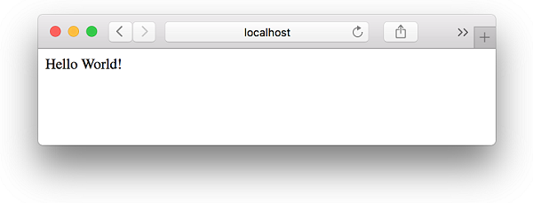
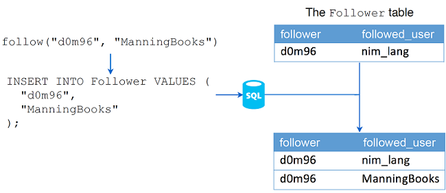
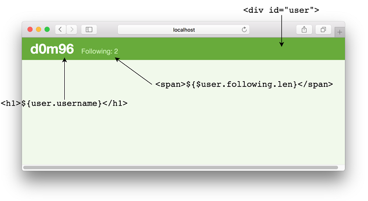
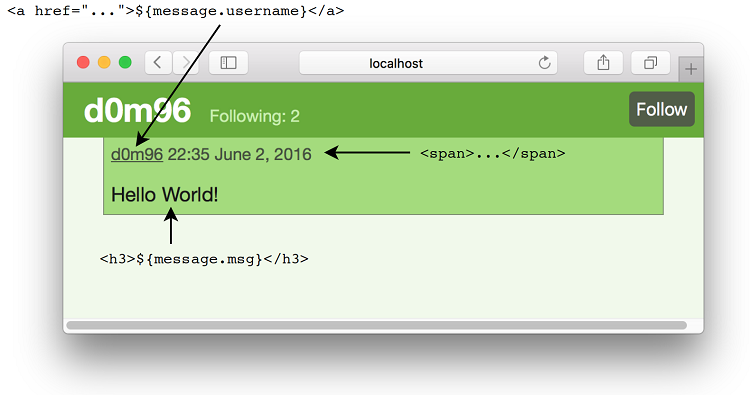
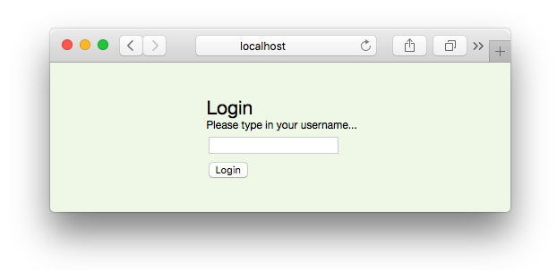
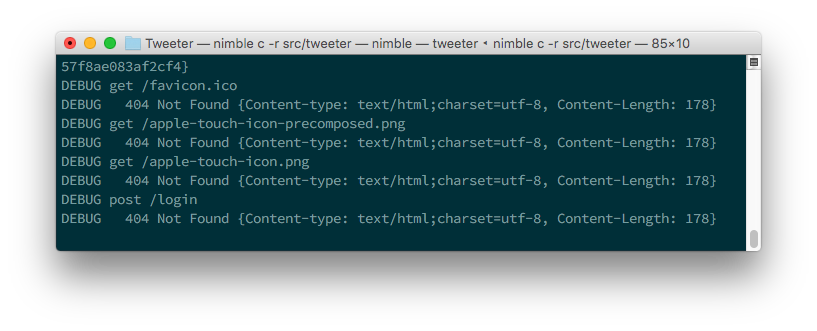
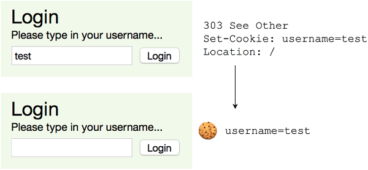
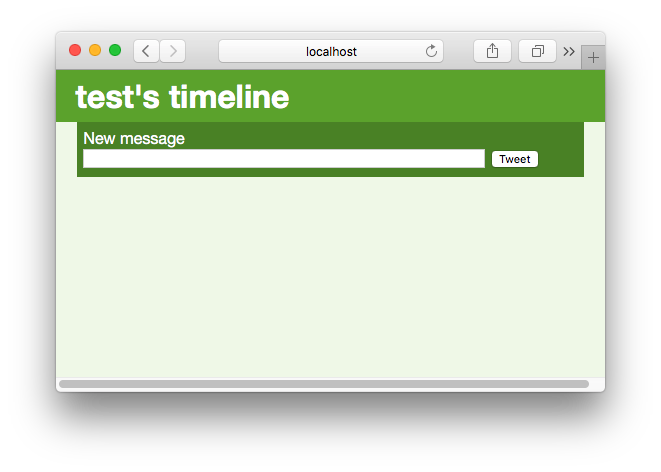
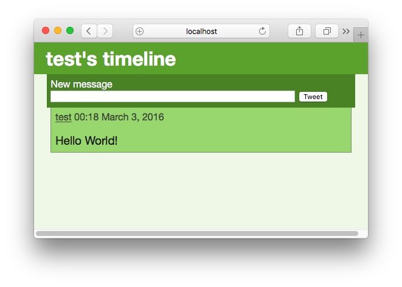

第七章 构建Twitter克隆
========================

本章包括：
* 用Nim开发Twitter克隆
* 在SQL数据库中存储和查询数据
* 生成HTML并将其发送到用户的浏览器
* 部署web应用程序

由于Web浏览器的广泛使用和大多数Web应用程序的便利性，Web应用程序近年来变得非常流行。Web应用程序很方便，因为它们可以立即使用，而无需安装任何附加软件。

基于Web的电子邮件是使用最广泛的Web应用程序类型之一。Gmail、Outlook、Yahoo和ProtonMail等电子邮件提供商都提供作为web应用程序实现的自定义电子邮件客户端。桌面电子邮件客户端也被广泛使用，但大多数用户选择使用更方便的基于web的电子邮件客户端。您以前可能至少使用过一个这样的基于web的电子邮件客户端。

开发人员已经创建了许多类型的web应用程序。其中许多应用程序一直以web应用程序的形式使用，而其他应用程序最初是桌面应用程序。Web浏览器正在不断发展，它们包含了比以往更多的功能。Web浏览器现在甚至可以使用计算机的图形卡实时渲染3D图形。这些特性使开发web本地应用程序变得更容易，而web浏览器的跨平台特性使web应用程序的开发更具吸引力。

许多技术和编程语言支持web应用程序的开发。一些编程语言甚至专门设计用于web开发。PHP是此类语言中最著名的例子。其他编程语言的设计考虑到了其他用例。但由于它们的一个或多个特性，程序员发现这些语言非常适合web开发。

由许多组件组成的大型web应用程序通常用多种不同的编程语言编写。选择的语言和技术应符合该组件的要求。在大多数情况下，核心基础设施是用一种语言编写的，少数小型专用组件是用一或两种不同的编程语言编写的。例如，YouTube使用C、C++、Java和Python作为其许多不同的组件，但核心基础设施是用Python编写的。


由于Python提供了巨大的开发速度，YouTube能够快速响应变化并快速实现新想法，从而快速发展。起初，性能不是一个重要因素，而且在需要更高性能的情况下，可以使用C扩展实现。

较小的web应用程序通常用单一编程语言编写。编程语言的选择有所不同，但它通常是Python、Ruby或PHP等脚本语言。这些语言因其表达和解释特性而备受青睐，这使得web应用程序可以快速迭代。

不幸的是，用这些语言编写的应用程序通常很慢。这导致一些主要网站出现问题。例如，Twitter最初是用Ruby编写的，但最近被转移到了Scala，因为Ruby太慢，无法处理用户每天发布的大量推文。

网站也可以用C++、Java和C#等编译语言编写。这些语言产生了非常快的应用程序，但其开发速度不如Python或其他脚本语言。这是因为这些语言的编译时间很慢，这意味着在对应用程序进行一些更改后，您必须花更多时间等待测试。这些语言也不像Python或其他脚本语言那样富有表现力。

Nim是一种混合语言，它既是一种编译语言，也是一种脚本语言。在许多方面，它与任何脚本语言一样富有表现力，也与任何编译语言一样快。尼姆的编译时间也很快。这使得Nim成为优雅地开发高效web应用程序的好语言。

本章将引导您完成web应用程序的开发。具体来说，它将向您展示如何开发与Twitter非常相似的web应用程序。当然，开发一个完整的Twitter克隆将花费太多的时间和精力，本章将开发的版本将大大简化。

在本章中，您需要一些SQL知识。具体来说，您需要知道如何理解常见SQL语句的结构和语义，包括`CREATE TABLE` 和`SELECT`。

7.1 web应用程序的体系结构
======================================
开发人员在设计web应用程序时使用了许多不同的体系结构模式。许多web框架基于非常流行的模型-视图-控制器(MVC)模式及其变体。MVC框架的一个例子是RubyonRails。

模型视图控制器是一种体系结构模式，传统上用于桌面上的图形用户界面。事实证明，这种模式对于包含呈现给用户的界面的web应用程序也非常有用。MVC模式由三个不同的组件组成。这些部件经过专门选择，使它们彼此独立。MVC中的三个组件是充当数据存储的*model*、向用户呈现数据的*view*和赋予用户控制应用程序能力的*controller*，*图7.1*显示了三个不同组件的通信方式。

图7.1.MVC架构中的三个不同组件及其交互方式


想象一个由多个按钮和一个显示器组成的简单计算器应用程序。在这种情况下，*模型*将是一个简单的数据库，它存储已输入计算器的数字，*视图*将是显示当前计算结果的显示器，*控制器*将检测任何按钮按下并相应地控制*视图*和*模型*，*图7.2*显示了一个带有不同组件标签的简单图形计算器。

图7.2.计算器GUI上的三个不同MVC组件


使用此模式设计web应用程序是一个好主意。尤其是在编写非常大的web应用程序时。使用此模式可以确保代码不会将数据库代码、HTML生成代码和逻辑代码混合在一起。这使得大型web应用程序更易于维护。根据用例的不同，也可以使用这种模式的变体，即以不太严格的方式分隔代码，反之亦然。

在设计web应用程序的架构时，您可能已经很自然地将代码划分为逻辑独立的单元。这样做可以获得与使用MVC模式相同的好处，另外还有一个好处，就是让代码库更具体地解决您正在解决的问题。并不总是需要遵守架构模式，而且有些web框架是模式无关的。这些类型的框架更适合小型web应用程序，或者不需要包含MVC模式的所有组件的应用程序。

对于每一个强制使用MVC模式的web框架，至少有一个web框架没有这样做。Sinatra就是这种框架的一个例子。它是用Ruby编写的，就像RubyonRails一样，但与RubyonRails不同，它被设计成极简主义。与RubyonRails相比，Sinatra要轻得多，因为它缺乏成熟的web应用程序框架中常见的许多功能，例如：

* 帐户、身份验证和授权。
* 数据库抽象层。
* 输入验证和输入整洁性。
* 模板化引擎。
  
这使得Sinatra非常容易使用，但意味着它不支持RubyonRails那样多的开箱即用功能。Sinatra反而鼓励其他开发人员开发实现缺失功能的附加包。

术语“微框架”是指像Sinatra这样的极简web应用程序框架。存在许多微框架，其中一些基于Sinatra并用各种编程语言编写。甚至有一个是用Nim写的，叫做Jester。

《Jester》是一部以Sinatra为原型的微框架作品。在撰写本文时，它是目前最流行的Nim web框架之一。本章将使用Jester开发web应用程序，因为它很容易上手，并且是所有Nim web框架中最成熟的。Jester托管在Github上，网址如下：<https://github.com/dom96/jester>. 在本章稍后，您将看到如何使用Nimble包管理器安装Jester，现在让我解释如何使用Jester这样的微框架来编写web应用程序。

7.1.1 微框架中的路由
---------------------------------
成熟的web框架通常需要在开始开发web应用程序之前创建一个大的应用程序结构。微框架可以立即使用，所需要的只是对路由的简单定义，*清单7.1*显示了Jester中的一个简单路由定义。

清单7.1.使用Jester定义的`/`路由

```nim
routes:
  get "/":
    resp "Hello World!"
```

为了更好地理解“路由”是什么，让我先解释一下web浏览器如何从web服务器检索网页*图7.3*显示了对twitter.com的HTTP请求。

图7.3.对twitter.com的HTTP请求


当您浏览互联网并导航到不同的网站或网页时，Web浏览器会使用特定的URL请求该页面。例如，当导航到Twitter的首页时，您的web浏览器首先连接到`Twitter.com`，然后要求Twitter服务器向其发送首页的内容。交换使用HTTP协议进行，看起来类似于*清单7.2*中所示的协议。

清单7.2.一个简单的 HTTP GET 请求


```
GET / HTTP/1.1      ❶
Host: twitter.com   ❷
  ❸
```

>❶ 此行指定三条信息。第一个是使用的HTTP请求类型，第二个是请求的页面的*路径*，第三个是HTTP协议版本。
❷ HTTP请求可能包含一个或多个标头信息。“主机”标头指定web浏览器连接到的域名
❸ 发送空行请求服务器响应。

请注意*清单7.2*和*清单7.1*中的信息之间的相似之处。两个重要的信息是`GET `（HTTP请求的一种类型）和`/`（请求的网页的路径）。`\`路径是指首页的特殊路径。

在web应用程序中，路径用于区分不同的路线。这允许您根据请求的页面使用不同的内容进行响应。Jester接收到类似于*清单7.2*中的HTTP请求，它检查路径并相应地执行适当的路由*下图7.4*显示了此操作的实际情况。


一个普通的web应用程序将定义多个这样的路由，这些路由将包括`/register`、`/login`、`/search`等。您将开发的web应用程序将包括类似的路线。一些路由将执行某些操作，例如推特，而其他路由将简单地检索信息。


7.1.2 Tweeter的架构
----------------------------------
推特是我将用来指推特的简化版本的名字，您将在本章中开发它。显然，实现Twitter的每一项功能都需要花费太多的时间和精力，因为这样的Twitter将包含以下功能：
* 发布最多140个字符的消息。
* 在Twitter和许多其他社交媒体网站上订阅另一个用户的帖子，称为`following`关注。
* 查看您关注的其他用户发布的消息。

某些将明确不实现的功能包括：
* 用户身份验证：用户只需输入用户名并登录，无需注册。
* 搜索包括标签。
* 转发、回复消息或点赞消息。

这是一组非常小的特性，但它应该足以教你Nim中的web开发基础知识。通过这些功能，您将了解：
* web应用程序项目的结构
* 如何在SQL数据库中存储数据
* 如何使用Nim的模板语言
* 如何使用Jester web框架
* 如何在服务器上部署生成的应用程序

Tweeter的架构大致遵循前面解释的MVC架构模式。
以下信息需要存储在数据库中：
* 发布的消息以及发布这些消息的用户。
* 每个用户的用户名。
* 每个用户所关注的用户的名称。

在开发web应用程序时，将数据库操作抽象到一个单独的模块中是很有用的。在Tweeter中，这个模块将被称为`database`数据库，它将定义读取和写入数据库的过程。这很好地映射到MVC架构中的*model*组件。

HTML需要根据`database`模块提供的数据生成。为此，将创建两个单独的视图。其中一个视图将包含为首页生成HTML的过程，另一个视图包含为不同用户的时间线生成HTML的程序。每个过程都将生成一段不同的HTML。例如，将有一个`renderMain`过程，它将生成一个HTML页面，还有一个`renderUser`过程，该过程将生成一小段表示用户的HTML。

最后，包含路由的主源代码文件将充当控制器。它将从web浏览器接收HTTP请求，并根据这些请求执行以下操作：
* 从数据库中检索适当的数据。
* 基于该数据构建HTML代码。
* 将生成的HTML代码发送回请求的web浏览器。
* 图7.5*显示了开发这三个组件及其功能的过程。
  
图7.5 Tweeter的架构


7.2 开始项目
=========================

现在，您应该知道作为本章的一部分，您将构建什么。上一节描述了web应用程序的一般设计，并描述了Tweeter的具体设计。本节将描述开始项目所需的第一步，包括：
* 设置Tweeter的目录结构
* 初始化Nimble软件包
* 构建一个简单的Hello World Jester web应用程序

就像在*第3章*中一样，让我们从创建保存项目所需的目录和文件开始。在您的首选代码目录中创建一个新的“Tweeter”目录，例如`C:\code\Tweeter`或`~/code/Tweeter`。然后在其中创建一个`src`目录，并在该`src`文件夹中创建一个名为 `tweeter.nim`的Nim源代码文件。

清单7.3.Tweeter的目录结构

```
Tweeter
└── src   ❶
    └── tweeter.nim
```

这个项目将使用的web框架是Jester。这是一个外部依赖项，需要下载才能编译Tweeter。这个依赖项可以手动下载，但谢天谢地，这不是必须的，因为Jester是一个Nimble包，这意味着Nimble可以为您下载它。

*第5*章向您展示了如何使用Nimble，并解释了它的工作原理。在本章中，您将在开发期间使用Nimble。要做到这一点，您需要首先创建一个“.agible”文件。您可能还记得，可以使用Nimble的“init”命令快速生成一个。

为了初始化项目目录中的`.nimble`文件，请执行以下步骤。
1.打开新的终端窗口。
2.通过执行类似“cd~/code/Tweeter”的命令，使用`cd`进入到项目目录中。确保将“~/code/Tweeter”更换为项目的位置。
3.执行  `nimble init` 。
4.回答Nimble给出的提示。只需按回车键，即可使用其中大多数的默认值。

如果您正确完成了所有操作，那么终端窗口应该看起来像这样。

图7.6 Nimble软件包的成功初始化


现在打开由nimble创建的`Tweeter.nimble`文件。它应该与以下内容类似。

清单7.4.`Tweeter.nimble`文件

```nim
# Package

version       = "0.1.0"
author        = "Dominik Picheta"
description   = "A simple Twitter clone developed in Nim in Action."
license       = "MIT"

# Dependencies

requires "nim >= 0.13.1"
```

从最后一行可以看到，为了使“Tweeter”包成功编译，Nim编译器的版本必须至少为“0.13.1”。“requires”行指定了“Tweer”包的依赖性要求。您需要编辑这一行，以引入对“jester”包的要求。要做到这一点，只需编辑最后一行，使其显示为`requires"nim>=0.13.1,jester>=0.0.1"`。或者，您也可以在`Tweeter.nimble`文件的底部添加`requires"jester>=0.0.1"`。

您还需要将`bin=@["“"Tweeter"]`添加到`tweeter.nimble`文件中。这是为了让Nimble知道需要编译包中的哪些文件。确保您的`Tweeter.nimble`文件现在包含以下内容。

清单7.5.最终的`Tweeter.nimble`文件

```
# Package

version       = "0.1.0"
author        = "Dominik Picheta"
description   = "A simple Twitter clone developed in Nim in Action."
license       = "MIT"

bin = @["tweeter"]

# Dependencies

requires "nim >= 0.13.1"
```

现在再次打开`tweeter.nim`并将以下代码写入其中。

清单7.6.一个简单的Jester测试
```nim
import asyncdispatch      ❹

import jester             ❶

routes:                   ❷   ❹
  get "/":                ❺   ❸
    resp "Hello World!"   ❻   ❸

runForever()              ❼
```

>❶ 此模块定义用于运行事件循环的`runForever`过程
❷ 这将导入Jester web框架|
❸ 这些是Jester定义的领域特定语言的一部分
❹ 开始定义路由
❺ 定义在使用HTTP GET请求访问“/”路径时将执行的新路由|
❻ 回复文本“Hello World！”
❼ 一直运行异步事件循环


返回终端并执行`nimble c -r src/tweeter`。您的终端应显示类似于以下内容的内容：

图7.7`tweeter`的成功编译和执行


使用Nimble编译项目将确保满足项目的所有依赖项。如果您以前没有安装Jester包，Nimble将在编译Tweeter之前为您安装它。

正如您在*图7.7*中看到的那样，Jester以其独特的方式让您知道可以用来访问web应用程序的URL。现在，在您最喜爱的网络浏览器中打开一个新选项卡，并导航到Jester提供给您的URL<http://localhost:5000/>. 浏览时，您应该看到消息“Hello World”，如下图7.8*所示。

图7.8 Jester的Hello World



您的web应用程序将继续运行，并响应您抛出的任何请求。您可以通过按Ctrl+C（即Control和C键）终止它。

这将为您开发Tweeter提供一个良好的起点。这是一个缓慢的开始，但它向你展示了开始使用Jester是多么容易，尤其是在Nimble的帮助下。

现在让我们继续实现Tweeter，第一个任务是实现“数据库”模块。

7.3在数据库中存储数据
===============================
许多应用程序需要永久存储数据。数据库存储有组织的数据集合，有许多不同类型的数据库以不同的方式组织数据。这些数据库有许多不同的实现，因此在为项目选择数据库时有很多选择。

因为Nim还比较年轻，所以它支持的数据库不如一些更流行的编程语言（如C++或Java）那么多。然而，它确实支持许多最流行的数据库，包括Redis（一个键值数据库）、MongoDB（一个面向文档的数据库）、MySQL（一个关系数据库）等等。

如果您熟悉数据库，就会知道Redis和MongoDB都是所谓的NoSQL数据库。顾名思义，这些数据库不支持结构化查询语言对数据库进行查询。相反，他们实现了自己的语言，这种语言通常不像SQL那样成熟或复杂。

与许多不同类型的NoSQL数据库相比，您可能对关系数据库有更多的经验。你会很高兴听到Nim支持三种不同的SQL数据库。MySQL、SQLite和PostgreSQL都分别通过“db_MySQL”、“db_SQLite”和“db_postgres”模块支持。

Tweeter需要存储以下信息：
* 用户发布的消息，包含发布消息的用户及其发布时间的元数据。
* 有关特定用户的信息，包括他们的用户名和他们关注的用户的名称。


我提到的所有数据库都可以用来存储这些信息。数据库的选择取决于需求。在本章中，我将使用SQL数据库进行开发，因为它们很受欢迎，所以我会这样做。我将使用的具体实现是SQLite，因为它比MySQL或PostgreSQL更容易上手。

“数据库”模块将实现与推特消息和用户相关的特定信息的存储和查询。该模块的设计方式可以方便地扩展到以后使用不同的数据库实现。

7.3.1设置类型
---------------------------

首先在Tweeter的“src”目录中创建一个新的“database.nim”文件。您可以从定义该文件中的类型开始。这些类型将用于存储有关特定消息和用户的信息*清单7.7*显示了这些定义的样子。

清单7.7.用于保存推特消息和用户信息的类型。


```nim
import times       ❶
type   ❷
  User* = object   ❸
    username*: string   ❹
    following*: seq[string]   ❺

  Message* = object     ❻
    username*: string   ❼
    time*: Time    ❽
    msg*: string   ❾
```


 >❶ 导入`times`模块，因为它定义了`Message`定义中需要的`Time`类型
❷ 开始新的类型定义部分|
❸ 定义新的`User` 值类型|
❹ 在`User` 类型中定义字符串 `username`字段
❺ 在 `User`型中定义一个序列`following`，这将包含用户所有粉丝的用户名列表
❻ 定义新的 `Message` 值类型
❼ 在 `Message` 类型中定义字符串 `username`字段。此字段将指定发布消息的用户的唯一名称
❽ 在 `Message` 类型中定义浮点`time`字段。此字段将存储邮件发布的时间和日期
❾ 在 `Message` 类型中定义字符串 `Message` 字段。此字段将存储发布的实际消息

这两种类型及其字段都使用`*`字符导出。`User`类型将表示关于单个特定用户的信息，而`Message`类型将类似地表示关于单个具体消息的信息。为了更好地说明这一点，请查看*图7.9*，其中显示了一条Twitter消息示例。

图7.9.Twitter消息示例


`Message`类型的实例可用于表示该消息中的数据*清单7.8*显示了如何以这种方式表示数据。

清单7.8.使用`Message` 的实例表示*图7.9*

```nim
var message = Message(
  username: "d0m96",
  time: parse("18:16 - 23 Feb 2016", "H:mm - d MMM yyyy"),   ❶
  msg: "Hello to all Nim in Action readers!"
)
```

>❶ `parse`是在`times`模块中定义的过程，它可以解析指定格式的给定时间，并返回保存该时间的`TimeInfo` 对象。

*图7.9*没有包含我关注的人的信息，但我们可以推测并为其创建一个“User”类型的实例。

清单7.9.使用`user`的实例表示用户


```nim
var user = User(
  username: "d0m96",
  following: @["nim_lang", "ManningBooks"]
)
```

 `database` 模块需要提供返回此类对象的过程。一旦返回了这些对象，就只需将存储在这些对象中的信息转换为HTML即可。然后，HTML可以由web浏览器呈现。

7.3.2设置数据库
------------------------------
在创建查询和存储数据的过程之前，需要创建数据库模式并用其初始化新数据库。

对于推特来说，这很简单。上面的`User` 和 `Message` 类型很好地映射到`User` 与 `Message` 表。您需要做的就是在数据库中创建这些表。

>注释 ORM
您可能熟悉对象关系映射库，它主要是基于对象自动创建表。不幸的是，Nim还没有任何可以使用的成熟ORM库。可以随意使用Nimble上发布的库。

我将使用SQLite作为Tweeter的数据库。SQLite很容易上手，因为完整的数据库可以直接嵌入到应用程序的可执行文件中。其他数据库软件需要提前设置并配置为作为单独的服务器运行。

在数据库中创建表是一项一次性任务，只有在需要创建新的数据库实例时才能执行。一旦创建了表，就可以用数据填充数据库并随后进行查询。我将向您展示如何编写一个快速Nim脚本，该脚本将创建数据库和所有必需的表。

在Tweeter的“src”目录中创建一个名为“createDatabase.nim”的新文件*清单7.10*显示了开始时应该使用的代码。

清单7.10.连接到SQLite数据库
```nim
import db_sqlite

var db = open("tweeter.db", "", "", "")   ❶

db.close()
```


>❶ `open`过程在指定位置创建新数据库。在这种情况下，它将在`createDatabase`的工作目录中创建一个`tweeter.db`文件。


“db_sqlite”模块“API的设计使其与其他数据库模块（包括“db_mysql”和“db_postgres”）兼容。这样，您可以简单地更改导入的模块以使用不同的数据库。这也是“db_sqlite”模块中的“open”过程有三个未使用的参数的原因。

清单7.10*中的代码除了在指定位置初始化一个新的SQLite数据库，或者在存在的情况下打开一个现有的数据库外，没有做太多的工作。“open”过程返回一个“DbConn”对象，然后可以使用该对象与数据库对话。让我向您展示如何开始创建表。

创建表的操作需要一些SQL知识*图7.10*显示了表创建后的样子。

图7.10.数据库表


*清单7.11*显示了如何创建存储“User”和“Message”对象中包含的数据所需的表。

清单7.11.在SQLite数据库中创建表
```nim
import db_sqlite

var db = open("tweeter.db", "", "", "")

db.exec(sql"""
  CREATE TABLE IF NOT EXISTS User(           ❶
    username text PRIMARY KEY                ❷
  );
""")

db.exec(sql""" 
  CREATE TABLE IF NOT EXISTS Following(      ❶
    follower text,        ❸
    followed_user text,   ❹
    PRIMARY KEY (follower, followed_user),   ❺
    FOREIGN KEY (follower) REFERENCES User(username),       ❻
    FOREIGN KEY (followed_user) REFERENCES User(username)   ❻
  );
""")

db.exec(sql"""
  CREATE TABLE IF NOT EXISTS Message(        ❶
    username text,        ❼
    time integer,         ❽
    msg text NOT NULL,    ❾
    FOREIGN KEY (username) REFERENCES User(username)        ❻
  );
""")

echo("Database created successfully!")

db.close()
```

>❶ 此SQL语句将创建一个新表，只要数据库尚未包含该表。
❷ 指定`User` 表应包含`username` 字段，并且该字段应为主键。
❸ 此字段包含关注者的用户名。
❹ 此字段包含 `follower`所关注用户的用户名。
❺ 这指定 `follower`和`followed_user`字段都是主键。
❻ 这将创建一个外键约束，以确保添加到数据库中的数据是正确的。
❼ 此字段包含发布消息的用户的用户名。
❽ 此字段包含消息发布的时间，存储为Unix时间，即自1970-01-01 00:00:00 UTC以来的秒数。
❾ 这包含实际的消息文本，还存在`NOT NULL`键约束以确保其不为空。

哇，这是很多SQL。让我更详细地解释一下。每个“exec”行执行一段单独的SQL，如果该SQL未成功执行，则会引发错误。否则，将使用指定的字段成功创建新的SQL表。清单7.11*中的代码执行完毕后，生成的数据库将包含三个不同的表。由于SQLite不支持数组，因此需要第三个名为关注者`Following`的表（Follow:关注者，粉丝）。

表定义包含许多表约束，这些约束可防止无效数据存储在数据库中。例如，`Following`表中存在的`FOREIGN KEY`约束确保`followed_user`和`follower`字段包含已存储在`user`表中的用户名。

将代码保存在`createDatabase.nim`文件中的*清单7.11*中。然后通过执行`nim c-r src/createDatabase`编译并运行它。您应该会看到`Database created successfully！`（数据库创建成功！）消息和tweeter目录中的一个`tweeter.db`文件。

数据库已经创建，现在可以开始定义存储和查询数据的过程了。


7.3.3存储和检索数据
----------------------------------
`createDatabase.nim`文件现在已完成，因此您可以切换回`database.nim`。本节介绍如何开始将数据添加到数据库中，然后如何取回存储在数据库中的数据。

让我们从将数据存储到数据库开始。触发数据添加到Tweeter数据库的三个操作如下：
* 发布新邮件。
* 跟踪用户。
* 创建帐户。

`database.nim`模块应定义这三个操作的过程。程序定义如下：

```nim
proc post(message: Message)
proc follow(follower: User, user: User)
proc create(user: User)
```

每个过程对应一个动作*图7.10*显示了`follow` 过程将如何修改数据库。

图7.11.在数据库中存储粉丝的数据



这些过程中的每一个都需要执行适当的SQL语句来存储所需的数据。为此，程序还需要将`DbConn`对象作为参数。`DbConn`对象应保存在自定义 `Database` 对象中，以便将来需要时可以更改*清单7.12*显示了 `Database` 类型的定义。

清单7.12.  `Database` 数据库类型

```nim
type
  Database* = ref object
    db: DbConn

proc newDatabase*(filename = "tweeter.db"): Database =
  new result
  result.db = open(filename, "", "", "")
```

将上面的类型定义和相应的构造函数添加到`database.nim` 文件的顶部。还要确保将 `import db_sqlite`添加到文件的顶部。完成后，您就可以执行 `post`, `follow` 和 `create` 过程了*清单7.13*显示了如何实现它们。

清单7.13.实现`post`, `follow` 和 `create` 过程

```nim
proc post*(database: Database, message: Message) =
  if message.msg.len > 140:   ❶
    raise newException(ValueError, "Message has to be less than 140 characters.")

  database.db.exec(sql"INSERT INTO Message VALUES (?, ?, ?);",         ❷
    message.username, $message.time.toSeconds().int, message.msg)      ❸

proc follow*(database: Database, follower: User, user: User) =
  database.db.exec(sql"INSERT INTO Follower VALUES (?, ?);",           ❷
    follower.username, user.username)

proc create*(database: Database, user: User) =
  database.db.exec(sql"INSERT INTO User VALUES (?);", user.username)   ❷
```

>❶ 验证消息长度不超过140个字符。如果是，则引发异常。
❷ 在指定表中插入一行。问号将替换为SQL语句后传入的值。`exec`过程确保对值进行转义以防止SQL注入。
❸ 通过调用`toSeconds`，将类型为`time` 的时间转换为自Unix时间以来的秒数。然后将`float`结果转换为`int`。

清单7.13*中的代码非常简单，注释突出并解释了代码的重要部分。这些程序应该工作得很好，但为了确保它们正常工作，您应该测试它们。为了做到这一点，您需要一种查询数据的方法，这为实现从数据库获取信息所需的过程提供了一个很好的接口。

就像在实现上述过程时一样，让我们考虑一下将提示从数据库检索数据的操作。

用户与推特互动的主要方式是通过其首页。最初，首页会询问用户的用户名，Tweeter需要检查该用户名是否已经创建。需要定义名为`findUser`的过程来检查数据库中是否存在用户名。此过程应返回一个新的`User`对象，其中包含用户的用户名和被跟踪的用户列表。

如果用户名不存在，将为其创建一个帐户。然后，用户将登录。此时，用户将看到他们关注的用户发布的消息列表。需要定义名为`findMessages`的过程。此过程将获取用户列表，并按时间顺序返回这些用户发布的消息。

显示给用户的每条消息都将包含一个指向发布该消息的用户的个人资料的链接。一旦用户单击该链接，将只显示该用户发布的消息。`findMessages`过程足够灵活，可用于此目的。

让我们定义这两个过程*清单7.14*显示了它们的定义和实现。

清单7.14.实现`findUser`和`findMessages`过程

```nim
proc findUser*(database: Database, username: string, user: var User): bool =   ❶
  let row = database.db.getRow(
      sql"SELECT username FROM User WHERE username = ?;", username)            ❷
  if row[0].len == 0: return false   ❸
  else: user.username = row[0]

  let following = database.db.getAllRows(
      sql"SELECT username FROM Following WHERE follower = ?;", username)       ❹
  user.following = @[]
  for row in following:              ❺
    if row[0].len != 0:
      user.following.add(row[0])

  return true

proc findMessages*(database: Database, usernames: seq[string],
    limit = 10): seq[Message] =      ❻
  result = @[]   ❼
  if usernames.len == 0: return
  var whereClause = " WHERE "
  for i in 0 .. <usernames.len:      ❽
    whereClause.add("username = ? ")
    if i != <usernames.len:
      whereClause.add("or ")

  let messages = database.db.getAllRows(
      sql("SELECT username, time, msg FROM Message" &
          whereClause &
          "ORDER BY time LIMIT " & $limit),
      usernames)         ❾
  for row in messages:   ❿
    result.add(Message(username: row[0], time: fromSeconds(row[1].parseInt), msg: row[2]))
```

>❶ 此过程返回一个布尔值，用于确定是否找到用户。 `User`对象保存在`User`参数中
❷ 在数据库中查找具有指定用户名的行
❸ 当数据库不包含指定的用户名时，返回一个空字符串
❹ 查找具有指定用户名的用户所关注的人的所有用户名。
❺ 遍历指定用户关注的每一行，并将该用户名添加到`following` 关注者列表中。
❻ 此过程采用可选的`limit`参数，其默认值为`10`，并指定此过程将返回的消息量。
❼ 初始化`seq[Message]`，以便将消息`add`到其中。
❽ 添加`username = ?` 对于`usernames`中指定的每个用户名，将其设置为`whereClause`。这确保了SQL查询从每个指定的用户名返回消息。
❾ 要求数据库按时间顺序返回`username`中所有消息的列表，该列表的值限制为`limit`。
❿ 遍历每个消息并将它们添加到结果序列中。返回的时间整数，表示为Unix时间使用`fromSeconds`过程转换为`Time`对象后的秒数。

将这些过程添加到“database.nim”文件中，您需要导入“strutils”模块，该模块定义“findMessages”过程中使用的“parseInt”过程。

这些程序要复杂得多。“findUser”过程进行查询以查找指定的用户，但它还进行另一个查询以查找用户关注的对象。“findMessages”过程需要一些字符串操作来构建SQL查询的一部分，这是必需的，因为传入此过程的用户名数量可能会有所不同。一旦构建了SQL查询的“WHERE”子句，剩下的就相当简单了。SQL查询还包含两个关键字，“ORDER BY”关键字指示SQLite根据发布时间对生成的消息进行排序，“LIMIT”关键字确保只返回特定数量的消息。

7.3.4 测试数据库
---------------------------

“数据库”模块现在可以测试了。让我们编写一些简单的单元测试，以确保其中的所有过程都正常工作。

为此，首先在Tweeter的根目录中创建一个名为`tests`的新目录。然后在`tests`目录中创建一个名为`database_test.nim`的新文件。在`database_test.nim`中键入`import database`，然后尝试通过执行`nimble c tests/database_test:nim`进行编译。编译将失败，并显示“错误：无法打开”数据库“”。这是由于不幸的事实，Nim和Nimble都无法找到“数据库”模块，该模块隐藏在“src”目录中，因此无法找到。

为了解决这个问题，在`tests`目录中创建一个名为`database_test.nim.cfg`的新文件。在里面写`--path:“./src”`。这将指示Nim编译器在编译`database_test`模块时在`src`目录中查找模块。验证`database_test.nim`文件是否已编译。

测试需要创建自己的数据库实例。这样就不会覆盖Tweeter的数据库实例。不幸的是，设置数据库的代码位于`createDatabase`模块中。您将不得不将大部分代码移到`database`模块中，以便`database_test`可以使用它。添加*清单7.15*中所示的过程后，新的`createDatabase.nim`将小得多。请参见*清单7.16*了解新的`createDatabase.nim`实现。

清单7.15.指定给`database.nim`的`setup`和`close`过程

```nim
proc close*(database: Database) =   ❶
 database.db.close()

proc setup*(database: Database) =   ❷
  database.db.exec(sql"""
    CREATE TABLE IF NOT EXISTS User(
      username text PRIMARY KEY
    );
  """)

  database.db.exec(sql"""
    CREATE TABLE IF NOT EXISTS Following(
      follower text,
      followed_user text,
      PRIMARY KEY (follower, followed_user),
      FOREIGN KEY (follower) REFERENCES User(username),
      FOREIGN KEY (followed_user) REFERENCES User(username)
    );
  """)

  database.db.exec(sql"""
    CREATE TABLE IF NOT EXISTS Message(
      username text,
      time integer,
      msg text NOT NULL,
      FOREIGN KEY (username) REFERENCES User(username)
    );
  """)
```

>❶  `close` 过程简单地关闭数据库，释放任何分配的资源给操作系统。
❷ `setup` 过程初始化创建 `User`, `Following` 和 `Message` 三个表。


清单.16. `createDatabase.nim`新的实现：

```nim
import database

var db = newDatabase()
db.setup()
echo("Database created successfully!")
db.close()
```

将*清单7.15*中的代码添加到`database.nim `中，并用*清单7.16*中的内容替换`createDatabase.nim `的内容。

现在代码的小重组已经完成，您可以开始在`database_test.nim`文件中编写测试代码*清单7.17*显示了“数据库”模块的一个简单测试。

清单7.17.数据库模块的测试

```nim
import database

import os, times

when isMainModule:
  removeFile("tweeter_test.db")             ❶
  var db = newDatabase("tweeter_test.db")   ❷
  db.setup()                                ❸

  db.create(User(username: "d0m96"))        ❹
  db.create(User(username: "nim_lang"))     ❹

  db.post(Message(username: "nim_lang", time: getTime() + 4.seconds,   ❺
      msg: "Hello Nim in Action readers"))
  db.post(Message(username: "nim_lang", time: getTime() + 2.seconds,   ❺
      msg: "99.9% off Nim in Action for everyone, for the next minute only!"))

  var dom: User
  doAssert db.findUser("d0m96", dom)        ❻
  var nim: User
  doAssert db.findUser("nim_lang", nim)     ❻
  db.follow(dom, nim)   ❼

  doAssert db.findUser("d0m96", dom)        ❽

  let messages = db.findMessages(dom.following)   ❾
  echo(messages)
  doAssert(messages[0].msg == "Hello Nim in Action readers")
  doAssert(messages[1].msg == "99.9% off Nim in Action for everyone, for the next minute only!")
  echo("All tests finished successfully!")
```

>❶ 删除旧的测试数据库。
❷ 创建一个新的`tweeter_test.db`数据库。
❸ 在SQLite数据库中创建表。
❹ 测试用户创建。
❺ 通过发布两条消息来测试消息发布，一条是4秒后，另一条是2秒后。
❻ 测试`findUser`过程，在这两种情况下都应该返回`true`，因为已经创建了“d0m96”和“nim_lang”用户。
❼ 测试 `follow` 程序。
❽ 重新读取“d0m96”的用户信息，以确保 `following` 信息正确。
❾ 测试`findMessages` 过程。

测试规模很大。它作为一个整体测试“数据库”模块，这是完全测试它所必需的。尝试自己编译它，你会看到屏幕上显示的两条消息，后面跟着“所有测试都成功完成！”。

这就是本节的内容。“数据库”模块是完整的，它可以存储有关用户的信息，包括他们关注的对象和他们发布的消息。然后，该模块还可以将该数据读回。所有这些都在一个API中公开，该API将数据库抽象出来，并只定义构建Tweeter web应用程序所需的过程。

7.4开发web应用程序视图
==========================================

现在，“数据库”模块已经完成，是时候开始开发该应用程序的web组件了。

“数据库”模块提供应用程序所需的数据。它相当于我上面解释的MVC架构模式中的模型组件。剩下的两个组件是视图和控制器。控制器充当将视图和模型组件连接在一起的链接，因此最好先实现视图。

在Tweeter的例子中，视图将包含多个模块，每个模块定义一个或多个过程。这些过程将数据作为输入，并返回HTML作为输出。生成的HTML将以可由web浏览器呈现并适当显示给用户的方式表示数据。

数据将由“数据库”模块提供。将要使用的其中一个过程将被称为`renderUser`，正如您可能想象的那样，这个过程将采用一个`User`对象，然后将使用该对象生成HTML。HTML将作为`string`返回*下面的图7.12*显示了一个简化示例，说明该过程与“数据库”模块和控制器将如何向访问web应用程序的人员显示用户的信息。

图7.12.在web浏览器中显示用户信息的过程


有许多方法可以实现将信息转换为HTML的过程，如`renderUser`过程。一种方法是使用`%`字符串格式运算符根据以下列表所示的数据建立字符串。

```nim
proc renderUser(user: User): string =
  return "<div><h1>$1</h1><span>Following: $2</span></div>" %
          [user.username, $user.following.len]
```

不幸的是，这很容易出错，而且它不能确保转义特殊字符，如`&`符号或 `<`。不转义这些字符会导致生成无效的HTML，从而导致向用户显示无效的数据。但更重要的是，这可能会导致重大安全风险！

谢天谢地，Nim支持两种更直观的HTML生成方法。第一个在`htmlgen`模块中定义。此模块定义用于生成HTML的域特定语言。下面的列表显示了如何使用它。

```nim
proc renderUser(user: User): string =
  return `div`(          ❶
    h1(user.username),   ❷
    span("Following: ", $user.following.len)   ❸
  )
```

>❶ 需要在 `div`周围加上反引号“”，因为 `div`是一个关键字。
❷ 传递给`h1`的用户名将成为`＜h1＞`标记的内容。
❸ 只接受字符串，因此必须使用 `$` 运算符将长度显式转换为字符串。

当生成的HTML很小时，这种生成HTML的方法很好。但是还有另一种更强大的生成HTML的方法叫做过滤器*清单7.18*显示了正在运行的过滤器。

清单7.18.使用Nim过滤器生成HTML

```nim
#? stdtmpl(subsChar = '$', metaChar = '#')   ❶
#import "../database"   ❷
#           ❸
#proc renderUser*(user: User): string =
#  result = ""          ❹
<div id="user">         ❺
  <h1>${user.username}</h1>
  <span>${user.following.len}</span>
</div>
#end proc   ❻
#
#when isMainModule:
#  echo renderUser(User(username: "d0m96", following: @[]))
#end when
```
>❶ 这一行称为过滤器定义，它允许您自定义过滤器的行为.
❷]（#CO12-2）|此文件假定它位于“views”子目录中，这就是为什么“..”需要导入“数据库”
❸ 这是一个需要记住的重要问题。其解释如下
❹ 在过滤器中创建了一个普通的过程，您需要在其中初始化“result”变量
❺ 编译器将不以“#”开头的每一行转换为“result.add”
❻ 关键字用于在过程结束时进行分隔，因为缩进在这样的模板中无法正常工作

过滤器允许将尼姆代码与任何其他代码混合在一起。这样，HTML可以逐字书写，尼姆代码仍然可以使用。在Tweeter的“src”目录中创建一个名为“views”的新文件夹，然后将*清单7.18*的内容保存到“views/user.nim”中。然后编译此文件。您应该看到以下输出：

```html
<div id="user">
  <h1>d0m96</h1>
  <span>0</span>
</div>
```
过滤器功能强大，可定制长度。不幸的是，它们仍然相当bug。但它们仍然非常适用于生成HTML。

>[警告]() 有一件重要的事情可以让你从过滤器中脱颖而出
过滤器中需要注意的一个重要问题是空行。除非您希望Nim生成`result.add("")`，否则应该在空行前面加上`#`。如果忘记这样做，代码中会出现 `undeclared identifier: result`等错误。

*图7.13*显示了“renderUser”过程将要创建的结果视图。

图7.13.*清单7.18创建的视图*



*清单7.18*中显示的代码仍然存在与本节第一个示例相同的问题：它不转义特殊字符。但由于过滤器的灵活性，这很容易修复。下面的列表显示了如何做到这一点。

清单 7.19. `views/user.nim`

```nim
#? stdtmpl(subsChar = '$', metaChar = '#', toString = "xmltree.escape")   ❶
#import "../database"
#import xmltree   ❷
#
#proc renderUser*(user: User): string =
#  result = ""
<div id="user">
  <h1>${user.username}</h1>
  <span>${$user.following.len}</span>
</div>
#end proc
#
#when isMainModule:
#  echo renderUser(User(username: "d0m96<>", following: @[]))   ❸
#end when
```

>❶ 请注意，`toString`参数正在被新字符串`xmltree.escape`覆盖。此参数指定应用于每个表达式，如 `${user.username}`的操作。这样，这些表达式将被转义。
❷ 需要导入定义`escape`的`xmltree`模块。
❸ 用户的用户名现在是`d0m96<>`，以测试转义机制。

>提示过滤器定义|
|您可以通过查看他们的文档来了解有关如何自定义过滤器的更多信息，可从以下URL获取：<http://nim-lang.org/docs/filters.html>

将此文件保存在`views/user.nim`中，并记录新输出。除 `<h1>`标记应为 `<h1>d0m96&lt;&gt;</h1>`，注意`<>`如何转义为 `&lt;&gt;`。

7.4.1开发用户视图
-------------------------------
绝大多数用户视图已经在`view/user.nim`文件中实现。每当访问特定用户的页面时，将使用此视图中定义的过程。

连同用户的一些基本信息，用户的页面将显示用户的所有消息。关于用户的基本信息已经使用“renderUser”过程以HTML的形式呈现。

`renderUser`过程需要包含`follow`和`取消`按钮。与其让`renderUser`过程更复杂，不如让我们用一个新的过程来重载它。这个新的`renderUser`过程将采用一个名为`currentUser`的附加参数*下面的清单7.19*显示了它的实现。?

清单7.20.第二个`renderUser`过程

```nim
#proc renderUser*(user: User, currentUser: User): string =   ❶
#  result = ""
<div id="user">
  <h1>${user.username}</h1>
  <span>Following: ${$user.following.len}</span>
  #if user.username notin currentUser.following:   ❷
  <form action="follow" method="post">             ❸
    <input type="hidden" name="follower" value="${currentUser.username}">   ❹
    <input type="hidden" name="target" value="${user.username}">            ❹
    <input type="submit" value="Follow">
  </form>
  #end if
</div>
#
#end proc
```

>❶ 注意过程定义与之前的“renderUser”过程几乎相同。不同之处在于参数，在本例中添加了“currentUser”参数
❷ 检查当前登录的用户是否已经关注指定的“用户”。如果没有，则创建“关注”按钮。
❸ 此过程添加一个包含“跟随”或“取消跟随”按钮的表单。表单将提交到`/follow` 路由
❹ 隐藏字段用于将信息传递给`/follow` 路由.

*图7.14*显示了渲染后关注按钮的外观。

图7.14.*清单7.19*中`renderUser`构造的Follow按钮


现在，让我们也实现一个 `renderMessages`过程*下面的清单7.20*显示了 `renderMessages`过程的完整实现，以及上一节中实现的 `renderUser`过程。


清单.21. `views/user.nim`

```nim
#? stdtmpl(subsChar = '$', metaChar = '#', toString = "xmltree.escape")
#import "../database"
#import xmltree
#import times   ❶
#
#proc renderUser*(user: User): string =
#  result = ""
<div id="user">
  <h1>${user.username}</h1>
  <span>Following: ${$user.following.len}</span>
</div>
#end proc
#
#proc renderUser*(user: User, currentUser: User): string =
#  result = ""
<div id="user">
  <h1>${user.username}</h1>
  <span>Following: ${$user.following.len}</span>
  #if user.username notin currentUser.following:
  <form action="follow" method="post">
    <input type="hidden" name="follower" value="${currentUser.username}">
    <input type="hidden" name="target" value="${user.username}">
    <input type="submit" value="Follow">
  </form>
  #end if
</div>
#
#end proc
#
#proc renderMessages*(messages: seq[Message]): string =        ❷
#  result = ""                  ❸
<div id="messages">             ❹
  #for message in messages:     ❺
    <div>
      <a href="/${message.username}">${message.username}</a>   ❻
      <span>${message.time.getGMTime().format("HH:mm MMMM d',' yyyy")}</span>   ❼
      <h3>${message.msg}</h3>   ❽
    </div>
  #end for                      ❾
</div>
#end proc
#
#when isMainModule:
#  echo renderUser(User(username: "d0m96<>", following: @[]))
#  echo renderMessages(@[        ❿
#    Message(username: "d0m96", time: getTime(), msg: "Hello World!"),
#    Message(username: "d0m96", time: getTime(), msg: "Testing")
#  ])
#end when
```

>❶ 导入`times`模块，以便格式化时间。
❷ 新的 `renderMessages`过程获取消息列表并返回单个字符串。
❸ 如前所述，`result`被初始化，以便过滤器可以将文本附加到其上。
❹ 该过程将首先发出一个新的`<div>`标记。
❺ 遍历所有消息。下面的所有HTML代码将在每次迭代中逐字添加。
❻ 首先将用户名添加到HTML中。
❼ 创建邮件的时间被格式化，然后添加到HTML中。
❽ 最后添加消息文本。
❾ for循环由 `end for` 关键字显式完成。
❿ 使用一些消息测试 `renderMessages`过程。

将`views/user.nim`文件的内容替换为*清单7.20*中的内容。然后编译并运行它，应该会看到类似于以下内容的内容：

```html
<div id="user">
  <h1>d0m96&lt;&gt;</h1>
  <span>Following: 0</span>
</div>

<div id="messages">
    <div>
      <a href="/d0m96">d0m96</a>
      <span>12:37 March 2, 2016</span>
      <h3>Hello World!</h3>
    </div>
    <div>
      <a href="/d0m96">d0m96</a>
      <span>12:37 March 2, 2016</span>
      <h3>Testing</h3>
    </div>
</div>
```

*图7.15*显示了可能的情况。

图7.15.由`renderMessages`生成的消息



这就是`用户` 视图所需的全部内容。现在剩下的就是构建剩下的视图。


7.4.2开发总体视图
----------------------------------

`用户`视图将用于特定用户的页面。剩下的只是首页。首页将显示一个登录表单，或者如果用户已经登录，则会显示他们关注的人发布的消息。

这些都将在Tweeter的首页中使用，所以为了简单起见，让我们在一个名为`general.nim`的新文件中实现这些过程。现在在`views`目录中创建这个文件。

仍然缺少的一个重要过程是生成HTML页面主体的过程。现在让我们将其实现为`renderMain`过程*清单7.21*显示了如何实现此过程。

清单7.22.实现`renderMain`过程

```nim
#? stdtmpl(subsChar = '$', metaChar = '#')        ❶
#import xmltree
#
#proc `$!`(text: string): string = escape(text)   ❷
#end proc
#
#proc renderMain*(body: string): string =         ❸
#  result = ""
<!DOCTYPE html>
<html>
  <head>
    <title>Tweeter written in Nim</title>
    <link rel="stylesheet" type="text/css" href="style.css">
  </head>

  <body>
    <div id="main">
      ${body}
    </div>
  </body>

</html>
#end proc
```


>❶ 注意，`toString`参数已从过滤器定义中删除
❷ 这定义了一个新的运算符，可用于轻松转义文本
❸ 这定义了`renderMain`过程。该过程只需生成一个新的HTML文档，并在`＜div＞`标记中插入`body`

代码相当简单。一个重要的区别是删除了过滤器定义中的`toString`参数。`renderMain`过程接受一个名为`body`的参数，该参数包含应插入HTML页面正文中的HTML代码。删除了`toString`参数，以确保不转义`body`。而是一个名为 `$!` 的新运算符该运算符只是`escape`过程的别名。这意味着您可以很容易地决定要嵌入的字符串中哪些将被转义，哪些不会被转义。

现在已经实现了`renderMain`过程，是时候开始实现剩下的两个过程了：`renderLogin`和`renderTimeline`。第一个过程将显示一个简单的登录表单，第二个过程将向用户显示他们的*时间线*。时间线是指用户关注的人发布的消息。

让我们从`renderLogin`开始，*下面的清单7.22*显示了它可以实现。

清单7.23.`renderLogin`的实现

```nim
#proc renderLogin*(): string =
#  result = ""
<div id="login">
  <span>Login</span>
  <span class="small">Please type in your username...</span>
  <form action="login" method="post">
    <input type="text" name="username">
    <input type="submit" value="Login">
  </form>
</div>
#end proc
```

这个过程非常简单，因为它不需要任何参数。它只返回一段表示登录表单的静态HTML。*图7.16*显示了在web浏览器中呈现时的样子。将此过程添加到 `general.nim`的底部。

图7.16.呈现的登录页面


下一个过程也相当简单，尽管它需要两个参数*下面的清单7.23*显示了它是如何实现的。

清单7.24.`renderTimeline`的实现

```nim
#proc renderTimeline*(username: string, messages: seq[Message]): string =
#  result = ""
<div id="user">
  <h1>Your timeline</h1>
</div>
<div id="newMessage">
  <span>New message</span>
  <form action="createMessage" method="post">
    <input type="text" name="message">
    <input type="hidden" name="username" value="${$!username}">   ❶
    <input type="submit" value="Tweet">
  </form>
</div>
${renderMessages(messages)}   ❷
#end proc
```

>❶ `$!` 这里使用运算符来确保`username`被转义。
❷ 调用`renderMessages`过程，并将其结果插入到生成的HTML中。

将此过程添加到`general.nim`的底部，并确保同时在文件顶部导入`../database`和`user`。实现本身相当简单。它首先创建一个保存标题的`<div>`标记，然后创建一个允许用户推送新消息的`<div>`标记。最后调用`user`模块中定义的`renderMessages`过程。

为了完整起见，这里是完整的`general.nim`代码。

清单7.25.`general.nim`

```nim
#? stdtmpl(subsChar = '$', metaChar = '#')
#import "../database"
#import user
#import xmltree
#
#proc `$!`(text: string): string = escape(text)
#end proc
#
#proc renderMain*(body: string): string =
#  result = ""
<!DOCTYPE html>
<html>
  <head>
    <title>Tweeter written in Nim</title>
    <link rel="stylesheet" type="text/css" href="style.css">
  </head>

  <body>
    ${body}
  </body>

</html>
#end proc
#
#proc renderLogin*(): string =
#  result = ""
<div id="login">
  <span>Login</span>
  <span class="small">Please type in your username...</span>
  <form action="login" method="post">
    <input type="text" name="username">
    <input type="submit" value="Login">
  </form>
</div>
#end proc
#
#proc renderTimeline*(username: string, messages: seq[Message]): string =
#  result = ""
<div id="user">
  <h1>${$!username}'s timeline</h1>
</div>
<div id="newMessage">
  <span>New message</span>
  <form action="createMessage" method="post">
    <input type="text" name="message">
    <input type="hidden" name="username" value="${$!username}">
    <input type="submit" value="Tweet">
  </form>
</div>
${renderMessages(messages)}
#end proc
```

随着视图组件的完成，Tweeter非常接近完成。剩下的就是将数据库和视图连接在一起的组件。

7.5 控制器
===================

控制器将“数据库”模块和两个不同的视图连接在一起。相对于前面几节中已经实现的三个模块，控制器将更小。大部分工作现在基本上都已完成。

您已经创建了一个实现控制器的文件，名为`tweeter.nim`。现在打开此文件，以便开始编辑它。

此文件当前仅包含一个路由：`/` 路由。您需要修改此路由，使其以登录页面的HTML响应。为此，首先导入上一节中实现的不同模块。特别是 `database`, `views/user`, 和 `views/general`。您可以使用以下代码导入这些模块：


```nim
import database, views/user, views/general
```
现在，您已经完成了，您可以修改 `/` 路由，以便它将登录页面发送到用户的web浏览器：

```nim
get "/":
  resp renderMain(renderLogin())
```

保存新修改的`tweeter.nim`文件，然后编译并运行它，导航到<http://localhost:5000>. 您应该看到一个登录表单，尽管是一个非常白的表单。它可能类似于*图7.17*。

图7.17.未设置样式的登录表单


让我们为这个页面添加一些CSS样式。如果你熟悉CSS并且对自己的网页设计能力有信心，那么我鼓励你自己编写一些CSS，以便为Tweeter的登录页面创建一个漂亮的设计。

>注意 共享CSS
如果你最终设计了自己的Tweeter，那么请在Twitter上用“#NimInActionTweeter”标签分享你的想法。我个人很想看看你的想法，如果你没有Twitter，你也可以在尼姆论坛或曼宁论坛上发布，网址是<http://forum.nim-lang.org>以及<https://forums.manning.com/forums/nim-in-action>分别|

如果你更像我自己，并且没有任何网页设计能力，你可以使用以下URL提供的CSS：<https://github.com/dom96/nim-in-action-code/blob/master/Chapter7/Tweeter/public/style.css>
CSS文件应放在“public”目录中。现在创建此目录并将CSS文件保存为“style.CSS”。当请求页面时，Jester将检查“public”目录中是否有与请求页面匹配的文件。如果请求的页面存在于“public”目录中，Jester会将该页面发送到浏览器。

>注意 静态文件目录
|“public”目录称为静态文件目录。此目录默认设置为“public”，但可以使用“setStaticDir”过程或在设置块中进行配置。[[24]]（编号d5e8900）

将CSS文件放入“public”目录后，刷新页面。您应该看到，登录页面现在是样式化的，它看起来应该类似于*图7.18*中的屏幕。

图7.18.登录页面



现在输入用户名，然后单击“登录”按钮。您将看到一条错误消息，内容为“404 Not Found”。看看您的终端，看看Jester在那里显示了什么，您应该会看到类似于下面*图7.19*的内容。


图7.19.Jester的调试信息


注意最后一行：
```
DEBUG post /login
DEBUG   404 Not Found {Content-type: text/html;charset=utf-8, Content-Length: 178}
```

这指定对“/login”页发出了HTTP post请求。尚未创建“/login”页面的路由，因此Jester只会返回“404 not Found”错误。

7.5.1实现`/login`路由
--------------------------------------

现在让我们实现`/login`路由。其实现代码很短：


```
post "/login":    ❶
  setCookie("username", @"username", getTime().getGMTime() + 30.minutes)   ❷
  redirect("/")   ❸
```


>❶ 指定路径 `/login`上的新POST路由。 `/login`上的任何HTTP POST请求都将激活此路由，并执行其主体中的代码。
 ❷ 设置一个密钥为 `"username"`的新cookie，并告诉它在30分钟后过期。cookie的值设置为用户在首页的登录框中键入的用户名。
 ❸ 要求Jester将用户的web浏览器重定向到首页。

 将上面列表中的代码添加到`tweeter.nim`，确保它与其他路径一样缩进。您还需要导入`times`模块。上面的代码可能有点神奇，所以让我更详细地解释一下。

该代码做了两件简单的事情：设置一个cookie，然后将用户重定向到Tweeter的首页。cookie是存储在用户浏览器中的一段数据，它由密钥、值和过期日期组成。在此路由中创建的cookie存储一个用户名，该用户名是用户在单击`登录`按钮之前键入的。当单击`登录`按钮时，该用户名与HTTP请求一起发送，它被称为`用户名`，因为这是在`renderLogin`过程中创建的`＜input＞`标记的`名称`。在Jester中使用`@`运算符访问`username`的值。最后，使用特殊的`+`运算符计算cookie的到期日期，该运算符将`TimeInterval`添加到`TimeInfo`对象，在这种情况下，它将创建一个未来30秒的日期。最后，通过将用户重定向到首页来完成路由。

重新编译`tweeter.nim`，运行并测试它。现在，您应该能够键入新用户名，单击登录按钮，并看到web浏览器自动导航到首页。请注意终端中发生的情况，尤其是以下行：

```
DEBUG post /login
DEBUG   303 See Other {Set-Cookie: username=test; Expires=Wed, 02 Mar 2016 21:57:29 UTC, Content-Length: 0, Location: /}
```

最后一行实际上是Jester发送的响应，以及包含`Set Cookie`标头的HTTP标头*图7.20*显示了这一点。

图7.20.当前登录过程



7.5.2 扩展`/`路由
------------------------------

将用户重定向回首页后，设置cookie。不幸的是，用户在没有实际登录的情况下仍然显示在首页。让我们来解决这个问题*清单7.26*显示了修复此问题的`/`路由的修改版本。

清单7.26.`/`路由

```nim
let db = newDatabase()    ❶

routes:
  get "/":
    if request.cookies.hasKey("username"):   ❷
      var user: User
      if not db.findUser(request.cookies["username"], user):     ❸
        user = User(username: request.cookies["username"], following: @[])   ❹
        db.create(user)   ❹
      let messages = db.findMessages(user.following)             ❺
      resp renderMain(renderTimeline(user.username, messages))   ❻
    else:
      resp renderMain(renderLogin())         ❼
```

>❶ 创建一个新的数据库实例，这将打开保存在`tweeter.db`中的数据库。这是在一个全局变量中完成的，这样每个路由都可以访问它。
 ❷ 检查cookie是否已设置。
 ❸ 检查数据库中是否已存在用户名。
 ❹ 如果数据库中不存在用户名，请创建它。
 ❺ 检索“用户”关注的用户发布的消息。
 ❻ 使用`renderTimeline`过程渲染用户的时间线，然后将结果传递给`renderMain`，后者返回完全渲染的网页。
 ❼ 如果未设置cookie，只需显示登录页面。


用上面*清单7.26*中的代码替换`/`路由，修改`tweeter.nim` 。然后重新编译并再次运行Tweeter。导航到<http://localhost:5000>，在登录文本框中键入`test`，然后单击“登录”按钮。现在您应该可以看到测试的时间线了。它应该类似于下面*图7.21*中的截图。

图7.21.一个简单的时间表



恭喜你，你几乎已经创建了自己的Twitter克隆。

7.5.3实现`/createMessage`路由
----------------------------------------------

让我们继续前进。下一步是实现推特功能。单击“Tweet”按钮将转到`/createMessage`路径，导致另一个404错误。现在是实现`/createMessage`路由的时候了*下面的清单7.27*显示了如何实现它。

清单7.27.`/createMessage`路由
```nim
post "/createMessage":
  let message = Message(
    username: @"username",
    time: getTime(),
    msg: @"message"
  )
  db.post(message)
  redirect("/")
```

此路由只需初始化新的`Message`，并使用 `database` 模块中定义的 `post` 过程将消息保存到数据库中。然后它将浏览器重定向到首页。

将此代码添加到路由的底部。然后重新编译，运行Tweeter并导航到<http://localhost:5000>. 登录后，您应该可以开始推特。不幸的是，你会很快注意到你创建的推文并没有出现。这是因为您的用户名未传递到 `/` 路由中的`findMessages`过程。

要解决此问题，请更改 `let messages = db.findMessages(user.following)` 为 `let messages = db.findMessages(user.following & user.username)`. 然后，您应该能够看到重新编译并运行Tweeter后创建的消息*下图7.22*显示了一个示例。
图7.22.包含消息的时间线



7.5.4 实现用户路由
----------------------------------

消息中的用户名`test`是可单击的。它会将您带到该特定用户名的用户页面。单击它应该会将您带到<http://localhost:5000/test>这将导致404错误。因为尚未创建`/test`的路由。这个路由有点不同，因为它应该接受任何用户名，而不仅仅是`test`。Jester在路由路径中提供模式以支持此类用例*下面的清单7.28*显示了如何实现显示任何用户时间线的路由。

清单7.28.用户路由
```
get "/@name":   ❶
  var user: User
  if not db.findUser(@"name", user):   ❷
    halt "User not found"   ❸

  let messages = db.findMessages(@[user.username])
  resp renderMain(renderUser(user) & renderMessages(messages))   ❹
```

>❶ 路径中以`@`字符开头的任何内容都是变量。当路径为`/test`、 `/foo`或`/<insert_anything_here>`时，Jester将激活此路由。
❷ 在路由内部，然后使用`@`运算符检索路径中 "name" 变量的值。然后检索该用户名值的 `User`对象。
❸ 如果找不到用户，则路由将以指定的消息提前结束。 `halt` 过程类似于 `return`。
❹ `renderMessages`过程用于呈现指定 `user`的时间线，然后 `renderMessages`过程也用于生成用户消息的HTML。

将*清单7.28*中的路由添加到 `tweeter.nim`中，然后重新编译、运行并导航到首页：<http://localhost:5000/>.

你会注意到页面不再有任何样式与之相关。那么发生了什么？不幸的是，您刚刚添加的路由也与`/style.css`匹配，并且由于具有该名称的用户不存在，因此返回404错误。

谢天谢地，这很容易解决。Jester提供了一个名为`cond` 的过程，该过程接受布尔参数，如果该参数为false，则跳过路由。只需添加 `cond '.' notin @"name"`变量的值内。这将在访问 `/style.css`时跳过路由，并返回到使用静态文件进行响应。

通过重新编译`tweeter.nim`并再次运行来测试它。当您导航到<http://localhost:5000/>. 使用 `test` 用户名登录，然后再次单击消息中的用户名。您应该看到类似于*图7.23*的内容。

图7.23.另一个用户的时间线


7.5.5 添加`"关注"`按钮
-------------------------------

用户的时间线页面中缺少一个重要功能。这是“关注”按钮，没有它，用户就无法相互关注。谢天谢地， `user`视图已经包含对它的支持。路由只需要检查cookie，看看用户是否登录。

这个操作已经变得很常见，`/`路由也执行它。将此代码放入一个过程中以使其可重用是有意义的。现在让我们创建此过程：


```nim
proc userLogin(db: Database, request: Request, user: var User): bool =
  if request.cookies.hasKey("username"):
    if not db.findUser(request.cookies["username"], user):
      user = User(username: request.cookies["username"], following: @[])
      db.create(user)
    return true
  else:
    return false
```


将`userLogin`过程添加到路由上方和`routes`块之外。 `userLogin` 过程检查cookie中的"username"键。如果存在一个用户，它将读取该值，尝试从数据库中检索该用户，如果不存在该用户，则将创建该用户。该过程执行与`/` 路由相同的操作。

`/` 和用户路由的新实现相当容易*清单7.29*显示了两条路由的新实现。

清单7.29.`/` 和用户路由的新实现

```nim
  get "/":
    var user: User
    if db.userLogin(request, user):
      let messages = db.findMessages(user.following & user.username)
      resp renderMain(renderTimeline(user.username, messages))
    else:
      resp renderMain(renderLogin())

  get "/@name":
    cond '.' notin @"name"
    var user: User
    if not db.findUser(@"name", user):
      halt "User not found"
    let messages = db.findMessages(@[user.username])

    var currentUser: User
    if db.userLogin(request, currentUser):
      resp renderMain(renderUser(user, currentUser) & renderMessages(messages))
    else:
      resp renderMain(renderUser(user) & renderMessages(messages))
```

现在，当您导航到用户的页面时，应该会出现"关注"按钮。但单击它将再次导致404错误。

7.5.6 实现 `/follow`路由
---------------------------------------
让我们通过实现"关注"路由来解决这个问题。此路由所需做的只是调用`database`模块中定义的`follow`过程*下面的清单7.30*显示了如何实现`/follow`路由。

清单7.30 `/follow`路由

```
post "/follow":
  var follower: User
  var target: User
  if not db.findUser(@"follower", follower):   ❶
    halt "Follower not found"        ❷
  if not db.findUser(@"target", target):       ❶
    halt "Follow target not found"   ❷
  db.follow(follower, target)        ❸
  redirect(uri("/" & @"target"))     ❹
```

>❶ 从数据库中检索当前用户和要"关注"的目标用户
 ❷ 如果数据库中没有任何一个用户名，则返回错误
 ❸ 调用“跟随”过程，该过程将在数据库中存储跟随者信息
 ❹ `redirect`过程用于将用户的浏览器重定向回用户页面

这就是它的全部内容。您现在可以登录Tweeter，创建消息，使用指向其他用户时间线的直接链接关注其他用户，然后查看您正在关注的其他用户在您自己的时间线上创建的消息。

目前，Tweeter可能不是最方便用户或最安全的。不幸的是，演示和解释许多功能的实现，这将改善这两个方面，需要花费太多的页面。尽管作为本章的一部分，您已经实现了有限的功能，但您现在应该具备必要的知识，以扩展Tweeter的更多功能。

因此，我想请您考虑实现以下功能：
* 取消跟踪用户的能力。
* 使用密码进行身份验证。
* 更好的导航，包括一个将用户带到首页的按钮。
[[24]]()Jester中的静态文件配置<https://github.com/dom96/jester#static-文件>

7.6部署web应用程序
==================================

现在，web应用程序已基本完成。您可能希望将其部署到服务器。

当您编译并运行Jester web应用程序时。Jester启动了一个小型HTTP服务器，可用于在本地测试web应用程序。默认情况下，此HTTP服务器在端口“5000”上运行，但可以轻松更改此端口。典型的web服务器的HTTP服务器在端口80上运行。当您导航到网站时，web浏览器默认为该端口。

您可以简单地在端口80上运行web应用程序，但不建议这样做。原因是Jester的HTTP服务器没有设计为用户可以直接访问。从安全角度来看，直接公开这样的web应用程序也不是一个好主意。

一种更安全的方法是运行可靠的HTTP服务器，如nginx、apache或lighttpd，并以这样的方式配置它，以便将请求传递到Jester，充当“反向代理”。


7.6.1配置Jester
-------------------------

默认的Jester端口可以用于大多数开发工作。但毫无疑问，这是一个需要改变的时刻。您可能还希望配置Jester的其他方面，例如静态目录。

Jester可以使用`settings`块轻松配置。例如，要将端口更改为“80”，只需将*清单7.31*中的代码放在路由上方。

清单7.31.配置Jester

```
settings:
  port = Port(5454)
```

可以在Jester中自定义的其他参数可以在其文档中找到：<https://github.com/dom96/jester#readme>

7.6.2设置反向代理
---------------------------------

*反向代理*是一种代表客户端从一个或多个服务器检索资源的软件。在Jester的情况下，反向代理将接受来自web浏览器的HTTP请求，确保它们有效，并将它们传递到Jester应用程序。Jester应用程序随后会向反向代理发送响应，然后反向代理会将其传递给客户端web浏览器，就像它生成了响应一样*图7.24*显示了从web浏览器接收请求并将其转发到Jester应用程序的反向代理。

图7.24.反向代理


在配置这样的体系结构时，必须首先决定如何将web应用程序的工作二进制文件放到服务器本身上。请记住，在特定操作系统上编译的二进制文件与其他操作系统不兼容。例如，如果您在运行Mac OS X的MacBook上开发，则无法将二进制文件上载到运行Linux的服务器。您要么必须交叉编译，这需要设置一个新的C编译器，要么可以在服务器本身上编译web应用程序。

后者要简单得多。您只需要在服务器上安装Nim编译器，上传源代码并编译它。

一旦您的web应用程序被编译，您需要一种方法在后台执行它，同时保留它的输出。在后台运行的应用程序称为*守护进程*。谢天谢地，许多Linux发行版支持开箱即用的守护程序管理。您需要了解Linux发行版附带的init系统，以及如何使用它来运行自定义守护程序。

一旦您的web应用程序启动并运行，剩下的就是配置您选择的HTTP服务器。这在大多数HTTP服务器中应该相当简单*下面的清单7.32*显示了一个适合Jester web应用程序的配置，可以用于nginx。

清单7.32.Jester的Nginx配置
```
server {
        server_name tweeter.org;

        location / {
                proxy_pass http://localhost:5000;
                proxy_set_header Host $host;
                proxy_set_header X-Real_IP $remote_addr;
        }
}
```

您所需要做的就是将其保存到“/etc/nginx/sites-enabled/throor.org”中，重新加载nginx的配置，您应该在<http://tweeter.org>. 但也许更现实的是<http://yourDomainHere.org>.

其他web服务器应该支持类似的配置，包括Apache和lighttpd。不幸的是，演示如何为每个web服务器执行此操作超出了本书的范围。但是，关于如何将这些web服务器配置为反向代理，在线上有很多很好的指南。

7.7 总结
============
* "模型-视图-控制器"是开发web应用程序的一种非常流行的模式。
* 一些web框架是在考虑MVC的情况下构建的。
* 微框架是极简的web框架，它们缺乏成熟web框架的某些特性，但反过来又更简单。
* Jester是Sinatra启发的Nim web框架。
* 为了确保Nimble能够构建您的项目，您必须确保在`.nimble`文件中指定了所有依赖项。
* Nim的标准库定义了三个不同的数据库模块：`db_sqlite`, `db_mysql`和`db_postgresql`。这些可以自由交换，无需更改太多代码。
* Nim过滤器可以用作渲染HTML的强大模板工具。
* 建议在反向代理之后部署Jester应用程序。