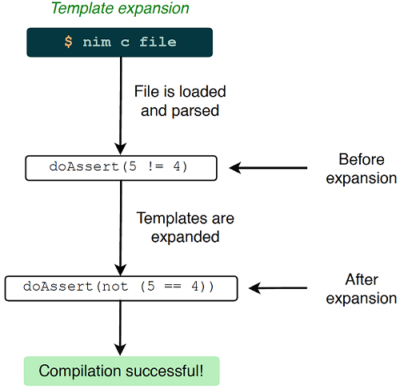
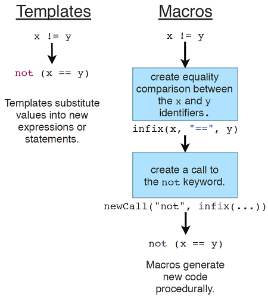
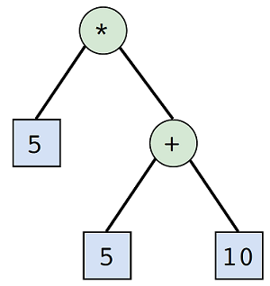

第九章 元编程 
=========== 

本章包括：

* 元编程是什么以及如何最好地使用它
* 使用泛型消除代码重复
* 抽象语法树AST是什么
* 在编译时执行代码
* 使用模板和宏

本章描述了Nim编程语言中最先进、最强大的功能之一。这个特性称为元编程，它由许多组件组成，包括泛型、模板和宏。

元编程是Nim的一项功能，它使您能够将应用程序的源代码视为数据。这意味着您能够编写代码来读取、生成、分析和修改其他代码。能够执行这样的活动会带来很多好处，例如，它允许您使用更少的代码完成解决方案。反过来，这意味着元编程减少了开发时间。

在大多数语言中，生成代码通常很容易，但阅读、分析和修改代码却不是。考虑以下简单类型定义：

```Nim
type
  Person = object
    name: string
    age: int
```

在没有元编程的语言中，分析此代码以检索有关Person类型的信息并不容易。您可以尝试将类型定义视为字符串并对其进行解析，但这样做很容易出错。在Nim中，有一些工具可以让您分析类型定义。例如，您可能希望遍历指定类型中的每个字段：

```Nim
import macros

type
  Person = object
    name: string
    age: int

static:
  for sym in getType[Person](2):
    echo(sym.symbol)
```

编译上述代码将显示编译器输出中的字符串名称和年龄。

这只是元编程允许您实现的一个示例。您可以使用它来序列化任何数据类型，而不必编写特定于您或其他人定义的每个数据类型的代码。您会发现，通过这一特性和许多其他特性，元编程打开了大量的可能性。

元编程为Nim编程语言增加了很多灵活性，因为元编程代码是在编译时执行的，所以不会减少程序的执行时间。

在本章中，您将学习三种元编程构造方式，从泛型开始，到模板，再到宏。最后，您将看到如何为配置文件编写简单的域特定语言。领域特定语言是专门用于特定应用领域的语言，有关详细信息，请参阅第9.4节。

## 9.1 Generics 泛型

正如你已经知道的，Nim是一种静态类型的编程语言，这意味着Nim中的每个数据都有一个与其相关的类型。在某些情况下，这些类型是不同的，但非常相似，例如int和float类型都表示数字，但前者不能表示分数，而后者可以表示分数。

泛型是一种允许您以称为泛型编程的样式编写应用程序的功能。在泛型编程中，您根据在调用算法之前未知的类型编写算法。泛型编程非常有用，因为它可以减少代码重复。

泛型与Nim中的另外两个元编程组件有关，即模板和宏，因为它们提供了生成重复代码的方法。本节将介绍过程和类型中的泛型，向您展示如何在这些上下文中最佳地利用它们。它还将简要地向您展示如何约束泛型以使算法的定义更准确。

有些语言将泛型称为参数多态性或模板。许多著名的静态类型编程语言都支持泛型，包括Java、C#、C++、Objective C和Swift。也有少数语言有意忽略了这一特性，Go编程语言因此臭名昭著。

### 9.1.1 泛型过程(函数)

为了让您更好地了解Nim中的泛型是如何工作的，请查看泛型myMax过程的以下实现：

```Nim
proc myMax[T](a, b: T): T =
  if a < b:
    return b
  else:
    return a

doAssert myMax(5, 10) == 10
doAssert myMax(31.3, 1.23124) == 31.3
```

该示例的关键部分是第一行。在那里，泛型类型T定义在过程名称后的方括号中，然后用作参数a和b的类型以及过程的返回类型。

有时编译器可能无法推断泛型类型，在这种情况下，您可以使用方括号显式指定它们，如以下代码所示：

 `doAssert myMax[float](5, 10.5) == 10.5` 

上面的代码明确地告诉编译器，对于这个myMax过程调用，泛型类型T应该实例化为float。

大多数时候，编译器在推断T的类型方面做得很好。例如，如果指定int文本作为第一个参数，而指定float文本作为第二个参数。编译器将隐式地将第一个参数转换为浮点。

 `doAssert myMax(5，10.5)==10.5` 

即使传递给myMax过程的两个参数的类型不同，上述代码也将成功编译。

您可以在过程定义中定义任意多的泛型类型。当前myMax过程只接受两个相同类型的参数。这意味着以下过程调用将失败，并出现类型不匹配错误。

 `doAssert myMax(5'i32，10.5)==10.5` 

上述代码未能编译的原因是，参数a的类型是int32，而b的类型是float。上面定义的myMax过程只能用相同类型的参数调用。

### 9.1.2类型定义中的泛型

在编写Nim代码时，可能会遇到在初始化期间指定对象中一个或多个字段类型的情况。这样，您可以有一个单一的类型定义，但可以根据具体情况进行专门化。

这对于容器类型(如列表和哈希表)非常有用。一个简单的单项通用容器可以这样定义：

```Nim
type
  Container[T] = object
    empty: bool
    value: T
```

上面的代码定义了一个接受泛型类型T的Container类型。然后，Container类型存储的值的类型由定义Container变量时指定的泛型类型T确定。

Container类型的构造函数可以这样定义：

```Nim
proc initContainer[T](): Container[T] =
  result.empty = true
```

然后可以这样调用此构造函数：

 `var myBox=initContainer[string]()` 

当前必须在方括号之间指定泛型类型。这意味着以下代码将不起作用：

 `var myBox=initContainer()` 

编译此代码将导致错误：无法实例化： `T` 错误消息。如前所述，编译器不能总是推断泛型类型，这是一种无法推断的情况。

### 9.1.3 泛型限制

有时，您可能希望限制泛型过程或类型定义所接受的类型。这有助于增强定义，从而使您和代码的其他用户更清楚。考虑前面定义的myMax过程，以及使用两个字符串调用它时会发生什么：

```Nim
proc myMax[T](a, b: T): T =
  if a < b:
    return b
  else:
    return a
echo myMax("Hello", "World")
```

如果保存此代码，编译并运行它，那么您将看到显示的字符串 `World` 。

假设我们不希望算法与一对字符串一起使用，而只与整数和浮点数一起使用。我们可以像这样约束myMax过程的泛型类型：

```Nim
proc myMax[T: int | float](a, b: T): T =
  if a < b:
    return b
  else:
    return a

echo myMax("Hello", "World")
```

编译此代码将失败，并出现以下错误：

```bash
/tmp/file.nim(7, 11) Error: type mismatch: got (string, string)
but expected one of:
proc myMax[T: int | float](a, b: T): T
```

为了使约束过程更加灵活，Nim提供了少量的类型类。类型类是一种特殊的伪类型，可用于匹配约束上下文中的多个类型。您可以这样定义自定义类型类：

```Nim
type
  Number = int | float | uint

proc isPositive(x: Number): bool =
  return x > 0
```

许多已在系统模块中为您定义。还有许多内置类型类可以匹配所有类型组，您可以在Nim手册中找到它们的列表。

### 9.1.4  Concepts 概念

概念，在其他编程语言中有时被称为用户定义的类型类，是一种构造，可以用来指定匹配类型必须满足的任意要求。它们对于定义过程的一种接口很有用，但仍然是一种实验性的Nim特性。本节将为您提供概念的快速概述，而不必过多地详细介绍。因为它们的语义仍然可能改变。

前面定义的max过程包含一个约束，该约束将其限制为仅接受int和float类型作为参数。但对于max过程，接受任何为其定义了<运算符的类型更有意义。可以使用一个概念以代码的形式指定此要求.

```Nim
type
  Comparable = concept a     # <1>
    (a < a) is bool     # <2>

proc max(a, b: Comparable): Comparable =
  if a < b:
    return b
  else:
    return a
```

><1>概念定义与concept关键字一起引入，后面是类型标识符。
<2>该行指定，为了使此概念与类型匹配，必须为该类型定义一个返回布尔值的 < 过程。

概念由一个或多个表达式组成。这些表达式通常使用在concept关键字之后定义的实例。当根据一个概念检查一个类型时，只要满足以下条件，该类型就可以实现该概念：
  * 概念体中的所有表达式都会编译，
  * 并且计算为布尔值的所有表达式均为true。

is运算符确定指定的表达式是否返回bool类型的值，如果返回true，则返回false。

我们可以通过编写一些快速测试来检查Comparable概念是否如预期的那样有效，以下内容取自前面的示例。

```Nim
doAssert max(5, 10) == 10
doAssert max(31.3, 1.23124) == 31.3
```

您希望这两行都能正常工作。第一行指定了两个int参数，proc `<` (a，b:int)：bool存在，因此int满足Comparable概念。第二行指定两个float参数，类似地proc<'(a，b：float)：boo也存在。
但尝试通过写入echo max([5，3]，[1，6])将两个数组传递到max过程失败，原因是：

```bash
/tmp/file.nim(11, 9) Error: type mismatch: got (Array constructor[0..1, int], Array constructor[0..1, int])
but expected one of:
proc max[Comparable](a, b: Comparable): Comparable
proc max(x, y: int): int
proc max(x, y: int8): int8
```

概念是强大的，但它们也是一个非常新的Nim功能，因此被认为是实验性的。由于它们的实验性质，本章将不详细介绍它们，但非常欢迎您在Nim手册中了解它们。[27]现在，让我们继续学习模板。

## 9.2 TEMPLATES 模板

Nim中的模板是一个生成代码的过程。模板提供了直接生成代码的最简单方法之一，另一种是宏，您将在下一节中学习。与泛型不同，它们提供了一种替换机制，允许您替换模板主体中传递给它们的参数。就像所有元编程特性一样，它们的代码生成能力帮助您处理样板代码。

通常，模板提供了一种减少代码重复的简单方法。在Nim中，通过定义模板最容易实现一些功能，例如将变量注入调用范围的能力。

模板的调用方式与过程相同。当Nim编译器编译源代码时，任何模板调用都将替换为模板的内容。例如，看看标准库中的以下模板：

```Nim
template `!=` (a, b: untyped) =     # <1>
  not (a == b)
```

<1>现在不要担心非类型化类型，稍后会解释。

将 != 运算符定义为一个过程是可能的，但这需要为每个类型单独实现。为了解决这个问题，当然可以使用泛型，但这样做会导致更多的调用开销。

这个定义 != 会像下面一样：

 `doAssert(5 != 4)` 

语句被重新定义为：

 `doAssert(not (5 == 4))` 

这是在编译过程中完成的，如图9.1所示。

图9.1 Nim源代码编译过程中扩展的模板



模板的主要目的是提供一种简单的替代机制，减少代码重复的需要。除此之外，模板还提供了一个过程无法提供的功能，即模板可以接受代码语句。

### 9.2.1向模板传递代码块

代码块由一个或多个语句组成。在普通过程调用中，只能使用匿名过程向其中传递多个语句。使用模板，您可以更轻松地传递代码块。Nim支持模板的特殊语法，允许将一个或多个代码语句传递给模板。
下面的代码列表显示了接受代码块作为其参数之一的模板定义。

```Nim
import os

template repeat(statements: untyped) =
  while true:
    statements

repeat:
  echo("Hello Templates!")
  sleep(1000)
```

><1>sleep函数需要 os 模块
<2>模板接受一个语句参数，这对应于代码块。
<3>代码块被替换到此处。
<4>接受代码块的模板是这样使用的。

宏中的代码块:  宏(您将在下一节中了解)也支持代码块作为参数。

模板主体中的语句标识符将替换为传递到模板中的任何代码块。编译器展开模板后，剩下的代码如下所示：

```Nim
import os

while true:
  echo("Hello Templates!")
  sleep(1000)`
```

图9.2显示了重复模板生成的代码，该模板接受代码块作为参数。

图9.2.传递到重复模板中的代码块被替换到其主体中


这显示了模板的一些惊人的替换功能。当然，模板参数并不总是必须接受代码块。下一节描述模板参数如何在模板主体中替换，以及参数的类型如何影响此功能。

>多个代码块
还有一些方法可以通过do符号将多个代码块传递给模板或宏。但这超出了本章的范围。有关更多信息，请参阅Nim手册。[28]

了解代码块和其他参数如何交互很重要。规则是，当代码块传递到模板中时，最后一个参数始终包含它。例如：

```Nim
import os
template repeat(count: int, statements: untyped) =     # <1>
  for i in 0 .. <count:
    statements

repeat 5:
  echo("Hello Templates!")
  sleep(1000)`
```

<1>最后一个名为语句的参数包含代码块。

### 9.2.2模板中的参数替换

模板可以接受多个参数，这些参数通常是简单的标识符，例如变量或类型名称。在本节中，我将解释不同的模板特定参数类型，以及它们如何修改模板中的参数替换行为。
参数可以以与过程相同的方式传递到模板中：

```Nim
template declareVar(varName: untyped, value: typed) =     # <1>
  var varName = value     # <2>

declareVar(foo, 42)       # <3>
echo(foo)
```

><1>模板的返回值是非类型的，因为它是一个没有类型的语句。
<2>无论传递到模板中的参数是什么，它们都将替换此行中的varName和值。
<3>将展开为：var foo=42。

当调用declareVar模板时，它将扩展为一个简单的变量声明。在模板中使用两个参数指定变量的名称和值。参数的类型不同，第一个是非类型化的，第二个是类型化的。这两种类型的区别很简单。

图9.3显示了declareVar模板如何生成定义新变量的代码。

图9.3.参数在模板中被替换，其类型决定是否接受未定义的标识符


非类型化模板参数允许指定尚未声明的标识符。之所以将此类型命名为非类型化，是因为未声明的标识符还没有类型。上面示例中的foo标识符没有在任何地方声明，因此是非类型化的。。
 
类型化模板参数允许指定已声明的标识符或具有类型的值。在上面的示例中，值42有一个int类型。该类型允许指定任何类型，但模板也允许您指定int、float和string等具体类型。

要更详细地说明差异，请查看以下declareVar调用：

```Nim
template declareVar(varName: untyped, value: typed) =
  var varName = value

var myInt=42
declareVar(foo，myInt)  # <1>
declareVar(foo，myUndeclardVar)  # <2>
```

><1>这将编译，因为上面声明了myInt。
<2>这将不会编译，因为myUndeclaredVar未在任何地方声明。

请记住，第二个参数是类型化的，因此不能将未声明的变量传递给它。只有定义了具有该名称的变量，才能将其传递给该参数。

编译上述代码将导致未声明的标识符错误

### 9.2.3 Template Hygiene 模板洁净性(类似于闭包，变量不出作用域)

如上面的declareVar模板所示，模板可以定义在调用模板后可以访问的变量。这个特性可能并不总是可取的，在某些情况下，您可能希望在模板内声明一个变量，而不将其暴露于外部范围。这样做的能力称为模板洁净性。

再次考虑前面的模板示例：

```Nim
template-declareVar(varName:untyped，value:typed)=
 var varName=value

declareVar(foo，42)
echo(foo)
```

调用declareVar模板将声明一个新变量。这是因为varName变量被注入到调用范围中。注入会自动发生，因为变量的名称取自模板的参数。通常，变量不会被注入到模板中，除非它们用｛.inject.｝pragma显式标记。以下代码列表显示了注入变量和未注入变量的不同情况的比较：

```Nim
template hygiene(varName: untyped) =
  var varName = 42          # <1>
  var notInjected = 128     # <2>
  var injected {.inject.} = notInjected + 2     # <3>

hygiene(injectedImplicitly)

doAssert(injectedImplicitly == 42)
doAssert(injected == 130)
```

><1>隐式注入，因为其名称取自varName参数。
<2>只能在此模板中访问。
<3>由于｛.inject.｝pragma而注入，请注意notInjected变量仍然可以使用。

尝试访问模板外部的notInjected变量将导致错误：未声明的标识符：'notInjected'消息。其他变量可以访问，因为它们是由模板注入调用作用域的。

在编写模板时，请确保精确地记录由其注入的变量，并注意仅暴露这些变量。请记住，一般来说，注入变量被认为是不好的风格。标准库只会将其注入mapIt之类的对象中。 (映射到？)

上述洁净性规则与以下定义相同：

```Nim
type
var
let
const
```

默认情况下，这些定义都是洁净的。以下定义的规则相反：

```Nim
proc
iterator
converter
template
macro
```

默认情况下，这些定义是不洁净的。这些规则的原因是为了捕获没有解释的最常见用例。

下一节将介绍宏，这是Nim中与模板相关的组件，它比模板灵活得多，功能强大得多。

>[28] Nim手册中  `do`  的说明, <http://nim-lang.org/docs/manual.html#procedures-do-notation>

## 9.3 Macro 宏

Nim中的宏是一种特殊的过程，在编译时执行，并返回Nim表达式或语句。宏是读取、生成、分析和修改Nim代码的最终方法。在计算机科学的世界中，它们存在于许多不同的形式。模板确实是宏的一种形式，尽管它是一种非常简单的形式，主要由一个简单的替换组成。模板被称为声明性的，因为它们在其主体中显示了应该生成的代码的样子，而不是描述生成代码所需的步骤。。

另一方面，Nim宏被认为是过程性的，因为它包含描述应该生成的代码的步骤。事实上，当调用宏时，它们的主体在编译时执行。因此，Nim编程语言的一个相关特性，即编译时函数执行，也与宏的研究相关。此功能允许编译器在编译过程中执行过程，您将在下一小节中了解更多信息。

宏对Nim代码进行操作，但与对代码进行操作的方式不同。作为程序员，您习惯于处理代码的文本表示。您可以以文本形式编写、读取和修改代码。但是宏不是这样工作的，它们在不同的表示上运行，这种表示被称为抽象语法树。

图9.4显示了模板和宏之间的主要区别。

图9.4.模板是声明性的，而宏是程序性的。


本节将带您了解这些概念中的每一个，以便教您如何使用宏。最后，您还将使用新的宏技能编写一个简单的配置库。

### 9.3.1编译时函数执行

编译时函数执行(CTFE)是Nim的一个特性，它允许在编译时执行过程。这是一个在编程语言中相对少见的强大功能。

CTFE已经在第2章中向您简要介绍过了，您看到Nim中常量的值必须在编译时可计算。

```Nim
proc fillString(): string =
  result = ""
  echo("Generating string")
  for i in 0 .. 4:
    result.add($i)

const count = fillString()
```

编译上述代码列表时，编译消息中将显示消息"Generating string"。这是因为fillString过程是在编译时执行的。
编译时执行有一些限制，包括：
 * 无法访问外部函数接口(FFI)，这意味着某些模块/过程无法使用。例如，因此，您无法在编译时生成随机数，除非您使用staticExec间接生成。
 * 编译时无法访问未使用｛compileTime.｝pragma注释的全局变量。
  
尽管有这些限制，Nim还是提供了一些变通方法，以允许在编译时读取文件和执行外部进程等常见操作。这些操作可以分别使用 `staticRead` 和 `staticExec` 过程执行。

由于宏用于生成、分析和修改代码，因此它们也必须在编译时执行。这意味着同样的限制也适用于他们。

### 9.3.2 Abstract Syntax Trees 抽象语法树

抽象语法树(AST)是表示源代码的数据结构。许多编译器在最初解析源代码后在内部使用它，有些像Nim编译器向用户公开它。
 
AST是一棵树，每个节点代表代码中的一个结构。为了更好地了解AST是什么，让我们看一个AST的示例。考虑一个简单的算法表达式，例如  `5*(5+10)`  ，最简单的AST可能类似于**图9.5**所示。

Figure 9.5. 表示5*（5+10）的简单AST图



从现在起，在本章的其余部分中，我将把这个AST称为Simple AST。让我们来看看Simple AST如何表示为Nim数据类型。清单9.1显示了Node类型的定义，然后将其用于建模Simple AST，如图9.5所示。


```Nim
type
  NodeKind = enum
    Literal, Operator       # <1>

  Node = ref object
    case kind: NodeKind
    of Literal:
      value: int            # <2>
    of Operator:
      left, right: Node     # <3>
      operator: char        # <4>

proc newLiteralNode(value: int): Node =     # <4>
  result = Node(
    kind: Literal,
    value: value
  )

var root = Node(            # <6>
  kind: Operator,
  operator: '*',
  left: newLiteralNode(5),
  right: Node(
    kind: Operator,
    operator: '+',
    left: newLiteralNode(5),
    right: newLiteralNode(10),
  )
)
```

><1> 在SimpleAST中，只有两种节点类型：包含任意数字的文本和指定要执行的算术运算类型的运算符。
<2> 如果节点是文本，则可以在其值字段中存储int。
<3> 每个节点最多可以有两个子节点。此递归定义允许形成树。
<4> 如果节点是文本，则可以在其运算符字段中存储字符。
<5> 创建新文本节点的便捷过程。
<6> 根变量保存对AST中根节点的引用。

根节点现在以AST的形式保存   `5*(5+10)`  的完整表示。图9.6显示了SimpleAST图如何映射到清单9.1中定义的Node数据结构。

图9.6。一个带注释的图9.5显示了它如何映射到清单9.1中的根目录


您现在可以编写一个过程，将任何Node实例转换为其文本表示，或使用基于缩进的格式将其显示为树，如下所示：

清单9.2.使用基于缩进的格式显示的  `5*(5+10)`  的简化AST

```
Operator '*'
  Literal 5
  Operator '+'
    Literal 5
    Literal 10`
```

不幸的是，Nim的AST没有这么简单，它建模的语言比简单的算术表达式复杂得多。由simple AST建模的算术表达式也是有效的Nim代码，这意味着我们可以将Nim的AST与之进行比较。为此，我们可以使用宏模块中定义的dumpTree宏，该宏将一块代码作为输入，并以与清单9.2所示相同的基于缩进的格式输出代码块的AST。
要在Nim中显示  `5*(5+10)`  的AST，请编译以下代码列表：

```Nim
import macros

dumpTree:
  5 * (5 + 10)
```

在来自编译器的消息中，您应该看到：

```Nim
StmtList
  Infix
    Ident "*"
    IntLit 5
    Par
      Infix
        Ident "+"
        IntLit 5
        IntLit 10
```

您将注意到，Nim AST在两个重要方面有所不同：

* 它包括更多的节点类型，例如StmtList、Infix和Ident，以及Par
* AST不再是二叉树：某些节点包含2个以上的子节点。
 
但是结构是一样的，AST只包含关于表达式的更多信息。例如，它定义了使用中缀表示法调用 `*` 和 `+` 运算符，并且表达式的一部分包含在括号中。
 
AST可以表示任何有效的Nim代码，因此存在大量的节点类型。要了解不同的节点类型，请尝试显示一些常见构造的AST，例如过程、for循环、过程调用、变量声明以及您可以想到的任何其他构造。

Nim AST在以下URL提供的宏模块文档中进行了描述：<http://nim-lang.org/docs/macros.html> 该文档包含一个NimNode类型的定义，该类型与清单9.1中定义的Node类型非常相似。宏模块还包含许多可用于构建、修改和读取AST的过程。

在继续之前，让我们看看这些节点类型中的一些。表9.1描述了到目前为止您看到的Nim AST中的每种节点类型:

| 节点类型 | 描述 | 子节点类型 |
|---------|-----|----------|
|StmtList | 语句列表|表示语句的任意数量Nim节点 |
|Infix | 中缀表达式，例如5*5 | 中缀运算符，中缀运算符的两个参数。|
|Ident| 标识符，过程或变量名 |节点的标识字段包含标识符。不能包含子级|
|Par | 圆括号 | 代码在括号内 |
|IntLit |整数量，节点字段的整数值  | 不能包含子级|


让我们尝试使用宏模块中定义的过程构建  `5*(5+10)`  的Nim AST，类似于清单9.1中的root定义。清单9.3显示了创建  `5*(5+10)`  的Nim AST所需的代码。

清单9.3.创建  `5*(5+10)`  的Nim AST

```Nim
import macros     # <1>

static:           # <2>
  var root = newStmtList(
    infix(
      newIntLitNode(5),
      "*",
      newPar(
        infix(
          newIntLitNode(5),
          "+",
          newIntLitNode(10)
        )
      )
    )
  )
  echo(root.repr)     # <3>
```

><1> 宏模块定义了构建AST的所有必要步骤。
<2>  `static` 关键字在编译时运行其主体。因为AST过程仅在编译时可用，所以使用。
<3>  `repr` 调用将根节点转换为Nim代码的文本表示。

编译清单9.3，注意输出是  `5*(5+10)`  。您已经成功构建了第一个NimAST！

### 9.3.3 宏定义

到目前为止，您已经了解了AST是什么、如何构造它以及在编译过程中显示它的不同方式。但您仍然缺少一个非常重要的知识：发出生成的AST，以便它所代表的Nim代码包含在最终的可执行应用程序中。
宏正是用于此目的。在上一节中，您已经构造了一个生成数值的简单算术表达式的AST。让我们编写一个发出AST的宏，以便计算算术表达式。

清单 9.4. 传递(Emit，发出，传递，散发，发射)表达式的宏 5 * (5 + 10)

```Nim
import macros      # <1>

macro calculate(): int =     # <2>
  result = newStmtList(      # <3>
    infix(         # <4>
      newIntLitNode(5),      # <4>
      "*",         # <6>
      newPar(      # <7>
        infix(     # <8>
          newIntLitNode(5),
          "+",     # <6>
          newIntLitNode(10)
        )
      )
    )
  )

echo(calculate())
```

><1> 导入AST创建所需的宏模块。
<2> 定义一个名为 `calculate` 的新宏。
<3> 创建带有子节点的新 `StmtList` 节点。结果节点生成  `5*(5+10)`  。
<4> 创建一个新的 `Infix` 节点作为 `StmtList` 节点的子节点。结果节点生成  `5*(5+10)`  。
<5> 将新 `IntLit` 节点创建为 `Infix` 节点的子节点。结果节点产生 `5` 。
<6> 指定要调用的中缀运算符。
<7> 创建一个新的 `Par` 节点作为 `Infix` 节点的子节点。结果节点产生(5+10)。
<8> 创建一个新的 `Infix` 节点作为 `Par` 节点的子节点。结果节点产生 `5+10` 。

关于清单9.4，有两件重要的事情需要注意。首先，宏可以以与过程和模板相同的方式调用。第二个是在宏主体中构建的AST树结构。
 
计算宏当前仅生成一个表达式，因此可以安全地删除StmtList节点。计算宏的新定义如清单9.5所示。

清单9.5.在宏中生成单个表达式

```Nim
import macros

macro calculate(): int =
  result = infix(         # <1>
    newIntLitNode(5),     # <2>
    "*",        # <3>
    newPar(     # <4>
      infix(
        newIntLitNode(5),
        "+",
        newIntLitNode(10)
      )
    )
  )

echo(calculate())
```

><1> 创建新的 `Infix` 节点。生成的节点生成  `5*(5+10)`  。
<2> 创建新的 `IntLit` 节点。生成的节点生成 `5` 。
<3> 指定要调用的中缀运算符。
<4> 创建新的 `Par` 节点。结果节点产生(5+10)。

宏生成功能等效的代码，没有多余的AST节点。

这是一个非常简单的宏示例，旨在向您展示宏如何使用AST来发出Nim代码。等效模板更简单，实现了相同的功能：

```Nim
template calculate(): int = 5 * (5 + 10)

echo(calculate())
```

计算宏生成静态AST，但宏的真正威力是动态生成AST的能力。下一节将向您展示如何最好地利用这种能力。

### 9.3.4宏中的参数

 就像过程和模板一样，调用宏时，可以向它们传递一个或多个参数。这样做可以改变宏的行为，从而改变它生成的代码。例如，您可能希望传递宏应在其生成的代码中使用的变量的名称。

 不过，传递给宏的参数应该有点不同。例如，宏参数的类型可以是int，但在宏的主体中它是NimNode。下面的代码列表演示了这一点：

```Nim
import macros

macro arguments(number: int, unknown: untyped): untyped =     # <1>
  result = newStmtList()      # <2>
  echo number.treeRepr()      # <3>
  echo unknown.treeRepr()     # <3>

arguments(71, ["12", "89"])
```

><1>每个宏都必须具有返回类型。
<2>每个宏都必须生成一个有效的AST，在此创建一个空的 `StmtList` 节点以满足此规则。
 `<3>`  `treeRepr` 过程类似于 `dumpTree` 宏，它返回 `NimNode` 的四元组表示。

编译此列表将产生以下输出：

```Nim
IntLit 71     # <1>
Bracket       # <2>
  StrLit 12
  StrLit 89
```

><1> 传递给宏的第一个参数的AST：71。
<2> 传递给宏的第二个参数的AST：["12","89"]

您需要从这个示例中吸取两个东西：
* 宏必须始终具有返回类型，并且必须始终返回有效的AST，即使该AST本质上是空的。
* 所有宏参数都是Nim-AST节点。

后一点非常有意义，因为宏已经操纵了AST。将每个宏参数表示为AST节点允许在Nim中通常不可能实现的构造，例如：

```bash
arguments(71, ["12", 876, 0.5, -0.9])
```

此示例显示第二个参数的以下AST：

```Nim
Bracket
  StrLit 12
  IntLit 876
  Float64Lit 0.5
  Prefix
    Ident  "-"
    Float64Lit 0.9`
```

Nim中的数组是同构的，因此它们包含的每个值都必须是相同的类型。尝试声明值为 `12` 、876、0.5、-0.9的数组是不可能的，因为该值的类型包括字符串、int和float。在这种情况下，宏提供了更大的灵活性，允许在调用宏时使用异构数组构造函数。

这应该能让你很好地了解基本的宏观概念。在下一节中，我将向您展示如何构建配置DSL。

## 9.4 创建配置 DSL

元编程允许的最有用的功能之一是创建领域特定语言。领域特定语言(DSL)是专门用于特定应用领域的语言。在Nim语法的范围内，您可以定义非常灵活和直观的语言，使编写软件更容易。例如，您可以编写DSL来定义HTML的结构。您将编写以下内容，而不是编写容易出错的长字符串文字：

```Nim
html:
  head: title("My page")
  body: h1("Hello!")
```

这只是一个示例，在本节中，我将向您展示如何创建配置DSL。该DSL将允许您更容易地定义配置文件的结构，然后可以使用该结构轻松地读取和写入配置文件。您将首先看到典型的DSL是如何在Nim的AST中表示的，然后您将查看所需生成代码的AST表示，最后研究如何在用户使用DSL时根据用户指定的信息构建AST。

您将在本章中创建的DSL将允许编写以下代码：

```Nim
import configurator

config MyAppConfig:
  address: string
  port: int

var config = newMyAppConfig()
config.load("myapp.cfg")
echo("Configuration address: ", config.address)
echo("Configuration port: ", config.port)
```

这段代码定义了一个名为 `MyAppConfig` 的简单配置文件，该文件存储两条信息，一个是字符串的地址，一个整数的端口。该定义使用构造函数初始化，然后从本地myapp.cfg文件加载。然后，地址和端口可以作为字段访问，其值显示在屏幕上。

指定这样的配置非常有用，因为它简化了读取和写入配置文件的过程。只有一个地方定义了配置文件，而且这个地方非常容易阅读和理解。

此DSL将被编写为名为 `configuration` 的库。让我们开始吧！

### 9.4.1启动配置器项目

首先在文件系统的某处创建一个新的配置器目录。与任何项目一样，设置包含src目录和Nimble文件的项目目录结构。请记住，您可以使用灵活的init命令来帮助实现这一点。最后，在 `src` 目录中创建一个 `configuration.nim` 文件，并在您喜爱的代码编辑器中打开它。

宏将用于实现配置器DSL，因此请在新创建的配置器.nim文件的顶部导入宏模块。

当使用DSL时，最好先写下您希望它的样子。很可能无法使用配置DSL，您可以编译以下内容：

```Nim
import macros

dumpTree:
  config MyAppConfig:
    address: string
    port: int
```

如果编译成功，则您的DSL在Nim中语法有效，因此可以工作。
测试DSL的有效性后，为该DSL编写一个宏，并显示各种参数的AST，如下面的清单9.6所示。

清单9.6.一个简单的配置宏

```Nim
import macros

macro config(typeName: untyped, fields: untyped): untyped =     # <1>
  result = newStmtList()      # <2>
  echo treeRepr(typeName)     # <3>
  echo treeRepr(fields)       # <3>

config MyAppConfig:
  address: string
  port: int
```

><1>  `config` 宏接受类型名和字段列表。
<2> 每个宏都必须返回一个有效的AST，因此我们在这里创建一个基本的AST。
<3> 现在，我们显示 `typeName` 和 `fields` 参数的AST。

将此代码保存到configuration.nim中，然后编译该文件。您将在输出中看到以下内容：

```Nim
Ident  "MyAppConfig"
StmtList
  Call
    Ident  "address"
    StmtList
      Ident  "string"
  Call
    Ident  "port"
    StmtList
      Ident  "int"
```

这让您了解了将要使用的AST结构。接下来是决定需要发出什么代码来实现所需的代码逻辑的时候了。为了实现本节开头所示的示例，宏需要创建三个单独的构造：

 `- `  `MyAppConfig` 对象类型，用于存储配置数据。
- 初始化新 `MyAppConfig` 类型的 `newMyAppConfig` 构造函数过程。
- 一个加载过程，它解析指定的文件，然后用解析文件中存储的信息填充 `MyAppConfig` 对象的指定实例。

生成的类型和构造函数过程的名称取决于配置构造中指定的名称。宏需要使用这些信息来更改它生成的代码。生成的类型中包含的字段也将取决于配置构造中指定的字段。

接下来的三节将着重于在宏中实现功能，以创建三个构造，包括对象类型、构造函数过程和加载过程。

### 9.4.2生成对象类型

 在开始在宏中编写AST生成代码之前，首先需要确定要生成什么AST。要做到这一点，您需要知道希望宏发出的Nim代码。让我们先写下应该由 `config` 构造生成的类型定义，您之前看到过这个构造：

```Nim
config MyAppConfig:
  address: string
  port: int
```
需要从中生成的类型定义非常简单：

```Nim
type
  MyAppConfig = ref object
    address: string
    port: int
```
 `config` 构造中指定的两条信息已用于创建此类型定义，即类型名 `MyAppConfig` 和两个名为 `address` 和 `port` 的字段。与任何代码一样，此代码可以表示为AST。为了能够生成AST，您需要了解它的AST是什么样子的。

```Nim
import macros

dumpTree:
  type
    MyAppConfig = ref object
      address: string
      port: int
```

编译此代码应该会显示清单9.7中的AST。


清单9.7  `MyAppConfig` 类型定义的AST

```Nim
StmtList
  TypeSection
    TypeDef
      Ident  "MyAppConfig"
      Empty         # <1>
      RefTy
        ObjectTy
          Empty     # <1>
          Empty     # <1>
          RecList
            IdentDefs
              Ident  "address"
              Ident  "string"
              Empty     # <1>
            IdentDefs
              Ident  "port"
              Ident  "int"
              Empty     # <1>
```
><1> 空节点用于为AST中的泛型等额外功能预留空间。

清单9.8中的AST包含大量空节点。这些节点用于泛型等可选构造，以确保每个节点的索引位置保持不变。这一点很重要，因为导航AST是使用[]运算符和索引完成的，您将在本章稍后的操作中看到。

现在你知道需要生成的AST是什么样子了，你就可以开始编写生成它的代码了。在某些情况下，宏模块包含的过程可以使为特定构造生成AST的过程更容易。不幸的是，在这种情况下，您需要使用某些基本过程手动生成清单9.7中的AST，因为宏模块中当前没有类型节构造函数。清单9.8显示了一个生成大量AST的过程，如清单9.7所示。

清单9.8.为类型定义生成AST

```Nim
proc createRefType(ident: NimIdent, identDefs: seq[NimNode]): NimNode =     # <1>
  result = newTree(nnkTypeSection,     # <2>
    newTree(nnkTypeDef,        # <3>
      newIdentNode(ident),     # <4>
      newEmptyNode(),          # <4>
      newTree(nnkRefTy,
        newTree(nnkObjectTy,
          newEmptyNode(),      # <4>
          newEmptyNode(),      # <4>
          newTree(nnkRecList,
            identDefs
          )
        )
      )
    )
  )
```

><1> 此过程接受两个参数并返回一个新的 `NimNode` 。第一个参数是一个标识符，它指定要定义的类型的名称。第二个参数包含标识符定义列表，其中包含有关类型字段的信息
<2> 每个节点都使用 `newTree` 过程创建，该过程允许在创建过程中轻松添加子节点。
<3> 每个子节点都作为外部 `newTree` 调用的参数。
<4> 有一些特殊的程序可以使创建节点的过程更容易。

清单9.8所示的代码逐个手动创建每个节点。为此，使用 `newTree` 过程。它将节点类型与零个或多个子节点一起作为参数。这些子节点会自动添加到 `newTree` 返回的新Nim AST节点中。

每个节点类型都以 `nnk` 前缀开头，例如，在过程的主体中，第一行显示了 `nnkTypeSection` 节点的创建。这与清单9.7所示的 `dumpTree` 的输出相匹配，只是输出不包含nnk前缀。

注意清单9.7中显示的 `dumpTree` 输出和清单9.8中的代码之间惊人的相似性。节点的嵌套方式甚至是相同的。不同之处在于过程调用，其中大多数涉及 `newTree` ，但也有一些专门的过程。这些专业程序包括以下内容。

 `newIdentNode` 过程用于创建 `nnkIdent` 节点。它接受字符串或 `NimIdent` 参数，并从中创建适当的 `nnkIden` 节点。它也可以通过 `newTree` 创建，但这样做会更详细，因为还需要分配标识。 `ident` 节点可以引用任何标识符，例如变量或过程名称，但很像这种情况，它可能包含尚未定义的标识符。

 `n`  `ewEmptyNode` 过程创建一个新的 `nnkEmpty` 节点。它只是 `newTree(nnkEmpty)` 的别名。

 `createRefType` 过程不会生成清单9.7所示的完整AST。它错过了一个关键的部分，身份识别。相反，它接受它们作为一个参数，并假设它们是在其他地方生成的。单个 `nnkIdentDefs` 节点表示字段定义，包括字段的名称和类型。为了生成这些，让我们定义一个新的过程。清单9.9显示了 `toIdentDefs` 过程，该过程将调用语句列表转换为 `nnkIdentDef` 节点列表。

清单9.9.将调用语句列表转换为 `IdentDefs` 节点列表

```Nim
proc toIdentDefs(stmtList: NimNode): seq[NimNode] =
  expectKind(stmtList, nnkStmtList)     # <1>
  result = @[]          # <2>

  for child in stmtList:                # <3>
    expectKind(child, nnkCall)          # <4>
    result.add(         # <4>
      newIdentDefs(     # <6>
        child[0],       # <7>
        child[1][0]     # <8>
      )
 )
```

><1> 确保 `stmtList` 节点的类型为 `nnkStmtList` 。
<2>用空序列初始化结果变量。
<3>遍历 `stmtList` 中的所有子节点。
<4>确保子节点的类型为 `nnkCall` 。
<5>将 `nnkIdentDefs` 节点添加到结果序列中。
<6>创建新的 `nnkIdentDefs` 节点。
<7>字段名称。例如， `child` 的第一个child Call→ Indent！ `address` 。
<8>字段类型。child的第二个child的child，例如Call→ StmtList(StmtList)→ Indent  "string"。

将传递给t `oIdentDefs` 过程的 `stmtList` 参数是 `config` 宏中的第二个参数。更重要的是，如前所述， `stmtList` 的AST将如下所示：

```Nim
StmtList
  Call
    Ident  "address"
    StmtList
      Ident  "string"
  Call
    Ident  "port"
    StmtList
      Ident  "int"
```

 `toIdentDefs` 过程的任务是获取此AST并将其转换为与之匹配的 `nnkIdentDef` 节点列表

见清单9.7。代码相当短，可以进一步缩短，代价是进行一些错误检查。

 `expectKind` 过程用于确保输入AST不包含任何意外的节点类型。在编写宏时使用这个方法是一个好主意，因为有时宏可能会得到异常的AST，添加这样的检查使调试更容易，类似于使用 `doAssert` 过程。

转换过程相当简单：
 * 语句列表节点的子级被迭代。
 * 使用[]运算符访问每个孩子的孩子和孙子，以检索与字段的名称和类型相对应的两个标识符。
 * newIdentDefs过程用于创建新的nnkIdentDef节点。
 * 新的nnkIdentDefs节点将添加到结果序列中。

显然，转换取决于AST的结构，尤其是索引。谢天谢地，结构不应该改变，除非配置器库的用户在配置宏的主体中传递了一些意外的信息。在本节稍后部分，您将看到此代码如何对不同的输入做出反应，以及如何使故障更具信息性。

现在您已经定义了足够的值，可以在配置宏中生成正确的类型定义。您需要做的就是添加对 `createRefType` 和 `IdentDefs` 的调用。

```Nim
let identDefs = toIdentDefs(fields)
result.add createRefType(typeName.ident, identDefs)
```

在宏中定义结果变量后添加这两行。然后在宏的末尾添加 `echo treeRepr(result)` 以显示生成的AST。编译代码，AST应该与清单9.7所示的一致。

确认生成的AST正确的另一种方法是将其转换为代码并显示。您可以通过在文件末尾写入 `echo repr(result)` 来完成此操作。编译后，您应该看到以下内容：

```Nim
type
  MyAppConfig = ref object
    address: string
    port: int
```

这是这个宏的第一个也是最长的部分！剩下的两个部分应该不会花那么长时间。

### 9.4.3生成构造函数程序

配置宏现在可以生成单个类型定义。但此类型定义需要构造函数才能使用。本节将向您展示如何创建这个非常简单的构造函数。

构造函数不需要做很多事情，它只需要初始化引用对象。因此，需要生成的代码很简单：

```Nim
proc newMyAppConfig(): MyAppConfig =
  new result     # <1>
```

><1>新调用用于初始化内存中的引用对象。

该代码可以以与上一节中的类型定义类似的方式生成，但幸运的是有一种更简单的方法。可以使用模板来代替手动创建过程及其主体的AST。以下代码列表显示了所需的模板：

```Nim
template constructor(ident: untyped): untyped =
  proc `new ident`(): `ident` =
    new result
```

将此模板添加到 `configuration.nim` 文件中配置宏的正上方。

此模板创建一个新过程，将其命名为 `newIdent` ，其中 `Ident` 是传递给模板的 `Ident` 参数。 `ident` 参数还用于所创建过程的返回类型。如果要通过构造函数( `MyAppConfig` )调用此模板，则实际上需要定义以下过程：

```Nim
proc newMyAppConfig(): MyAppConfig =
  new result
```

但如何在配置宏中使用此模板？答案在于宏模块中定义的 `getAst` 过程。此过程将模板或宏返回的代码转换为一个或多个AST节点。

现在，由于 `getAst` 和模板的强大功能，您可以在 `createRefType` 调用后立即添加 `result.add getAst(constructor(typeName.ident))` 。您的配置宏现在应该如下所示：

```Nim
macro config*(typeName: untyped, fields: untyped): untyped =
  result = newStmtList()

  let identDefs = toIdentDefs(fields)
  result.add createRefType(typeName.ident, identDefs)
  result.add getAst(constructor(typeName.ident))

  echo treeRepr(typeName)
  echo treeRepr(fields)

  echo treeRepr(result)
  echo repr(result)
```

现在您应该能够再次编译代码，并看到构造函数过程已经生成。

### 9.4.4加载程序

最后但同样重要的是加载过程。它将为我们加载配置文件，解析它，最后用其内容填充配置类型的实例。

让我们看看这个加载过程的实现应该是什么样子。对于前面几节中显示的包含地址字符串字段和端口整数字段的配置定义，加载过程应定义如下：

```Nim
proc load*(cfg: MyAppConfig, filename: string) =
  var obj = parseFile(filename)           # <1>
  cfg.address = obj["address"].getStr     # <2>
  cfg.port = obj["port"].getInt           # <3>
```

><1> 从文件名加载JSON文件并将其保存到obj变量中。
<2> 从解析的JSON对象中获取地址字段，检索其字符串值并将其分配给配置实例的地址字段。
<3> 从解析的JSON对象中获取端口字段，检索其整数值并将其分配给配置实例的端口字段。需要进行类型转换，

因为 `getNum` 过程返回 `BiggestInt` 类型。

为了简单起见，本示例中使用的底层配置格式是JSON。加载过程首先解析JSON文件，然后访问解析的JSON对象中的地址和端口字段，并将它们分配给配置实例。

注意 `getStr` 和 `getNum` 的不同用法。这些过程用于分别从JsonNode变量对象中检索基础字符串和 `BiggestInt` 值。

地址字段是一个字符串，因此加载过程使用 `getStr` 获取该字段的字符串。与端口字段类似，尽管在本例中该字段是整数，因此使用 `getNum` 过程。这需要在生成过程时由宏确定。

为了生成这些语句，您需要有关配置字段的信息，包括它们的名称和类型。幸运的是，代码已经以 `IdentDefs` 的形式处理了这些信息。我们可以重用以前生成的 `IdentDef` 来生成加载过程。让我们再次看看 `MyAppConfig` 定义中这些 `IdentDef` 的样子：

```Nim
IdentDefs
  Ident  "address"
  Ident  "string"
  Empty
IdentDefs
  Ident  "port"
  Ident  "int"
  Empty
```

结构非常简单。有两个节点，每个节点都包含字段名和类型。现在让我们使用这些来生成加载过程，我将向您展示如何在步骤中编写它。
首先，定义一个新的 `createLoadProc` 过程：

```Nim
proc createLoadProc(typeName: NimIdent, identDefs: seq[NimNode]): NimNode =
```

将此定义添加到 `configuration.nim` 文件中配置宏的正上方。
就像前面定义的c `reateRefType` 过程一样，这个过程需要两个参数。类型名称和 `IdentDefs` 节点列表。该程序将使用半自动方法生成必要的AST。加载过程需要两个参数，一个 `cfg` 和一个文件名，您需要为每个参数创建一个 `Ident` 节点。除此之外，还应为过程中使用的 `obj` 变量创建 `Ident` 节点：

```Nim
var cfgIdent = newIdentNode("cfg")     # <1>
var filenameIdent = newIdentNode("filename")     # <2>
var objIdent = newIdentNode("obj")     # <3>
```

><1> 将存储配置对象实例的cfg参数。
<2> 将存储配置文件的文件名的文件名参数。
<3> 将存储解析的JSON对象的obj变量。

将此代码添加到 `createLoadProc` 过程的主体。

代码非常简单，它创建了三个不同的标识符节点，存储两个参数和一个变量的名称。让我们利用这些生成加载程序中的第一行。

```Nim
var body = newStmtList()     # <1>
body.add quote do:           # <2>
  var `objIdent`= parseFile(`filenameIdent`)     # <3>
```

><1> 定义存储加载过程主体的变量。
<2>  `quote` 过程返回表达式的AST，它允许在表达式中引用节点。
<3> 生成AST的表达式是加载过程的第一行，本质上是 `varobj=parseFile(fileName)` 。

将此代码附加到 `createLoadProc` 主体的末尾。

该代码首先创建一个新的 `StmtList` 节点，以保存加载过程主体中的语句。

这段代码首先创建一个新的 `StmtList` 节点来保存加载过程主体中的语句。然后使用宏模块中定义的引用过程生成第一条语句。 `quote` 过程以与 `getAst` 过程类似的方式返回一个 `NimNode` ，但它不需要声明单独的模板，而是允许您将语句传递给它。可以通过使用两个反引号将其引用来替换引号主体中的代码。

在上面的代码中， `objIdent` 节点持有的名称被替换到 `var` 定义中。f `ilenameIdent` 节点也会发生类似的替换。这将导致生成 `var obj=parseFile(fileName)` 。

下一步是遍历 `IdentDefs` 并基于它们生成正确的字段赋值。

```Nim
for identDef in identDefs:                  # <1>
  let fieldNameIdent = identDef[0]          # <2>
  let fieldName = $fieldNameIdent.ident     # <3>
  case $identDef[1].ident                   # <4>
  of "string":
    body.add quote do:
      `cfgIdent`.`fieldNameIdent` = `objIdent`[`fieldName`].getStr           # <4>
  of "int":
    body.add quote do:
      `cfgIdent`.`fieldNameIdent` = `objIdent`[`fieldName`].getInt     # <6>
  else:
    doAssert(false, "Not Implemented")
```

><1>遍历 `IdentDefs` 节点。
<2>从 `IdentDefs` 节点检索字段名。
<3>将 `Ident` 转换为字符串。
<4>根据字段的类型生成不同的代码。
<5>对于字符串字段，生成 `getStr` 调用。
<6>对于 `int` 字段，生成 `getNum` 调用和类型转换。

将此代码附加到 `createLoadProc` 主体的末尾。

这是一个相当大的代码块。但它会生成非常简单的语句，这些语句依赖于配置正文中指定的字段。对于前面几节中显示的配置定义，它将生成以下两条语句：

```Nim
cfg.address = obj["address"].getStr
cfg.port = obj["port"].getInt`
```

使用该代码，过程体现在已完全生成。现在剩下的就是为过程创建AST，这可以使用宏模块中定义的 `newProc` 过程轻松完成。

```Nim
return newProc(newIdentNode("load"),     # <1>
    [newEmptyNode(),     # <2>
     newIdentDefs(cfgIdent, newIdentNode(typeName)),           # <3>
     newIdentDefs(filenameIdent, newIdentNode("string"))],     # <4>
    body)                # <4>
```

><1> 过程的名称。
<2> 过程的返回类型，空节点用于表示 `void` 返回类型。
<3> 第一个过程参数，在本例中为 `cfg` 。
<4> 第二个过程参数，在本例中为文件名。
<5>  `StmtLis` t节点，包含要包含在过程主体中的语句。

 `newProc` 过程生成对过程建模的必要AST节点。您可以通过指定名称、参数、返回类型和过程主体来自定义过程。

现在所要做的就是在 `config` 宏中添加一个调用来生成 `load` 过程。只需在 `getAst` 调用下面添加 `result.add createLoadProc(typeName.ident，identiDefs)` 。这就是它的全部！让我们确保现在一切正常。

### 9.4.5 测试配置程序

在测试代码之前，您应该创建一个可以读取的JSON文件。在 `configuration.nim` 文件旁边创建一个名为 `myappconfig.json` 的新文件，并向其中添加以下代码：

```json
{
  "address": "http://google.com",
  "port": 80
}
```

这将由测试中的配置器读取。清单9.10显示了如何测试它。

清单9.10.测试配置宏

```Nim
import json

config MyAppConfig:
  address: string
  port: int

var myConf = newMyAppConfig()
myConf.load("myappconfig.json")
echo("Address: ", myConf.address)
echo("Port: ", myConf.port)
```

将清单9.10中的代码添加到 `configuration.nim` 文件的底部。然后编译并运行该文件。您应该看到以下输出：

```bash
Address: <http://google.com>
Port: 80
```

这就是它的全部。DSL完成了！基于这个示例，您现在应该对如何在Nim中编写DSL以及宏的工作方式有了很好的了解。可以随意使用生成的DSL，您可能希望添加对更多字段类型的支持，或者导出生成的类型和过程，以使它们可以从其他模块中使用。

## 9.5 总结

* 元编程由三个独立的结构组成：泛型、模板和宏。
* 通用过程减少了代码重复。
* 概念是与泛型相关的实验性特性，它允许您指定匹配类型必须满足的需求。
* 您已经学习了如何定义通用过程以减少代码重复。
* 模板是一种在编译时扩展的高级替换机制。
* 模板支持卫生，这是一种控制对其中定义的变量的访问的方法。
* 模板和宏是唯一可以将代码块作为参数的构造。
* 宏通过以抽象语法树的形式读取、生成和修改代码来工作。
* 您已经学习了如何获取任何Nim代码的AST表示。
* 现在您知道如何通过使用宏构造AST来生成代码。
